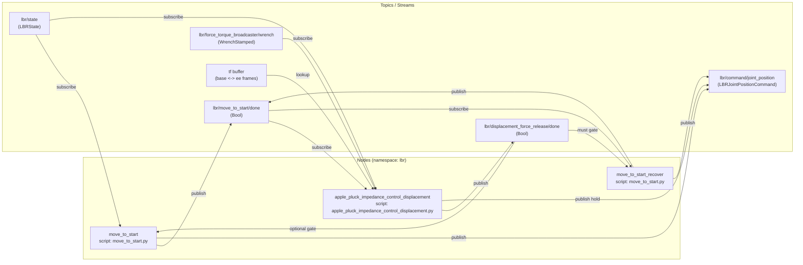

# Sinthlab kuka stack
## Steps on Kuka Arm
- Use the "Quick Start guide" to cable up the Arm, Cabinet and the SmartPad
- For the Safety on X11 interface in the Cabinet:
  - We first create 6 Jumper cables witht he provided Pins.
  - Based on the PIN diagram as elaborated in pg-53 of Spez_KUKA_Sunrise_Cabinet_en.pdf (section 6.6.2), we jump pins 1/2, 10/11 (external E-Stop), 3/4, 12/13 (Operator Safety) and 5/6, 14/15 (Safety stop 1).

## Setting up the Windows laptop
**Context Note** : As KUKA ARM software requires Windows while our stack requires Ubuntu, we will use Windows laptop as the machine to directly install applications on the Robot and then install our stack on WSL to then control the Arm.
### Prerequisite
- Please install Ubuntu 22.04 from marketplace (Note the version is important. please do not install anything default)
- Make sure you are on wsl version 2 (running wsl -l -v should show wsl version and ubuntu name installed).
- Make sure the robot controller box is on
- Install `Sunrise Workbench` on the Laptop. Note that for our Arm version, we have SunriseWorkbench-1.17.0.4-setup.exe made available to us by Kuka Support.
- Install FRI plugin on the sunrise workbench project (steps to be elaborated).

### Connection verification
- Connect your computer to the robot controller at X66 (default IP: 172.31.1.147) via an ethernet cable.
- Configure the same network on your computer, therefore, set your IP to 172.31.1.148 (or anything else in /16 subnet).
    - To do this on windows, go to settings -> Network & Internet -> Ethernet and then edit the IPv4 for manual setup setup to have IP as 172.21.1.148 and gateway as 255.255.0.0 ; leave other options as is and save.
- Try ping the robot `ping 172.31.1.147` from powershell, expect something like:
  ```
  PING 172.31.1.147 (172.31.1.147) 56(84) bytes of data.
  64 bytes from 172.31.1.147: icmp_seq=1 ttl=64 time=0.868 ms
  ```
- Enable hyper-v on the laptop
- Now we also would need to setup networking for the WSL2. For this, go to WSL setting (should be in start menu) and change the Networking mode to Mirrored
  
- Run the following command in PowerShell window with admin privileges to Configure Hyper-V firewall settings to allow inbound connections:
`Set-NetFirewallHyperVVMSetting -Name '{40E0AC32-46A5-438A-A0B2-2B479E8F2E90}' -DefaultInboundAction Allow`

### Install application to robot
Follow [these](https://lbr-stack.readthedocs.io/en/latest/lbr_fri_ros2_stack/lbr_fri_ros2_stack/doc/hardware_setup.html#install-applications-to-the-robot) steps to install application to the robot

## Setting up the Stack
*Note*: These steps are meant to be run on Ubuntu 22.04. 
- Install ROS 2 development tools. Refer this [link]( https://docs.ros.org/en/humble/Installation/Ubuntu-Install-Debs.html#setup-sources) to understand details of steps.
  
  ```
  sudo apt install software-properties-common
  sudo add-apt-repository universe
  sudo apt update && sudo apt install curl -y
  export ROS_APT_SOURCE_VERSION=$(curl -s https://api.github.com/repos/ros-infrastructure/ros-apt-source/releases/latest | grep -F "tag_name" | awk -F\" '{print $4}')
  curl -L -o /tmp/ros2-apt-source.deb "https://github.com/ros-infrastructure/ros-apt-source/releases/download/${ROS_APT_SOURCE_VERSION}/ros2-apt-source_${ROS_APT_SOURCE_VERSION}.$(. /etc/os-release && echo ${UBUNTU_CODENAME:-${VERSION_CODENAME}})_all.deb"
  sudo dpkg -i /tmp/ros2-apt-source.deb
  sudo apt update
  sudo apt upgrade
  sudo apt install ros-dev-tools
  ```
  
- Create a workspace, clone, and install dependencies
  ```
  source /opt/ros/humble/setup.bash
  mkdir -p lbr-stack/src && cd lbr-stack
  vcs import src --input https://raw.githubusercontent.com/sinthlab/sinthlab-kuka-stack/main/sinthlab_lbr_stack.repos
  rosdep install --from-paths src -i -r -y
  ```
- Build
  ```
  colcon build --symlink-install
  ```

## Visualizing mock setup on rviz
- In terminal 1, launch a mock setup via
```
source install/setup.bash
ros2 launch sinthlab_bringup iiwa7_mock_apple.launch.py
```

- In terminal 2, visualize setup via
```
source install/setup.bash
ros2 launch lbr_bringup rviz.launch.py \
  rviz_cfg_pkg:=lbr_bringup \
  rviz_cfg:=config/mock.rviz
```

## Running Physics Simulation via Gazebo
```
source install/setup.bash
ros2 launch sinthlab_bringup iiwa7_gazebo_apple.launch.py
```

## MoveIt with apple (mock or gazebo)
```
source install/setup.bash
# Mock + MoveIt + RViz
ros2 launch sinthlab_bringup iiwa7_moveit_apple.launch.py mode:=mock rviz:=true

# Gazebo + MoveIt + RViz
ros2 launch sinthlab_bringup iiwa7_moveit_apple.launch.py mode:=gazebo rviz:=true
```
## Running applications on the Hardware
Note that there are python dependencies to be installed. This step needs to be run only once, after you launch wsl:
```
pip install ruckig
pip install pyoptas
``` 
### Running the apple pluck scenario
1. On the Laptop, Open two wsl terminals, and go to the root of lbr-stack project. Currently it is setup as `cd ~/lbr-stack`
2. run `source install/setup.bash` in both the terminals. 
*Note: If you have git pull some changes, then make sure to follow build steps to build your workspace before sourcing*
3. From one terminal, Launch the Robot driver on the powershell by running command:
```
ros2 launch lbr_bringup hardware.launch.py \
    ctrl:=lbr_joint_position_command_controller \
    model:=iiwa7
```
4. On the KUKA Smartpad, launch the LBRServer application
5. Select:
  - FRI send period: 10 ms
  - IP address: 172.31.1.148
  - FRI control mode: POSITION_CONTROL
  - FRI client command mode: POSITION
6. Now back on the laptop, on the other terminal run the apple pluck scenario impedance controller using command below. Note, you can use the stiffness_scale parameter to tune the "resistance of motion" and the value range is `(0,1]`
```
ros2 launch sinthlab_bringup iiwa7_apple_pluck_impedance_control.launch.py stiffness_scale:=0.5
```
7. The arm will move to its start position, if it is not in that. once the arm reaches at the start position for experiment and the message is displayed on the screen saying `Captured baseline EE pose for displacement thresholding`, Please try applying gentle force on end effector.
8. You can keep on applying force till a displacement threshold is reached on End Effector (currently set on 'z' direction to to 0.2 m). Once it does, you will feel the arm is "holding" the pose at that moment and message comes up on screen `Displacement threshold reached..`
9. At that point, Arm will wait till no more force is detected on the End Effector, and then will move back to the start position.

### Explanation and setup for apple pluck scenario

- `lbr/move_to_start` (move_to_start.py) drives the arm to the initial pose, publishing commands on `lbr/command/joint_position` and announcing completion on `lbr/move_to_start/done`. It always listens to `lbr/state` and optionally to `lbr/displacement_force_release/done` when `start_action_needed == true`.
- `lbr/apple_pluck_impedance_control_displacement` (apple_pluck_impedance_control_displacement.py) waits on `lbr/move_to_start/done`, then monitors displacement/force via `lbr/state`, `lbr/force_torque_broadcaster/wrench`, and `TF`. It latches completion on `lbr/displacement_force_release/done` and temporarily publishes hold commands on `lbr/command/joint_position`.
- `lbr/move_to_start_recover` (same script as the first node) runs after the displacement node exits. With `start_action_needed == true`, it blocks on `lbr/displacement_force_release/done` before republishing the start trajectory and then shuts down the launch once `lbr/move_to_start/done` fires again.

**Note on default topics/states available from server**
- `lbr/state` comes from the lbr_state_broadcaster controller (`lbr_ros2_control/LBRStateBroadcaster`) that hardware.launch.py spawns via `/controller_manager`. It wraps the real-time stream coming from the KUKA FRI driver and republishes it as an LBRState message.
- `lbr/force_torque_broadcaster/wrench` is published by the standard ROS 2 controller force_torque_broadcaster (`force_torque_sensor_broadcaster/ForceTorqueSensorBroadcaster`), also spawned by the same launch file. It exposes the estimated wrist wrench provided by the hardware interface.
- TF frames are produced by the robot_state_publisher node (`lbr/robot_state_publisher`), also in the same launch file. It listens to `joint_states` from the joint state broadcaster and continuously republishes the `lbr_link_*` transforms.

## Troubleshoot 
- if your rviz window launches but is not displaying anything or gazebo window is crashing immediately, It might be because the graphics library trying to use the graphics card which might not be set. use command ` export LIBGL_ALWAYS_SOFTWARE=1` to first set the library to use CPU, and then run the commands to launch rviz/gazebo again.

## Development Environment
- The development strategy for this is to follow an Underlay-overlay structure. We are reusing the lbr_fri_ros2_stack (https://github.com/lbr-stack/lbr_fri_ros2_stack)[^1] and that in turn has ROS2 as underlay; So overall our codebase has classes and functions imported from the lbr_fri_ros2_stack repo.
- As mentioned in the steps, we install basic ros2 development tools and sinthlab_lbr_stack.repos file has the link to all the repos dependencies that we install.
- Once you setup the stack, within the src of the folder (which is ~/lbr-stack/src by default), you will see 4 different repos. We own and manage the sinthlab-kuka-stack; And hence we should only make changes in this folder
- Note that the git repo for sinthlab-kuka-stack is [here](https://github.com/sinthlab/sinthlab-kuka-stack).
  - This also means, if you want to add / make any changes to the repo, you need to create your own branch first and then a pull request on the github with your changes so that all of changes can be tracked and approved.
- If you are intending to use copilot (or any other AI assisted coding editor), I would strongly suggest to open the codebase from the root (which is ~/lbr-stack by default), as then the agent can use the whole codebase with dependencies for indexing and suggestions.

Maintainer (Navin Modi) Disclosure: For my development, I have used VSCode and Github Copilot with GPT-5 model for assisted development.

### Steps for testing
- Everytime you make changes, you need to rebuild the workspace from root (which is ~/lbr-stack by default) by running `rm -rf build/ install/ log/; colcon build --symlink-install`
- Now source the setup changes again `source install/setup.bash` and then launch whatever changes you want to test.

## Acknowledgement
Please note that this work has been built on top of Huber et al [^1] and hence all the original work credit for lbr_fri_ros2_Stack goes to that team.

[^1]: LBR-Stack: ROS 2 and Python Integration of KUKA FRI for Med and IIWA Robots, Journal of Open Source Software [doi](https://doi.org/10.21105/joss.06138)