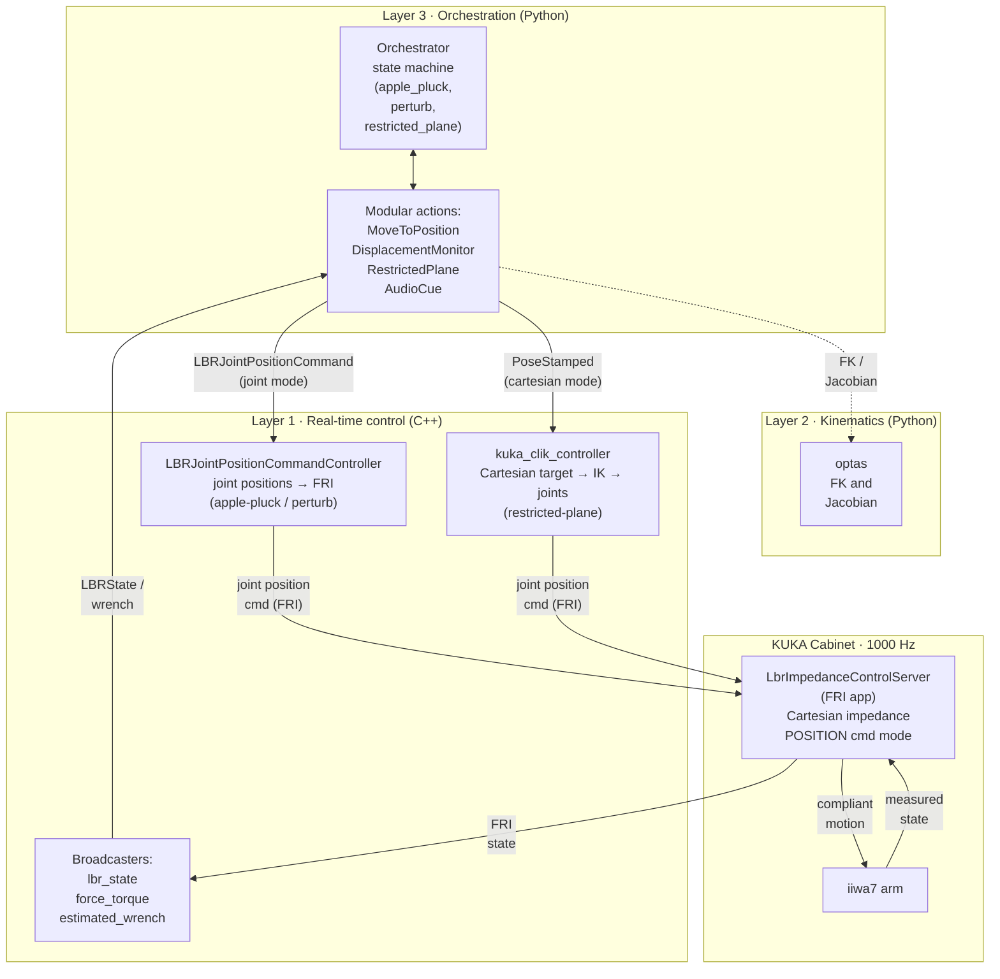
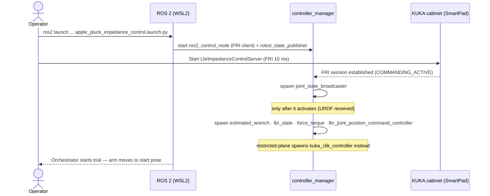
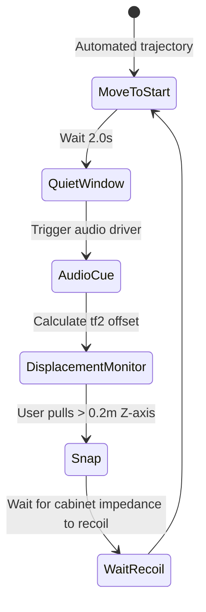
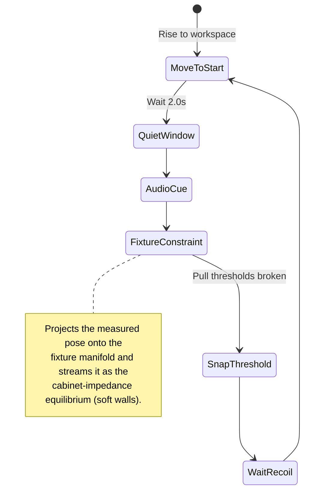
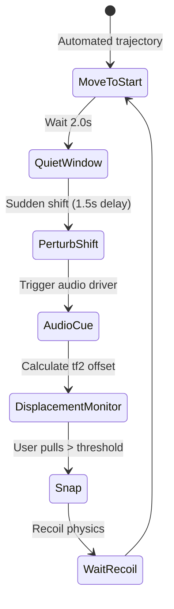

# Sinthlab KUKA Stack

A ROS 2 (Jazzy) control stack for running **compliant "apple‑pluck" experiments** on a KUKA
LBR iiwa7. It is built as an *overlay* on top of the [`lbr_fri_ros2_stack`][^1], adding the
high‑level experiment orchestration, motion actions, and the KUKA Sunrise (FRI) applications
needed to drive the arm.

In every hardware scenario the **Cartesian compliance ("spring") runs on the KUKA cabinet at
1000 Hz**. Apple-pluck / perturb stream **joint** setpoints to it via
`LBRJointPositionCommandController`; the restricted-plane scenario streams **Cartesian** poses via
`kuka_clik_controller`. Python state machines sequence each trial
(move → cue → monitor displacement → recoil → repeat).

## Table of Contents
- [1. Hardware Setup (KUKA Arm)](#1-hardware-setup-kuka-arm)
- [2. Windows Laptop Setup](#2-windows-laptop-setup)
- [3. Building the Stack](#3-building-the-stack)
- [4. Simulation & Visualization (no hardware)](#4-simulation--visualization-no-hardware)
- [5. Running Experiments on Hardware](#5-running-experiments-on-hardware)
- [6. Software Architecture](#6-software-architecture)
- [7. Troubleshooting](#7-troubleshooting)
- [8. Development & Contributing](#8-development--contributing)
- [Acknowledgement](#acknowledgement)

---

## 1. Hardware Setup (KUKA Arm)
- Use the "Quick Start guide" to cable up the Arm, Cabinet and the SmartPad.
- For the Safety on the X11 interface in the Cabinet:
  - First create 6 jumper cables with the provided pins.
  - Based on the PIN diagram (pg‑53 of `Spez_KUKA_Sunrise_Cabinet_en.pdf`, section 6.6.2),
    jump pins 1/2, 10/11 (external E‑Stop), 3/4, 12/13 (Operator Safety) and 5/6, 14/15
    (Safety stop 1).

---

## 2. Windows Laptop Setup
> **Why Windows + WSL2?** KUKA's robot software (Sunrise Workbench) requires Windows, while our
> stack requires Ubuntu. We use the Windows laptop to install applications onto the robot, and
> run our stack inside WSL2 (Ubuntu) on the same laptop to control the arm.

### Prerequisites
- Install Ubuntu 24.04 with `wsl --install -d Ubuntu-24.04` (the version matters — do **not**
  install the default).
- Confirm you are on WSL version 2 (`wsl -l -v` shows the version and the installed distro).
- Make sure the robot controller box is on.
- Install `Sunrise Workbench` on the laptop. For our arm version we use
  `SunriseWorkbench-1.17.0.4-setup.exe`, provided by KUKA Support.
- Install the FRI plugin in the Sunrise Workbench project (steps to be elaborated).

### Connection Verification
- Connect your computer to the robot controller at **X66** (default IP `172.31.1.147`) via an
  ethernet cable.
- Put your computer on the same network — set your IP to `172.31.1.148` (or anything else in the
  `/16` subnet).
  - On Windows: Settings → Network & Internet → Ethernet, edit the IPv4 manual setup to IP
    `172.31.1.148` and gateway `255.255.0.0`; leave other options as is and save.
- Ping the robot from PowerShell — `ping 172.31.1.147` — and expect something like:
  ```
  PING 172.31.1.147 (172.31.1.147) 56(84) bytes of data.
  64 bytes from 172.31.1.147: icmp_seq=1 ttl=64 time=0.868 ms
  ```
- Enable Hyper‑V on the laptop.
- Set up networking for WSL2: open WSL settings (in the Start menu) and change the Networking
  mode to **Mirrored**.
  
- In a PowerShell window **with admin privileges**, allow inbound Hyper‑V connections:
  ```powershell
  Set-NetFirewallHyperVVMSetting -Name '{40E0AC32-46A5-438A-A0B2-2B479E8F2E90}' -DefaultInboundAction Allow
  ```

### Install Application to Robot
Follow [these steps](https://lbr-stack.readthedocs.io/en/latest/lbr_fri_ros2_stack/lbr_fri_ros2_stack/doc/hardware_setup.html#install-applications-to-the-robot)
to install the application to the robot.

---

## 3. Building the Stack
> These steps run inside **WSL2 / Ubuntu 24.04**.

1. Install ROS 2 development tools (see this [guide](https://docs.ros.org/en/jazzy/Installation/Ubuntu-Install-Debs.html) for details):
   ```bash
   sudo apt update && sudo apt install locales
   sudo locale-gen en_US en_US.UTF-8
   sudo update-locale LC_ALL=en_US.UTF-8 LANG=en_US.UTF-8
   export LANG=en_US.UTF-8
   sudo apt install software-properties-common
   sudo add-apt-repository universe
   sudo apt update && sudo apt install curl -y
   export ROS_APT_SOURCE_VERSION=$(curl -s https://api.github.com/repos/ros-infrastructure/ros-apt-source/releases/latest | grep -F "tag_name" | awk -F'"' '{print $4}')
   curl -L -o /tmp/ros2-apt-source.deb "https://github.com/ros-infrastructure/ros-apt-source/releases/download/${ROS_APT_SOURCE_VERSION}/ros2-apt-source_${ROS_APT_SOURCE_VERSION}.$(. /etc/os-release && echo ${UBUNTU_CODENAME:-${VERSION_CODENAME}})_all.deb"
   sudo dpkg -i /tmp/ros2-apt-source.deb
   sudo apt update && sudo apt install ros-dev-tools
   sudo apt update
   sudo apt upgrade
   sudo apt install ros-jazzy-desktop
   sudo apt install python3-pip
   ```
2. Create a workspace, clone, and install dependencies:
   ```bash
   source /opt/ros/jazzy/setup.bash
   mkdir -p lbr-stack/src && cd lbr-stack
   vcs import src --input https://raw.githubusercontent.com/sinthlab/sinthlab-kuka-stack/main/sinthlab_lbr_stack.repos
   rosdep install --from-paths src -i -r -y
   ```
3. Install the required Python packages (only needed once per WSL session install):
   ```bash
   pip install pyoptas ruckig --break-system-packages
   ```
4. Build:
   ```bash
   colcon build --symlink-install
   ```

---

## 4. Simulation & Visualization (no hardware)

**Mock setup in RViz**
```bash
# Terminal 1 — launch the mock setup
source install/setup.bash
ros2 launch sinthlab_bringup iiwa7_mock_apple.launch.py
```
```bash
# Terminal 2 — visualize
source install/setup.bash
ros2 launch lbr_bringup rviz.launch.py \
  rviz_cfg_pkg:=lbr_bringup \
  rviz_cfg:=config/mock.rviz
```

**Physics simulation in Gazebo**
```bash
source install/setup.bash
ros2 launch sinthlab_bringup iiwa7_gazebo_apple.launch.py
```

**MoveIt with apple (mock or gazebo)**
```bash
source install/setup.bash

# Mock + MoveIt + RViz
ros2 launch sinthlab_bringup iiwa7_moveit_apple.launch.py mode:=mock rviz:=true

# Gazebo + MoveIt + RViz
ros2 launch sinthlab_bringup iiwa7_moveit_apple.launch.py mode:=gazebo rviz:=true
```

---

## 5. Running Experiments on Hardware
> Python dependencies (`pyoptas`, `ruckig`) must be installed once per WSL session install (see
> [Building the Stack](#3-building-the-stack)).
>
> ⚠️ **Safety first.** On the first run of any scenario, operate in **T1** (reduced speed) with a
> hand on the E‑stop. The arm is actively controlled the moment a SmartPad application is running.

### Scenario quick reference
| # | Scenario | Launch file | SmartPad app (FRI) | ROS controller |
|---|----------|-------------|--------------------|----------------|
| 1 | Apple Pluck          | `iiwa7_apple_pluck_impedance_control.launch.py` | `LbrImpedanceControlServer` | `LBRJointPositionCommandController` |
| 2 | Restricted on Plane  | `iiwa7_move_restricted_plane.launch.py`         | `LbrImpedanceControlServer` | `kuka_clik_controller` |
| 3 | Apple Pluck Perturb  | `iiwa7_apple_pluck_impedance_perturb.launch.py` | `LbrImpedanceControlServer` | `LBRJointPositionCommandController` |

All scenarios use FRI **POSITION** command mode: ROS streams a target pose and the **cabinet's
Cartesian impedance** (`LbrImpedanceControlServer`) provides the compliance.

### Scenario 1 — Apple Pluck
This scenario streams **joint** setpoints to the `LBRJointPositionCommandController` (joint positions
go straight to the FRI position command — no IK), while the KUKA cabinet runs Cartesian impedance
natively via the `LbrImpedanceControlServer` FRI app. The arm acts as a virtual physical spring and
recoils when pushed off its commanded anchor.

**Steps to run:**
1. Check that `update_rate` in
   `lbr-stack/src/lbr_fri_ros2_stack/lbr_description/ros2_control/lbr_controllers.yaml` is set to `200`.
2. On the KUKA SmartPad, start the **`LbrImpedanceControlServer`** application. It opens four
   selection dialogs in sequence — choose:

   | Prompt | Select |
   |--------|--------|
   | FRI send period [ms] | `10` |
   | Remote IP address | `172.31.1.148` (your ROS / WSL2 laptop IP) |
   | Cartesian stiffness (K diagonal) | `Uniform Medium (Apple Pluck)` |
   | Damping ratio (D0) | `0.7 (Standard)` |

   *This app is hard‑wired to Cartesian Impedance control in `POSITION` command mode. The other
   stiffness profiles (`Very Soft Z`, `Soft Z (Apple Pluck)`, `Stiff Cartesian`) and damping ratios
   (`0.3 (Underdamped)`, `1.0 (Critically Damped)`) are available if you want to change the feel.*
   The app then waits (~60 s) for the ROS client to connect.
3. **Launch the experiment** — this connects ROS to the waiting FRI app and starts the trial loop
   (nothing happens until you run this):
   ```bash
   ros2 launch sinthlab_bringup iiwa7_apple_pluck_impedance_control.launch.py
   ```
4. The arm moves to the start. Wait for the beep, then pull the end effector gently to trigger the
   0.2 m displacement threshold. A second beep plays, and the arm awaits physical recoil before
   restarting.

### Scenario 2 — Move Restricted on a Plane
This scenario applies mathematical **virtual fixtures** (planes, boxes, cylinders, sine rails): the
arm moves freely *within* an allowed region and is pushed back *outside* it. By default the
compliance runs **on the cabinet** (same `LbrImpedanceControlServer` app as Apple Pluck) —
`kuka_clik_controller` streams a **fixture‑constrained equilibrium** pose and the cabinet's Cartesian
impedance provides the free‑motion + soft‑wall feel at 1000 Hz. (A legacy rigid mode is also
available — see the note.)

**Steps to run:**
1. On the KUKA SmartPad, start the **`LbrImpedanceControlServer`** application (same app as Apple
   Pluck — the cabinet supplies the compliance). It opens four selection dialogs in sequence —
   choose:

   | Prompt | Select |
   |--------|--------|
   | FRI send period [ms] | `10` |
   | Remote IP address | `172.31.1.148` (your ROS / WSL2 laptop IP) |
   | Cartesian stiffness (K diagonal) | `Flat table (free X/Y, stiff Z)` (matches the plane fixture) |
   | Damping ratio (D0) | `0.7 (Standard)` |

   The app then waits (~60 s) for the ROS client to connect.
2. **Launch the experiment** — this connects ROS to the waiting FRI app and starts it:
   ```bash
   ros2 launch sinthlab_bringup iiwa7_move_restricted_plane.launch.py
   ```
3. The arm rises to the workspace; push it to feel free motion within the fixture and the soft wall
   at its boundary.

> **Tip:** Set `virtual_fixture_profile` (`sine_wave`, `flat_table`, etc.) in
> `virtual_fixtures_params.yaml`. The fixture geometry defines *where* the walls are; the cabinet
> stiffness sets *how firm* they feel.

#### How this relates to Apple Pluck — same cabinet compliance, different ROS controller
Both scenarios run the **same cabinet Cartesian impedance at 1000 Hz** (`LbrImpedanceControlServer`);
they differ in the ROS controller and what it streams:

| | Apple Pluck (1 & 3) | Restricted Plane (2) |
|---|---|---|
| Cabinet (SmartPad) | `LbrImpedanceControlServer`, 1000 Hz | `LbrImpedanceControlServer`, 1000 Hz |
| ROS controller | `LBRJointPositionCommandController` | `kuka_clik_controller` |
| ROS streams | **joint** positions (the start config) | a **Cartesian** pose projected onto the fixture manifold |
| Feel | omnidirectional spring toward one pose | free within the fixture; soft wall outside it |

So the cabinet — not Python — supplies the give: the arm yields to a sudden jerk at 1 kHz, and the
"walls" are **soft impedance walls** (the arm is gently pulled back onto the manifold), which is the
safer behaviour for an animal subject. The software (`MoveRestrictedOnAPlaneAction`) just keeps the
spring's equilibrium inside the allowed region.

### Scenario 3 — Apple Pluck Perturb
This scenario builds upon the Apple Pluck physics (cabinet‑side Cartesian impedance via
`LbrImpedanceControlServer`, with `LBRJointPositionCommandController` streaming the joint setpoints) but
introduces a sudden, programmatic Cartesian spatial shift right before the user acts, to study the
response to mechanical perturbation.

**Steps to run:**
1. Check that `update_rate` in
   `lbr-stack/src/lbr_fri_ros2_stack/lbr_description/ros2_control/lbr_controllers.yaml` is set to `200`.
2. On the KUKA SmartPad, start the **`LbrImpedanceControlServer`** application with the **same four
   selections as Scenario 1**:

   | Prompt | Select |
   |--------|--------|
   | FRI send period [ms] | `10` |
   | Remote IP address | `172.31.1.148` (your ROS / WSL2 laptop IP) |
   | Cartesian stiffness (K diagonal) | `Uniform Medium (Apple Pluck)` |
   | Damping ratio (D0) | `0.7 (Standard)` |

   The app then waits (~60 s) for the ROS client to connect.
3. **Launch the experiment** — this connects ROS to the waiting FRI app and starts it:
   ```bash
   ros2 launch sinthlab_bringup iiwa7_apple_pluck_impedance_perturb.launch.py
   ```
4. The arm acts exactly as the standard pluck, but automatically jerks to the side approximately
   1.5 seconds prior to the readiness cue.

---

## 6. Software Architecture
The stack separates **hard real‑time physical loops** from **high‑level orchestration**, so that
Python state transitions never compromise the 1000 Hz hardware control loops.

### 6.1 System Overview — data flow
Apple‑pluck / perturb send **joint** setpoints to the cabinet via `LBRJointPositionCommandController`;
restricted‑plane sends **Cartesian** poses via `kuka_clik_controller`. Either path becomes a joint
**position command** over FRI, and the **cabinet's Cartesian impedance provides the compliance**;
robot state flows *back up* to the Python monitors.


```mermaid
flowchart TB
    subgraph L3["Layer 3 · Orchestration (Python)"]
        ORCH["Orchestrator<br/>state machine<br/>(apple_pluck,<br/>perturb,<br/>restricted_plane)"]
        ACT["Modular actions:<br/>MoveToPosition<br/>DisplacementMonitor<br/>RestrictedPlane<br/>AudioCue"]
    end
    subgraph L2["Layer 2 · Kinematics (Python)"]
        OPTAS["optas<br/>FK and<br/>Jacobian"]
    end
    subgraph L1["Layer 1 · Real-time control (C++)"]
        JPC["LBRJointPositionCommandController<br/>joint positions → FRI<br/>(apple-pluck / perturb)"]
        CLIK["kuka_clik_controller<br/>Cartesian target → IK → joints<br/>(restricted-plane)"]
        BCAST["Broadcasters:<br/>lbr_state<br/>force_torque<br/>estimated_wrench"]
    end
    subgraph CAB["KUKA Cabinet · 1000 Hz"]
        APP["LbrImpedanceControlServer<br/>(FRI app)<br/>Cartesian impedance<br/>POSITION cmd mode"]
        ARM["iiwa7 arm"]
    end

    ORCH <--> ACT
    ACT -. "FK /<br/>Jacobian" .-> OPTAS
    ACT -- "LBRJointPositionCommand<br/>(joint mode)" --> JPC
    ACT -- "PoseStamped<br/>(cartesian mode)" --> CLIK
    JPC -- "joint position<br/>cmd (FRI)" --> APP
    CLIK -- "joint position<br/>cmd (FRI)" --> APP
    APP -- "compliant<br/>motion" --> ARM
    ARM -- "measured<br/>state" --> APP
    APP -- "FRI<br/>state" --> BCAST
    BCAST -- "LBRState /<br/>wrench" --> ACT
```

### 6.2 Hardware Bring‑up Sequence
Controllers are spawned in a deliberate order: `joint_state_broadcaster` first (it needs no URDF
and proves the controller_manager has received the robot description), then the controllers that
parse the URDF in `on_init()`.


```mermaid
sequenceDiagram
    actor Op as Operator
    participant ROS as ROS 2 (WSL2)
    participant CM as controller_manager
    participant CAB as KUKA cabinet (SmartPad)

    Op->>ROS: ros2 launch ... apple_pluck_impedance_control.launch.py
    ROS->>CM: start ros2_control_node (FRI client) + robot_state_publisher
    Op->>CAB: Start LbrImpedanceControlServer (FRI 10 ms)
    CAB-->>CM: FRI session established (COMMANDING_ACTIVE)
    CM->>CM: spawn joint_state_broadcaster
    Note over CM: only after it activates (URDF received)
    CM->>CM: spawn estimated_wrench · lbr_state · force_torque · lbr_joint_position_command_controller
    Note over CM: restricted-plane spawns kuka_clik_controller instead
    ROS-->>Op: Orchestrator starts trial — arm moves to start pose
```

### 6.3 Layers
**Layer 1 — Real‑time control (C++ / ros2_control)**
- **Cabinet‑side Cartesian impedance (`LbrImpedanceControlServer`):** the KUKA cabinet runs the
  Cartesian‑impedance virtual spring at 1000 Hz; ROS only streams the equilibrium to it.
- **`LBRJointPositionCommandController` (lbr_ros2_control):** the **apple‑pluck / perturb** controller
  — forwards joint positions straight to the FRI position command (no IK). Typed message
  `lbr_fri_idl/LBRJointPositionCommand` on `…/command/lbr_joint_position_command`.
- **`kuka_clik_controller` (IDRA Lab):** the **restricted‑plane** controller — a Closed‑Loop IK
  tracker that converts a Cartesian target into joint commands. Message `geometry_msgs/PoseStamped`
  on `…/kuka_clik_controller/target_frame`.

**Layer 2 — Kinematics math (Python)**
- **`optas`:** used inside the Python actions for fast Forward Kinematics (FK) and analytical
  Jacobian conversions, avoiding singular‑matrix crashes when reading Cartesian poses or mapping
  forces.

**Layer 3 — State‑machine orchestration (Python)**
The experimental flows are orchestrated entirely by high‑level `rclpy` nodes calling modular
actions (`MoveToPositionAction`, `CartesianImpedanceDisplacementMonitor`,
`MoveRestrictedOnAPlaneAction`, `AudioCue`). The per‑scenario flows are below.

### 6.4 Control rates — why a 1000 Hz spring but a 10 ms FRI period
The cabinet's control loop and the FRI network exchange run on **two different clocks** — don't
conflate them:

| Clock | What it does | Rate |
|-------|--------------|------|
| **Cabinet control loop** | Computes the Cartesian‑impedance law (`F = K·(x_target − x) − D·v`) and applies joint torques. | **1 ms (1000 Hz)** — fixed by KUKA Sunrise |
| **FRI send period** | Network packet exchange with the ROS client: ROS pushes a new **equilibrium** (joint positions for apple‑pluck, a Cartesian pose for restricted‑plane) and reads back state. | **10 ms (100 Hz)** — you pick 1 / 2 / 5 / 10 ms |

So selecting **10 ms does not slow the spring down.** The cabinet keeps evaluating the impedance
physics every 1 ms against the latest equilibrium; FRI only refreshes the *target* (the spring's
anchor) and the *feedback* 100×/second.

**Between FRI packets**, the cabinet holds the last commanded equilibrium and runs the 1 kHz loop
against it, smoothing the stepwise 10 ms updates via `joint_position_tau` (a 40 ms EMA in
`lbr_system_config.yaml`) so the arm doesn't jerk. Because the target moves slowly (a start pose, a
gentle pull), a 100 Hz anchor refresh is plenty — the 1 kHz loop fills in the dynamics.

**Why 10 ms and not 1 ms?** The FRI send period is a hard deadline the *client* must meet; miss it
and the session drops out of `COMMANDING_ACTIVE` and the robot stops. The client is ROS 2 on
**WSL2 — not a real‑time OS** — over a jittery ethernet link, so reliably hitting a 1–2 ms deadline
is impractical while 10 ms is robust. It also matches the ROS rate (`controller_manager`
`update_rate: 100`; `lbr_controllers.yaml` = `200`) — no point sending faster than ROS produces
commands.

This decoupling is the whole reason the impedance lives **on the cabinet**: the fast,
safety‑critical loop stays at 1 kHz on a real‑time controller, while the slow, non‑real‑time ROS
link only streams a position target at 100 Hz. Running the impedance in ROS instead would pin the
spring law to that ~100 Hz link — far coarser and riskier for torque control.

### 6.5 Experiment State Flows

**Flow 1 — Apple Pluck**

```mermaid
stateDiagram-v2
    [*] --> MoveToStart : Automated trajectory
    MoveToStart --> QuietWindow : Wait 2.0s
    QuietWindow --> AudioCue : Trigger audio driver
    AudioCue --> DisplacementMonitor : Calculate tf2 offset
    DisplacementMonitor --> Snap : User pulls > 0.2m Z-axis
    Snap --> WaitRecoil : Wait for cabinet impedance to recoil
    WaitRecoil --> MoveToStart
```

**Flow 2 — Restricted Virtual Fixtures**

```mermaid
stateDiagram-v2
    [*] --> MoveToStart : Rise to workspace
    MoveToStart --> QuietWindow : Wait 2.0s
    QuietWindow --> AudioCue
    AudioCue --> FixtureConstraint
    note right of FixtureConstraint
      Projects the measured pose onto the
      fixture manifold and streams it as the
      cabinet-impedance equilibrium (soft walls).
    end note
    FixtureConstraint --> SnapThreshold : Pull thresholds broken
    SnapThreshold --> WaitRecoil
    WaitRecoil --> MoveToStart
```

**Flow 3 — Perturb Experiment**

```mermaid
stateDiagram-v2
    [*] --> MoveToStart : Automated trajectory
    MoveToStart --> QuietWindow : Wait 2.0s
    QuietWindow --> PerturbShift : Sudden shift (1.5s delay)
    PerturbShift --> AudioCue : Trigger audio driver
    AudioCue --> DisplacementMonitor : Calculate tf2 offset
    DisplacementMonitor --> Snap : User pulls > threshold
    Snap --> WaitRecoil : Recoil physics
    WaitRecoil --> MoveToStart
```

---

## 7. Troubleshooting
- **RViz shows nothing / Gazebo crashes immediately.** The graphics library may be trying to use a
  GPU that isn't available. Force software rendering, then relaunch:
  ```bash
  export LIBGL_ALWAYS_SOFTWARE=1
  ```

---

## 8. Development & Contributing
- This stack follows an **underlay → overlay** structure. It reuses
  [`lbr_fri_ros2_stack`](https://github.com/lbr-stack/lbr_fri_ros2_stack)[^1], which in turn has
  ROS 2 as its underlay — so our code imports classes and functions from `lbr_fri_ros2_stack`.
- The `sinthlab_lbr_stack.repos` file lists every repository dependency that gets imported during
  setup. After setup, `~/lbr-stack/src` (the default) contains 4 repositories.
- **We own and manage only `sinthlab-kuka-stack`** — make changes only in that folder. Its git
  repository is [here](https://github.com/sinthlab/sinthlab-kuka-stack).
  - To contribute, create your own branch and open a pull request on GitHub so changes can be
    tracked and approved.
- If you use Copilot (or another AI‑assisted editor), open the codebase from the **root**
  (`~/lbr-stack` by default) so the agent can index the whole codebase including its dependencies.

> **Maintainer (Navin Modi) disclosure:** for my development I have used VS Code and Claude / Copilot
> agents for assisted development.

### Testing / rebuild loop
After making changes, rebuild from the workspace root (`~/lbr-stack` by default), re‑source, and
relaunch:
```bash
rm -rf build/ install/ log/
colcon build --symlink-install
source install/setup.bash
```

---

## Acknowledgement
This work is built on top of Huber et al.[^1]; all original credit for `lbr_fri_ros2_stack` goes to
that team.

The vendored controllers in [`vendored_controllers/`](vendored_controllers/) —
`kuka_clik_controller`, `controller_base`, and `debug_msg` — are by the **IDRA Lab** (University of
Trento), from [`idra-lab/ros2_effort_controller`](https://github.com/idra-lab/ros2_effort_controller)
(branch `kuka-prop-ctrl`), used via
[`idra-lab/kuka_lbr_control`](https://github.com/idra-lab/kuka_lbr_control). They are distributed
under the Apache License 2.0 (see [`vendored_controllers/LICENSE`](vendored_controllers/LICENSE)).
Credit to Luca Beber, Davide Nardi, et al.

[^1]: LBR-Stack: ROS 2 and Python Integration of KUKA FRI for Med and IIWA Robots, Journal of Open Source Software. [doi](https://doi.org/10.21105/joss.06138)
