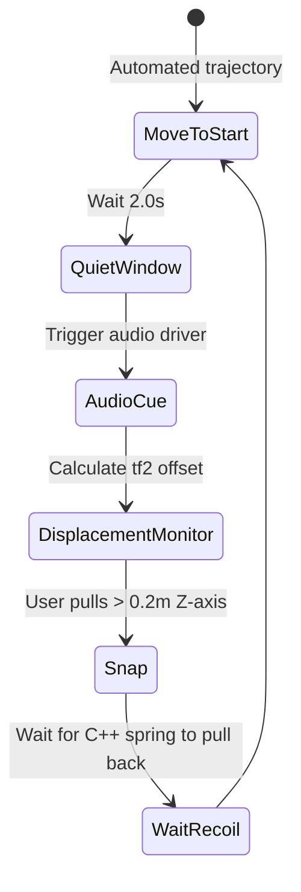
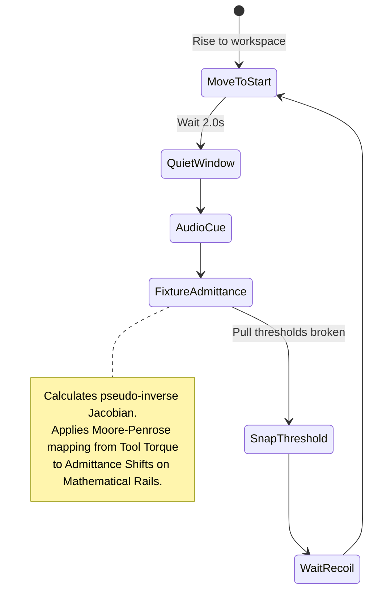
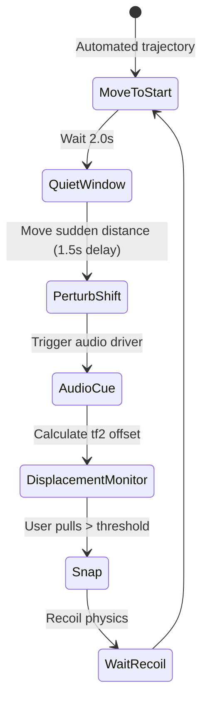

# Sinthlab kuka stack
## Steps on Kuka Arm
- Use the "Quick Start guide" to cable up the Arm, Cabinet and the SmartPad
- For the Safety on X11 interface in the Cabinet:
  - We first create 6 Jumper cables witht he provided Pins.
  - Based on the PIN diagram as elaborated in pg-53 of Spez_KUKA_Sunrise_Cabinet_en.pdf (section 6.6.2), we jump pins 1/2, 10/11 (external E-Stop), 3/4, 12/13 (Operator Safety) and 5/6, 14/15 (Safety stop 1).

## Setting up the Windows laptop
**Context Note** : As KUKA ARM software requires Windows while our stack requires Ubuntu, we will use Windows laptop as the machine to directly install applications on the Robot and then install our stack on WSL to then control the Arm.
### Prerequisite
- Please install Ubuntu 24.04 using command `wsl --install -d Ubuntu-24.04` (Note the version is important. please do not install anything default)
- Make sure you are on wsl version 2 (running wsl -l -v should show wsl version and ubuntu name installed).
- Make sure the robot controller box is on
- Install `Sunrise Workbench` on the Laptop. Note that for our Arm version, we have SunriseWorkbench-1.17.0.4-setup.exe made available to us by Kuka Support.
- Install FRI plugin on the sunrise workbench project (steps to be elaborated).

### Connection verification
- Connect your computer to the robot controller at X66 (default IP: 172.31.1.147) via an ethernet cable.
- Configure the same network on your computer, therefore, set your IP to 172.31.1.148 (or anything else in /16 subnet).
    - To do this on windows, go to settings -> Network & Internet -> Ethernet and then edit the IPv4 for manual setup setup to have IP as 172.21.1.148 and gateway as 255.255.0.0 ; leave other options as is and save.
- Try ping the robot `ping 172.31.1.147` from powershell, expect something like:
  ```
  PING 172.31.1.147 (172.31.1.147) 56(84) bytes of data.
  64 bytes from 172.31.1.147: icmp_seq=1 ttl=64 time=0.868 ms
  ```
- Enable hyper-v on the laptop
- Now we also would need to setup networking for the WSL2. For this, go to WSL setting (should be in start menu) and change the Networking mode to Mirrored
  
- Run the following command in PowerShell window with admin privileges to Configure Hyper-V firewall settings to allow inbound connections:
`Set-NetFirewallHyperVVMSetting -Name '{40E0AC32-46A5-438A-A0B2-2B479E8F2E90}' -DefaultInboundAction Allow`

### Install application to robot
Follow [these](https://lbr-stack.readthedocs.io/en/latest/lbr_fri_ros2_stack/lbr_fri_ros2_stack/doc/hardware_setup.html#install-applications-to-the-robot) steps to install application to the robot

## Setting up the Stack
*Note*: These steps are meant to be run on Ubuntu 24.04. 
- Install ROS 2 development tools. Refer this [link](https://docs.ros.org/en/jazzy/Installation/Ubuntu-Install-Debs.html) to understand details of steps.
  
  ```
  sudo apt update && sudo apt install locales
  sudo locale-gen en_US en_US.UTF-8
  sudo update-locale LC_ALL=en_US.UTF-8 LANG=en_US.UTF-8
  export LANG=en_US.UTF-8
  sudo apt install software-properties-common
  sudo add-apt-repository universe
  sudo apt update && sudo apt install curl -y
  export ROS_APT_SOURCE_VERSION=$(curl -s https://api.github.com/repos/ros-infrastructure/ros-apt-source/releases/latest | grep -F "tag_name" | awk -F'"' '{print $4}')
  curl -L -o /tmp/ros2-apt-source.deb "https://github.com/ros-infrastructure/ros-apt-source/releases/download/${ROS_APT_SOURCE_VERSION}/ros2-apt-source_${ROS_APT_SOURCE_VERSION}.$(. /etc/os-release && echo ${UBUNTU_CODENAME:-${VERSION_CODENAME}})_all.deb"
  sudo dpkg -i /tmp/ros2-apt-source.deb
  sudo apt update && sudo apt install ros-dev-tools
  sudo apt update
  sudo apt upgrade
  sudo apt install ros-jazzy-desktop
  sudo apt install python3-pip
  ```
  
- Create a workspace, clone, and install dependencies
  ```
  source /opt/ros/jazzy/setup.bash
  mkdir -p lbr-stack/src && cd lbr-stack
  vcs import src --input https://raw.githubusercontent.com/sinthlab/sinthlab-kuka-stack/main/sinthlab_lbr_stack.repos
  rosdep install --from-paths src -i -r -y
  ```
- Install required python package
  ```
  pip install pyoptas ruckig --break-system-packages
  ``` 
- Build
  ```
  colcon build --symlink-install
  ```

## Visualizing mock setup on rviz
- In terminal 1, launch a mock setup via
```
source install/setup.bash
ros2 launch sinthlab_bringup iiwa7_mock_apple.launch.py
```

- In terminal 2, visualize setup via
```
source install/setup.bash
ros2 launch lbr_bringup rviz.launch.py \
  rviz_cfg_pkg:=lbr_bringup \
  rviz_cfg:=config/mock.rviz
```

## Running Physics Simulation via Gazebo
```
source install/setup.bash
ros2 launch sinthlab_bringup iiwa7_gazebo_apple.launch.py
```

## MoveIt with apple (mock or gazebo)
```
source install/setup.bash
# Mock + MoveIt + RViz
ros2 launch sinthlab_bringup iiwa7_moveit_apple.launch.py mode:=mock rviz:=true

# Gazebo + MoveIt + RViz
ros2 launch sinthlab_bringup iiwa7_moveit_apple.launch.py mode:=gazebo rviz:=true
```
## Running Experimental Scenarios on Hardware
Note that there are python dependencies (`pyoptas`, `ruckig`) to be installed. This step needs to be run only once, after you launch wsl.

### 1. Apple Pluck Impedance Scenario
This scenario streams a target equilibrium pose to the `kuka_clik_controller` (IK-based position control), while the KUKA cabinet runs Cartesian impedance natively via the `LbrImpedanceControlServer` FRI app. The arm acts as a virtual physical spring and recoils when pushed off its commanded Cartesian anchor. 

**Steps to run:**
1. Check the `update_rate` in `lbr-stack/src/lbr_fri_ros2_stack/lbr_description/ros2_control/lbr_controllers.yaml` is set to `200`.
2. Run the launch file:
```bash
ros2 launch sinthlab_bringup iiwa7_apple_pluck_impedance_control.launch.py
```
3. On the KUKA Smartpad, launch the `LbrImpedanceControlServer` application (FRI send period: 10 ms).
4. The arm moves to the start. Wait for the beep, then pull the end effector gently to trigger the 0.2m displacement threshold. A second beep plays, and the arm awaits physical recoil before restarting.

### 2. Move Restricted on a Plane Scenario
This scenario utilizes the `kuka_clik_controller`, an exact-tracking inverse-kinematics (IK) solver with no built-in spring physics. The Python action scripts construct an instantaneous admittance engine to apply mathematical virtual fixtures (like sine waves, flat planes, bounding boxes) against user pushing torques.

**Steps to run:**
```bash
ros2 launch sinthlab_bringup iiwa7_move_restricted_plane.launch.py
```
3. On the KUKA Smartpad, launch the `LBRServer` application (FRI send period: 10 ms, mode: POSITION_CONTROL).

*Note: Ensure you tweak `virtual_fixtures_params.yaml` to set your desired `virtual_fixture_profile` (sine_wave, flat_table, etc).*

### 3. Apple Pluck Perturb Scenario
This scenario builds upon the Apple Pluck physics (cabinet-side Cartesian impedance via `LbrImpedanceControlServer`, with `kuka_clik_controller` streaming the equilibrium pose) but introduces a sudden, programmatic Cartesian spatial shift right before the user acts, studying response to mechanical perturbation.

**Steps to run:**
1. Check the `update_rate` in `lbr-stack/src/lbr_fri_ros2_stack/lbr_description/ros2_control/lbr_controllers.yaml` is set to `200`.
2. Run the launch file:
```bash
ros2 launch sinthlab_bringup iiwa7_apple_pluck_impedance_perturb.launch.py
```
3. On the KUKA Smartpad, launch the `LbrImpedanceControlServer` application (FRI send period: 10 ms).
4. The arm acts exactly as the standard pluck, but automatically jerks to the side approximately 1.5 seconds prior to the readiness cue.

---

## Software Architecture
The robotics stack abstracts hard real-time physical loops from high-level orchestration, ensuring that state transitions Python do not compromise 1000Hz hardware limits.

### 1. Hardware / Real-Time Layer (C++)
- **Cabinet-side Cartesian impedance (`LbrImpedanceControlServer`)**: The KUKA cabinet runs the Cartesian-impedance virtual spring at 1000Hz; ROS only streams the equilibrium pose to it.
- **`kuka_clik_controller` (IDRA Lab)**: Pure Closed-Loop Inverse Kinematics tracker without physical elasticity, heavily used for precise constraint tracking.
- *Message interface*: Receives `geometry_msgs/PoseStamped` tracking points.

### 2. Kinematic Math Layer (Python)
- **`optas`**: Used dynamically inside the Python action servers for rapid Forward Kinematics (FK) and analytical Jacobian conversions. This prevents singular matrix crashes when reading Cartesian poses or applying force translations.

### 3. State Machine Orchestration (Python)
The experimental flows are entirely orchestrated by high-level `rclpy` Nodes calling modular actions (`MoveToPositionAction`, `CartesianImpedanceDisplacementMonitor`, `MoveRestrictedOnAPlaneAction`):

#### Fluctuation Flow: Apple Pluck 

```mermaid
stateDiagram-v2
    [*] --> MoveToStart : Automated trajectory
    MoveToStart --> QuietWindow : Wait 2.0s
    QuietWindow --> AudioCue : Trigger audio driver
    AudioCue --> DisplacementMonitor : Calculate tf2 offset
    DisplacementMonitor --> Snap : User pulls > 0.2m Z-axis
    Snap --> WaitRecoil : Wait for C++ spring to pull back
    WaitRecoil --> MoveToStart
```

#### Fluctuation Flow: Restricted Virtual Fixtures

```mermaid
stateDiagram-v2
    [*] --> MoveToStart : Rise to workspace
    MoveToStart --> QuietWindow : Wait 2.0s
    QuietWindow --> AudioCue
    AudioCue --> FixtureAdmittance
    note right of FixtureAdmittance
      Calculates pseudo-inverse Jacobian.
      Applies Moore-Penrose mapping from Tool Torque
      to Admittance Shifts on Mathematical Rails.
    end note
    FixtureAdmittance --> SnapThreshold : Pull thresholds broken
    SnapThreshold --> WaitRecoil
    WaitRecoil --> MoveToStart
```

#### Fluctuation Flow: Perturb Experiment 

```mermaid
stateDiagram-v2
    [*] --> MoveToStart : Automated trajectory
    MoveToStart --> QuietWindow : Wait 2.0s
    QuietWindow --> PerturbShift : Move sudden distance (1.5s delay)
    PerturbShift --> AudioCue : Trigger audio driver
    AudioCue --> DisplacementMonitor : Calculate tf2 offset
    DisplacementMonitor --> Snap : User pulls > threshold
    Snap --> WaitRecoil : Recoil physics
    WaitRecoil --> MoveToStart
```


## Troubleshoot 
- if your rviz window launches but is not displaying anything or gazebo window is crashing immediately, It might be because the graphics library trying to use the graphics card which might not be set. use command ` export LIBGL_ALWAYS_SOFTWARE=1` to first set the library to use CPU, and then run the commands to launch rviz/gazebo again.

## Development Environment
- The development strategy for this is to follow an Underlay-overlay structure. We are reusing the lbr_fri_ros2_stack (https://github.com/lbr-stack/lbr_fri_ros2_stack)[^1] and that in turn has ROS2 as underlay; So overall our codebase has classes and functions imported from the lbr_fri_ros2_stack repo.
- As mentioned in the steps, we install basic ros2 development tools and sinthlab_lbr_stack.repos file has the link to all the repos dependencies that we install.
- Once you setup the stack, within the src of the folder (which is ~/lbr-stack/src by default), you will see 4 different repos. We own and manage the sinthlab-kuka-stack; And hence we should only make changes in this folder
- Note that the git repo for sinthlab-kuka-stack is [here](https://github.com/sinthlab/sinthlab-kuka-stack).
  - This also means, if you want to add / make any changes to the repo, you need to create your own branch first and then a pull request on the github with your changes so that all of changes can be tracked and approved.
- If you are intending to use copilot (or any other AI assisted coding editor), I would strongly suggest to open the codebase from the root (which is ~/lbr-stack by default), as then the agent can use the whole codebase with dependencies for indexing and suggestions.

Maintainer (Navin Modi) Disclosure: For my development, I have used VSCode and Github Copilot agents for assisted development.

### Steps for testing
- Everytime you make changes, you need to rebuild the workspace from root (which is ~/lbr-stack by default) by running `rm -rf build/ install/ log/; colcon build --symlink-install`
- Now source the setup changes again `source install/setup.bash` and then launch whatever changes you want to test.

## Acknowledgement
Please note that this work has been built on top of Huber et al [^1] and hence all the original work credit for lbr_fri_ros2_Stack goes to that team.

[^1]: LBR-Stack: ROS 2 and Python Integration of KUKA FRI for Med and IIWA Robots, Journal of Open Source Software [doi](https://doi.org/10.21105/joss.06138)