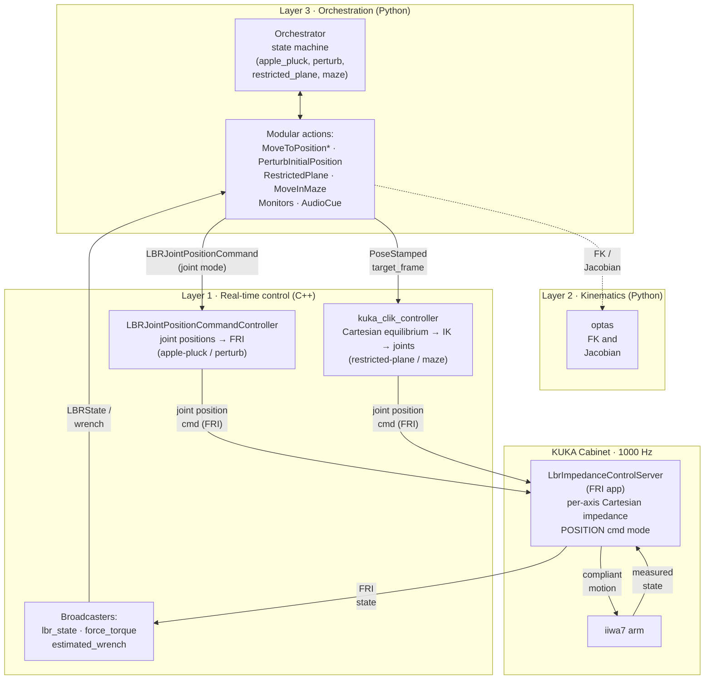
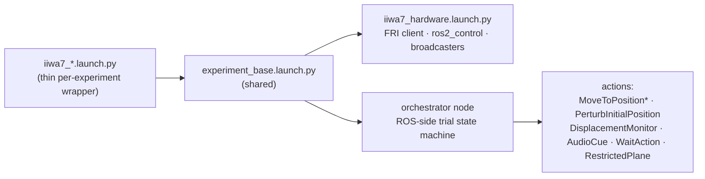
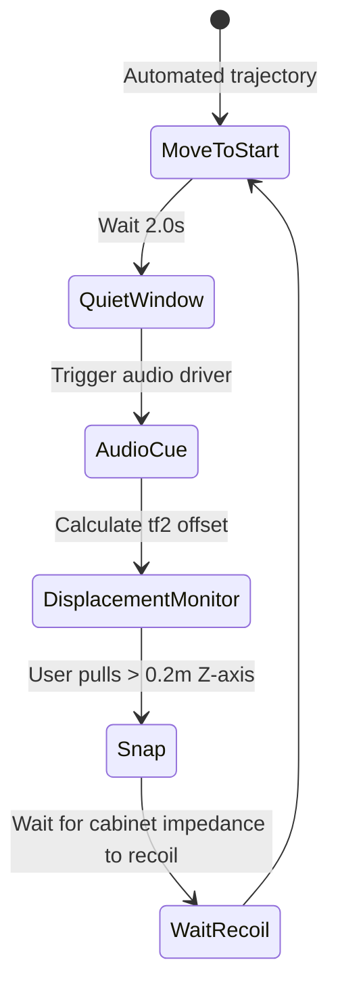
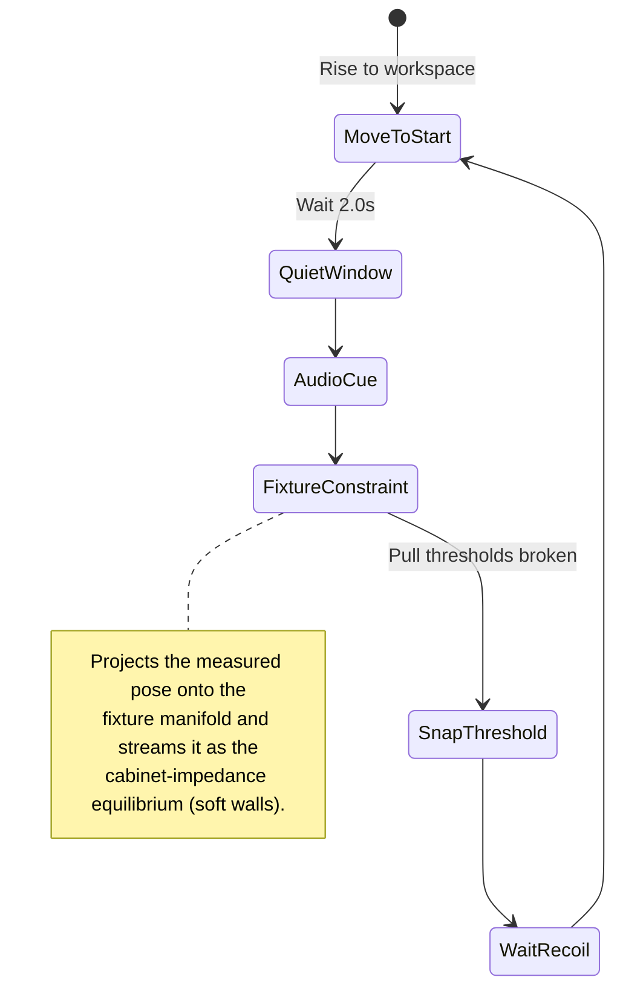
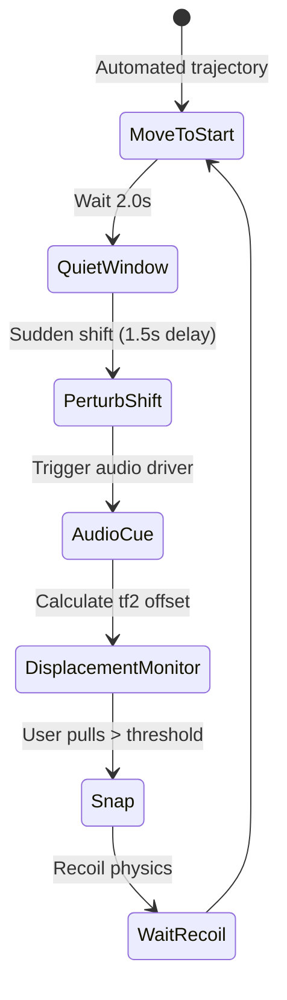

# Sinthlab KUKA Stack

A ROS 2 (Jazzy) control stack for running **compliant "apple‑pluck" experiments** on a KUKA
LBR iiwa7. It is built as an *overlay* on top of the [`lbr_fri_ros2_stack`][^1], adding the
high‑level experiment orchestration, motion actions, and the KUKA Sunrise (FRI) applications
needed to drive the arm.

All experiments run in FRI **position** mode, with the **cabinet** (`LbrImpedanceControlServer`)
providing the Cartesian spring at 1000 Hz. Apple-pluck / perturb stream **joint** setpoints via
`LBRJointPositionCommandController`; restricted-plane / maze stream a fixture-constrained **Cartesian
equilibrium** via `kuka_clik_controller`. Python state machines sequence each trial
(move → cue → monitor displacement → recoil → repeat).

The repo also carries the physical end of the rig: the parametric
[end‑effector design](end_effector_design/README.md) and the
[end‑effector board firmware](end_effector_metro_code/README.md) — a NeoPixel cue ring triggered
over a hardwired media‑flange line, whose **appearance is configured on the board over its own
Wi‑Fi**, see [§6.7](#67-end-effector-board--the-visual-cue).

Experiments can be run from the terminal or from the
[**experiment control dashboard**](experiment_ctrl_gui/README.md), a local web page. It covers:
picking an experiment, editing its parameters, Start / Stop / Restart / Pause, changing cues and
other live settings between trials, and following the status and log. See
[§5](#running-from-the-dashboard).

FRI **torque** mode (ROS-side impedance) was evaluated on hardware and **not adopted** — see the
[appendix](#appendix--fri-torque-mode-an-experiment-that-did-not-work-out) for what was learned and
the conditions under which it would be worth revisiting.

## Table of Contents
- [1. Hardware Setup (KUKA Arm)](#1-hardware-setup-kuka-arm)
- [2. Windows Laptop Setup](#2-windows-laptop-setup)
- [3. Building the Stack](#3-building-the-stack)
- [4. Simulation & Visualization (no hardware)](#4-simulation--visualization-no-hardware)
- [5. Running Experiments on Hardware](#5-running-experiments-on-hardware)
- [6. Software Architecture](#6-software-architecture)
- [7. Data Collected](#7-data-collected)
- [8. Troubleshooting](#8-troubleshooting)
- [9. Development & Contributing](#9-development--contributing)
- [Acknowledgement](#acknowledgement)
- [Appendix — FRI torque mode (not adopted)](#appendix--fri-torque-mode-an-experiment-that-did-not-work-out)

---

## 1. Hardware Setup (KUKA Arm)
- Use the "Quick Start guide" to cable up the Arm, Cabinet and the SmartPad.
- For the Safety on the X11 interface in the Cabinet:
  - First create 6 jumper cables with the provided pins.
  - Based on the PIN diagram (pg‑53 of `Spez_KUKA_Sunrise_Cabinet_en.pdf`, section 6.6.2),
    jump pins 1/2, 10/11 (external E‑Stop), 3/4, 12/13 (Operator Safety) and 5/6, 14/15
    (Safety stop 1).

---

## 2. Windows Laptop Setup
> **Why Windows + WSL2?** KUKA's robot software (Sunrise Workbench) requires Windows, while our
> stack requires Ubuntu. We use the Windows laptop to install applications onto the robot, and
> run our stack inside WSL2 (Ubuntu) on the same laptop to control the arm.

### Prerequisites
- Install Ubuntu 24.04 with `wsl --install -d Ubuntu-24.04` (the version matters — do **not**
  install the default).
- Confirm you are on WSL version 2 (`wsl -l -v` shows the version and the installed distro).
- Make sure the robot controller box is on.
- Install `Sunrise Workbench` on the laptop. For our arm version we use
  `SunriseWorkbench-1.17.0.4-setup.exe`, provided by KUKA Support.
- Install the FRI plugin in the Sunrise Workbench project (steps to be elaborated).

### Connection Verification
- Connect your computer to the robot controller at **X66** (default IP `172.31.1.147`) via an
  ethernet cable.
- Put your computer on the same network — set your IP to `172.31.1.148` (or anything else in the
  `/16` subnet).
  - On Windows: Settings → Network & Internet → Ethernet, edit the IPv4 manual setup to IP
    `172.31.1.148` and gateway `255.255.0.0`; leave other options as is and save.
- Ping the robot from PowerShell — `ping 172.31.1.147` — and expect something like:
  ```
  PING 172.31.1.147 (172.31.1.147) 56(84) bytes of data.
  64 bytes from 172.31.1.147: icmp_seq=1 ttl=64 time=0.868 ms
  ```
- Enable Hyper‑V on the laptop.
- Set up networking for WSL2: open WSL settings (in the Start menu) and change the Networking
  mode to **Mirrored**.
  
- In a PowerShell window **with admin privileges**, allow inbound Hyper‑V connections:
  ```powershell
  Set-NetFirewallHyperVVMSetting -Name '{40E0AC32-46A5-438A-A0B2-2B479E8F2E90}' -DefaultInboundAction Allow
  ```

### Install Application to Robot
Follow [these steps](https://lbr-stack.readthedocs.io/en/latest/lbr_fri_ros2_stack/lbr_fri_ros2_stack/doc/hardware_setup.html#install-applications-to-the-robot)
to install the application to the robot.

### Tool Load Data (payload calibration)
The cabinet must know the end‑effector's mass, or the compliant control modes (Cartesian / joint
impedance) refuse to activate. With an uncalibrated tool the experiment launch aborts with:
```
[lbr_fri_ros2::StateGuard]: External torque not in limits for joint lbr_A2. Measured: 2.4 Nm, limit: 2 Nm
... External torque limits exceeded. Perform load data calibration!
```
You define a **tool** in Sunrise Workbench, then let the controller measure its mass and centre of
mass with the smartPAD's **Load data** view (Sunrise.OS 1.16 SI manual §7.5; ours is 1.17).

1. **Define the tool** in Sunrise Workbench — open the project's `RoboticsAPI.data.xml` and add a
   tool under `objectTemplates`. Keep the TCP at the flange (all‑zero transform) so the FRI control
   point stays aligned with the ROS `lbr_link_ee`, and leave `loadData` at zero (Determine fills it):
   ```xml
   <objectTemplates>
     <toolTemplate class="" defaultMotionFrameRef="/SinthLabIiwa7EE_link_ee" name="SinthLabIiwa7EE">
       <frames>
         <frame name="SinthLabIiwa7EE_link_ee">
           <transformation a="0.0" b="0.0" c="0.0" x="0.0" y="0.0" z="0.0"/>
         </frame>
       </frames>
       <loadData cogA="0.0" cogB="0.0" cogC="0.0" cogX="0.0" cogY="0.0" cogZ="0.0"
                 inertiaX="0.0" inertiaY="0.0" inertiaZ="0.0" mass="0.0"/>
     </toolTemplate>
   </objectTemplates>
   ```
   `defaultMotionFrameRef` must match the frame name exactly. **Synchronize** the project to the controller.
2. **Determine the load** on the smartPAD, in **T1**: at the **Robot** level select the **Load data**
   tile → pick `SinthLabIiwa7EE` → hold the enabling switch → **Determining the load data** →
   **Apply**. Then **synchronize** the project so Sunrise Workbench keeps the values.
   - Only the wrist moves: A7 goes to 0° then to −90°, and A6 swings ±95° (A1–A4 stay put). Tick
     **Restricted motion range for axis 6** (±15° around the start) if the effector could hit the arm.
   - Start from a pose well away from singularities, and make sure nothing on the tool can move: tie
     down cables and any battery pack. Loose parts, or anyone touching the robot, falsify the result.
   - **Below 1 kg KUKA calls the mass measurement unreliable.** Weigh the effector, enter the mass in
     the tool's `loadData`, synchronize, then choose **Use existing mass** so only the centre of mass
     is measured.
3. **Attach the tool in the FRI app** so the cabinet actually compensates it: in
   `sunrise_controller_code/LbrImpedanceControlServer.java`, create the tool
   (`createFromTemplate("SinthLabIiwa7EE")`), `attachTo(lbr_.getFlange())`, and move the **tool**
   instead of the bare flange. Without this the guard still trips even after Determine.

> **Apply** stores the mass / COM on the controller; synchronizing copies them back into the project's
> `RoboticsAPI.data.xml`. Re‑run after any change to the end‑effector — a different apple height or a
> moved battery pack counts. The `gravitation` vector in `RoboticsAPI.data.xml` assumes a standard floor mount;
> set it to match if the arm is mounted otherwise.

---

## 3. Building the Stack
> These steps run inside **WSL2 / Ubuntu 24.04**.

1. Install ROS 2 development tools (see this [guide](https://docs.ros.org/en/jazzy/Installation/Ubuntu-Install-Debs.html) for details):
   ```bash
   sudo apt update && sudo apt install locales
   sudo locale-gen en_US en_US.UTF-8
   sudo update-locale LC_ALL=en_US.UTF-8 LANG=en_US.UTF-8
   export LANG=en_US.UTF-8
   sudo apt install software-properties-common
   sudo add-apt-repository universe
   sudo apt update && sudo apt install curl -y
   export ROS_APT_SOURCE_VERSION=$(curl -s https://api.github.com/repos/ros-infrastructure/ros-apt-source/releases/latest | grep -F "tag_name" | awk -F'"' '{print $4}')
   curl -L -o /tmp/ros2-apt-source.deb "https://github.com/ros-infrastructure/ros-apt-source/releases/download/${ROS_APT_SOURCE_VERSION}/ros2-apt-source_${ROS_APT_SOURCE_VERSION}.$(. /etc/os-release && echo ${UBUNTU_CODENAME:-${VERSION_CODENAME}})_all.deb"
   sudo dpkg -i /tmp/ros2-apt-source.deb
   sudo apt update && sudo apt install ros-dev-tools
   sudo apt update
   sudo apt upgrade
   sudo apt install ros-jazzy-desktop
   sudo apt install python3-pip
   ```
2. Create a workspace, clone, and install dependencies:
   ```bash
   source /opt/ros/jazzy/setup.bash
   mkdir -p lbr-stack/src && cd lbr-stack
   vcs import src --input https://raw.githubusercontent.com/sinthlab/sinthlab-kuka-stack/main/sinthlab_lbr_stack.repos
   rosdep install --from-paths src -i -r -y
   ```
3. **(Hardware only, one-time)** Raise the FRI external-torque limit. A recent `lbr_fri_ros2` update
   added a safety check on the *external joint torque at activation of compliant control modes*. On a
   floor-mounted iiwa7 this trips (~2.4 Nm on A2 vs. the 2 Nm default) at the extended apple-pluck
   start posture **even with no payload** — it's a gravity-model / mastering margin amplified by A2's
   moment, not a real load. Edit the upstream config
   `src/lbr_fri_ros2_stack/lbr_description/ros2_control/lbr_system_config.yaml` and raise the limit
   (keep the check enabled):
   ```yaml
   state_guard:
     external_torque_safety_check: true
     external_torque_limit: 4.0   # raised from the default 2.0
   ```
   Skip this for mock/sim. The proper long-term fix is calibrating the mounted tool's load data (see
   §2 “Tool Load Data”) so the residual stays under the default — raising the limit is the stopgap
   while the flange is load-free.
4. Install the required Python packages (only needed once per WSL session install):
   ```bash
   pip install pyoptas ruckig --break-system-packages
   ```
5. Build:
   ```bash
   colcon build --symlink-install
   ```

---

## 4. Simulation & Visualization (no hardware)

**Mock setup in RViz**
```bash
# Terminal 1 — launch the mock setup
source install/setup.bash
ros2 launch sinthlab_bringup iiwa7_mock_apple.launch.py
```
```bash
# Terminal 2 — visualize
source install/setup.bash
ros2 launch lbr_bringup rviz.launch.py \
  rviz_cfg_pkg:=lbr_bringup \
  rviz_cfg:=config/mock.rviz
```

**Physics simulation in Gazebo**
```bash
source install/setup.bash
ros2 launch sinthlab_bringup iiwa7_gazebo_apple.launch.py
```

**MoveIt with apple (mock or gazebo)**
```bash
source install/setup.bash

# Mock + MoveIt + RViz
ros2 launch sinthlab_bringup iiwa7_moveit_apple.launch.py mode:=mock rviz:=true

# Gazebo + MoveIt + RViz
ros2 launch sinthlab_bringup iiwa7_moveit_apple.launch.py mode:=gazebo rviz:=true
```

---

## 5. Running Experiments on Hardware
> Python dependencies (`pyoptas`, `ruckig`) must be installed once per WSL session install (see
> [Building the Stack](#3-building-the-stack)).
>
> ⚠️ **Safety first.** On the first run of any scenario, operate in **T1** (reduced speed) with a
> hand on the E‑stop. The arm is actively controlled the moment a SmartPad application is running.

### Running from the dashboard
The [experiment control dashboard](experiment_ctrl_gui/README.md) runs the same launches as the
commands below, with the parameters and status on one page:

```bash
~/lbr-stack/src/sinthlab-kuka-stack/experiment_ctrl_gui/run_gui.sh     # then open http://localhost:8080
python3 ~/lbr-stack/src/sinthlab-kuka-stack/experiment_ctrl_gui/server.py --demo   # try it without the robot
```

1. Pick the experiment. Follow its **Before you start** checklist for the SmartPad selections.
2. Review the parameters. **Live** ones can also change while it runs. **Per-run** ones cover
   everything else in the experiment YAML, including the start/recover poses and the maze geometry.
   They are editable now and locked for the run once started. Start and recover are edited together.
   For Restricted Plane and Maze the CLIK redundancy posture follows an edited start pose. **Fixed**
   (read-only) is only what is not in the experiment YAML: the SmartPad / FRI selections, launch
   arguments and controller configuration.
3. **▶ Start** within the ~60 s the SmartPad app waits for ROS. Then watch the trial phase, the
   event list and the log.
4. While it runs, change live settings (cues on/off, colours, tones, quiet window, NSP sync,
   threshold, perturbation, maze timeout). **They apply from the next trial**, never mid-trial, and
   each trial's sidecar records the values it used.
5. **⏸ Pause after trial** holds the arm at the start between trials. **■ Stop after trial** ends
   cleanly with every trial complete. **■ Stop now** is Ctrl-C; the trial in progress is saved as
   `partial`. **↻ Restart** does Stop now and then Start again.

Stop is Ctrl-C to the launch, **not an emergency stop** — the SmartPad E-stop is. The dashboard never
edits the package YAMLs: per-run edits go into a copy passed as the launch's `params_file` argument,
which every experiment launch now accepts (`ros2 launch … params_file:=/path/to.yaml`). The maze and
restricted-plane launches also accept `clik_nullspace_cfg:=` (a path under the package, or an
absolute path).

The same controls from a terminal, e.g. for apple pluck:
```bash
ros2 topic echo /lbr/experiment_status                                          # where the run is
ros2 param set /lbr/apple_pluck_orchestrator visual_cue.enabled false            # live: next trial
ros2 service call /lbr/apple_pluck_orchestrator/pause std_srvs/srv/SetBool "{data: true}"
```
A `ros2 param set` on anything that is not live is **rejected with the reason**. Before this, it was
silently accepted and had no effect, because orchestrators read their parameters once at start-up.
The list of live parameters is in
[`helpers/live_params.py`](sinthlab_bringup/sinthlab_bringup/helpers/live_params.py).

### Scenario quick reference
| # | Scenario | Launch file | SmartPad app (FRI) | ROS controller |
|---|----------|-------------|--------------------|----------------|
| 1 | Apple Pluck          | `iiwa7_apple_pluck_impedance_control.launch.py` | `LbrImpedanceControlServer` | `LBRJointPositionCommandController` |
| 2 | Restricted on Plane  | `iiwa7_move_restricted_plane.launch.py`         | `LbrImpedanceControlServer` | `kuka_clik_controller` |
| 3 | Apple Pluck Perturb  | `iiwa7_apple_pluck_impedance_perturb.launch.py` | `LbrImpedanceControlServer` | `LBRJointPositionCommandController` |
| 4 | Maze                 | `iiwa7_maze.launch.py`                          | `LbrImpedanceControlServer` | `kuka_clik_controller` |

**One control paradigm.** Every scenario uses FRI **POSITION** command mode with the **cabinet**
(`LbrImpedanceControlServer`) running the Cartesian impedance spring at 1000 Hz. They differ only in
what ROS streams into it:

- **Apple Pluck / Perturb (1 & 3)** — **joint** setpoints via `LBRJointPositionCommandController`
  (straight to the FRI position command, no IK).
- **Restricted-plane / Maze (2 & 4)** — a fixture-constrained **Cartesian equilibrium** via
  `kuka_clik_controller` (Cartesian target → IK → joint positions).

> **The two things that decide how a fixture feels** — both were long mis-set, and both are now
> configured correctly:
>
> 1. **Soft-inside comes from tracking, not from low stiffness.** Inside the allowed region the
>    fixture's projection returns the *measured* pose, so the spring error — and hence the force — is
>    ~zero **whatever K is**. High K only bites at the walls and on locked axes. What breaks this is
>    **tracking lag**: if the commanded equilibrium cannot keep up with the operator's hand it falls
>    behind *cumulatively* and `K × error` is felt as resistance in every direction. That is governed
>    by `kuka_clik_controller.max_linear_velocity` (now **1.0 m/s**, well above hand-guiding speed) and
>    the fixture's `max_target_step_m` (now **0.05 m**).
> 2. **Use an anisotropic stiffness profile.** `LbrImpedanceControlServer` takes a full per-axis
>    `{X,Y,Z,A,B,C}` diagonal. A *uniform* profile forces one compromise for locked axes, walls and
>    free motion alike — which is why the maze failed at every uniform value (400 = mushy walls,
>    3000 = heavy everywhere). Lock the constrained axis hard and keep the free axes firm enough for
>    walls; the interior stays free by (1).

### Scenario 1 — Apple Pluck
This scenario streams **joint** setpoints to the `LBRJointPositionCommandController` (joint positions
go straight to the FRI position command — no IK), while the KUKA cabinet runs Cartesian impedance
natively via the `LbrImpedanceControlServer` FRI app. The arm acts as a virtual physical spring and
recoils when pushed off its commanded anchor.

**Start pose — the apple points at the monkey.** The effector is tilted **25° below horizontal** toward
the monkey (+X), so the monkey pulls the apple toward itself and the NeoPixel ring faces it. Flange
≈ (0.40, 0, 0.75) m, apple ≈ (0.56, 0, 0.68) m in `lbr_link_0`, reached with the in-plane posture
`[0, −15.5, 0, −94.3, 0, 36.2, 0]`. It was solved by IK against the iiwa7 URDF, and the arm can be
pulled at least 0.30 m toward the monkey before nearing a joint limit or singularity. A **pluck** is any
**0.1 m** pull from the start, in any direction (`cartesian_axis: norm`), because the pull is toward
the monkey rather than along one base axis. Tilt, roll and height knobs are documented next to the
pose in `config/apple_pluck_impedance.yaml`.

**Steps to run:**
1. Check that `update_rate` in
   `lbr-stack/src/lbr_fri_ros2_stack/lbr_description/ros2_control/lbr_controllers.yaml` is set to `200`.
2. On the KUKA SmartPad, start the **`LbrImpedanceControlServer`** application. It opens four
   selection dialogs in sequence — choose:

   | Prompt | Select |
   |--------|--------|
   | FRI send period [ms] | `10` |
   | Remote IP address | `172.31.1.148` (your ROS / WSL2 laptop IP) |
   | Cartesian stiffness (K diagonal) | `Uniform Medium (Apple Pluck)` |
   | Damping ratio (D0) | `0.7 (Standard)` |

   *This app is hard‑wired to Cartesian Impedance control in `POSITION` command mode. The other
   stiffness profiles (`Very Soft Z`, `Soft Z (Apple Pluck)`, `Stiff Cartesian`) and damping ratios
   (`0.3 (Underdamped)`, `1.0 (Critically Damped)`) are available if you want to change the feel.*
   The app then waits (~60 s) for the ROS client to connect.
3. **Launch the experiment** — this connects ROS to the waiting FRI app and starts the trial loop
   (nothing happens until you run this):
   ```bash
   ros2 launch sinthlab_bringup iiwa7_apple_pluck_impedance_control.launch.py
   ```
4. The arm moves to the start. At the beep (and a **green** ring, if the visual cue is on) pull the
   apple toward you; **0.1 m** in any direction counts. A second beep and a **red** ring confirm it,
   the arm holds for a moment, then returns to the start.

### Scenario 2 — Move Restricted on a Plane
This scenario applies mathematical **virtual fixtures** (planes, boxes, cylinders, sine rails): the
arm moves freely *within* an allowed region and is pushed back *outside* it. `kuka_clik_controller`
streams a **fixture-constrained equilibrium** pose (the measured pose projected onto the allowed
manifold) and the cabinet's Cartesian impedance turns that into the free-motion + wall feel at 1000 Hz.
Along a free axis the equilibrium tracks the arm, so the spring error — and the force — is ~zero; off
the manifold it stays put, so the spring pulls the arm back.

**Steps to run:**
1. On the KUKA SmartPad, start the **`LbrImpedanceControlServer`** application. It opens four dialogs:

   | Prompt | Select |
   |--------|--------|
   | FRI send period [ms] | `10` |
   | Remote IP address | `172.31.1.148` (your ROS / WSL2 laptop IP) |
   | Cartesian stiffness (K diagonal) | **`Rail guide (uniform 1000)`** |
   | Damping ratio (D0) | `0.7 (Standard)` |

   The app then waits (~60 s) for the ROS client to connect.
2. **Launch the experiment** — this connects ROS to the waiting FRI app and starts it:
   ```bash
   ros2 launch sinthlab_bringup iiwa7_move_restricted_plane.launch.py
   ```
3. The arm rises to the workspace; pull it and feel it held onto the sine rail — free along the pull
   axis, walled in the other two.

> **Tune the feel with the SmartPad stiffness profile.** `Rail guide (uniform 1000)` pins X and holds
> the arm to the rail in Y, while Z (the pull axis) stays free because the equilibrium tracks it. If
> the pull feels heavy *while moving* rather than at the rail, that is tracking lag, not stiffness —
> raise `kuka_clik_controller.max_linear_velocity`.
>
> **Tip:** Set `virtual_fixture_profile` (`sine_wave`, `flat_table`, …) in
> `virtual_fixtures_params.yaml` — this defines *where* the fixture is. For the sine rail, size the
> **wavelength against the pull stroke** — below ~1 period over the stroke it reads as a straight lean.

#### How this relates to Apple Pluck — same cabinet compliance, different ROS controller
Both run the **same cabinet Cartesian impedance at 1000 Hz**; they differ in what ROS streams:

| | Apple Pluck (1 & 3) | Restricted Plane / Maze (2 & 4) |
|---|---|---|
| SmartPad app | `LbrImpedanceControlServer` | `LbrImpedanceControlServer` |
| Compliance | **cabinet** Cartesian impedance, 1000 Hz | **cabinet** Cartesian impedance, 1000 Hz |
| ROS controller | `LBRJointPositionCommandController` | `kuka_clik_controller` |
| ROS streams | **joint** positions (the start config) | a **Cartesian** pose projected onto the fixture manifold |
| Stiffness profile | uniform (omnidirectional spring) | **anisotropic** (lock one axis, firm walls on the others) |
| Feel | omnidirectional spring toward one pose | free within the fixture; firm wall outside it |

So the cabinet — not Python — supplies the give: the arm yields to a sudden jerk at 1 kHz, and the
"walls" are **soft impedance walls** (the arm is gently pulled back onto the manifold), which is the
safer behaviour for an animal subject. The software (`MoveRestrictedOnAPlaneAction`) just keeps the
spring's equilibrium inside the allowed region.

### Scenario 3 — Apple Pluck Perturb
This scenario builds upon the Apple Pluck physics (cabinet‑side Cartesian impedance via
`LbrImpedanceControlServer`, with `LBRJointPositionCommandController` streaming the joint setpoints) but
introduces a sudden, programmatic Cartesian spatial shift right before the user acts, to study the
response to mechanical perturbation.

It uses the **same start pose** as Apple Pluck (apple pointing at the monkey). The pluck threshold is
**0.1 m** in any direction (the same as Apple Pluck), measured from where the arm settles after the
perturbation.

**Tuning the perturbation** — `perturb_start` in `config/apple_pluck_impedance_perturb.yaml`:

| Knob | Effect |
|---|---|
| `polar_r_m` | How far the apple is displaced [m]. Default `0.05`. |
| `polar_plane` | `frontal` (default) — the plane **facing the monkey**, so the apple never moves toward or away from it. `horizontal` / `sagittal` — θ = 0 points **at** the monkey. |
| `polar_theta_deg` | Direction in that plane. For `frontal`: `0` = +Y (sideways), `90` = up, `180` = −Y, `270` = down. |
| `move_to_pos_a_max`, `move_to_pos_j_max` | **How fast.** On a short move the acceleration and jerk limits set the duration. |
| `move_to_pos_v_max` | Per-joint speed cap. It never binds on a 5–10 cm perturbation. |
| `start_delay_sec` | Wait after the start cue before the perturbation begins [s]. Default `1.5`. |

Measured from the start pose at r = 0.05 m (motion of the impedance anchor):

| `a_max` / `j_max` | Duration | Peak apple speed |
|---|---|---|
| 2 / 5 *(default)* | 0.73 s | 0.13 m/s |
| 5 / 20 | 0.46 s | 0.20 m/s |
| 10 / 50 | 0.34 s | 0.28 m/s |
| 20 / 150 | 0.23 s | 0.40 m/s |

The physical apple follows the anchor through the impedance spring, so it lags a very fast perturbation.

**Steps to run:**
1. Check that `update_rate` in
   `lbr-stack/src/lbr_fri_ros2_stack/lbr_description/ros2_control/lbr_controllers.yaml` is set to `200`.
2. On the KUKA SmartPad, start the **`LbrImpedanceControlServer`** application with the **same four
   selections as Scenario 1**:

   | Prompt | Select |
   |--------|--------|
   | FRI send period [ms] | `10` |
   | Remote IP address | `172.31.1.148` (your ROS / WSL2 laptop IP) |
   | Cartesian stiffness (K diagonal) | `Uniform Medium (Apple Pluck)` |
   | Damping ratio (D0) | `0.7 (Standard)` |

   The app then waits (~60 s) for the ROS client to connect.
3. **Launch the experiment** — this connects ROS to the waiting FRI app and starts it:
   ```bash
   ros2 launch sinthlab_bringup iiwa7_apple_pluck_impedance_perturb.launch.py
   ```
4. The arm acts as the standard pluck, but **1.5 s after the start cue** (`start_delay_sec`) it moves
   the apple **5 cm sideways** in the plane facing the monkey. Pull from where it settles: **0.1 m** in
   any direction counts.

### Scenario 4 — Maze
The operator (or animal) drives the compliant arm along a network of **linear rails** in a **vertical
Y‑Z plane** in front of the robot. It reuses the same fixture engine as Scenario 2
(`MoveRestrictedOnAPlaneAction` with the `maze` profile). Hitting a checkpoint plays a reward cue
(**any order, once each**); reaching the goal — or timing out — stops the fixtures, waits for the
operator to let go, and resets to the start.

**The legs are LINES, not corridors.** Each "corridor" in `maze_params.yaml` is a *degenerate*
rectangle — a horizontal leg has `b_min == b_max`, a vertical leg has `a_min == a_max` — so the fixture
always projects the equilibrium onto the **nearest segment**, exactly like the sine rail. You slide
*along* a rail and can only turn at a junction; there is no free area to wander in.

**Why vertical, and why this start posture.** The tool axis (the EE frame's **Z** axis) points ~+X at
the subject, and the maze locks base‑X so the plane is enforced by the cabinet. The start posture
matters more than it looks: both fixtures **lock orientation**, and translating the EE while holding
orientation is far more expensive in some arm configurations than others. The shipped start reaches the
same EE pose as an earlier one but with the **elbow flipped**, which cut the cost of sideways motion
from ‖q̇‖ ≈ 19.8 to ≈ 2.5 (6D condition number 45 → 10). Before that change the maze felt like treacle
in exactly the directions it was supposed to be free.

**Workspace limits (measured by IK, holding tool orientation).** From the shipped start the arm can
reach **a ∈ [−0.40, +0.40] m** sideways and **b ∈ [−0.35, +0.20] m** up/down — but that envelope is a
**trapezoid**: full width low down, pinched at the top (at b = +0.20 only a ∈ ±0.10).

**Why the maze sits entirely at or below the start.** Climbing is hard on this arm for two independent
reasons, both measured:

| | sideways cost | vertical cost | gravity at the tool |
|---|---|---|---|
| low (b = −0.15) | 2.8 | **3.4** | −5.3 N |
| high (b = +0.15) | 3.4 | **8.6** | −5.4 N |

1. The gravity-compensation residual is a constant **~5.5 N downward**, so climbing fights it and
   descending is assisted.
2. **Vertical conditioning degrades with height** — the cost of vertical motion with orientation held
   is 3.4 low down but **8.6** near the top, 2.5× the sideways cost there.

An earlier layout put the goal *above* the start, and its two climbing legs were reported as markedly
harder to pull than anything else in the maze. Moving the whole maze below the start (rows at
b = 0, −0.11, −0.33) cuts the worst vertical cost from **8.6 to 3.5** and puts gravity on the
operator's side.

**The maze is defined RELATIVE to the start EE** (`corridor_frame: relative`, `relative_to_start: true`),
so its origin is wherever the arm starts: change `move_to_start` and the whole maze — rails, checkpoints,
goal — moves with it. It is anchored on the **settled measured** pose, not the commanded one
(`anchor_settle_sec: 3.0`, `anchor_on_measured: true`): a free axis carries no restoring force, so the
arm sinks a few cm below the commanded start, and anchoring on the command put the whole maze that far
overhead and the checkpoints were missed.

#### What you should expect to see

A **2-D maze** of linear rails on a 0.15 m grid — shaded cells are solid, you can only travel the
rails, and only one route reaches the goal. Coordinates are **offsets from the anchored start**
(▶ = 0,0): **a = Y sideways, b = Z up/down**; X (in/out) is locked by the cabinet.

```
   a:      -0.30     -0.15      0.00     +0.15
         ┌────────────────────────────┐
 b  0.00 │░░░░░░░░░░░░░░░░░░▶════════┐│  ▶ START
         │░░░░░░░░░░░░░░░░░░░░░░░░░░░║│
 b -0.11 │┌════════◆═════════════════┘│  ◆ fork (reward cue)
         │║░░░░░░░░║░░░░░░░░░░░░░░░░░░│
 b -0.33 │└════════◆═════════════════★│  ★ GOAL — below the start
         └────────────────────────────┘
            the two ◆ are the only choices; every vertical leg is DESCENDED
            ░ = solid (no rail)     ═ ║ ┌ ┐ └ ┘ = rail you can travel
```

**A checkpoint fires only where a turn decision is actually made** — the **two** junctions offering a
real choice (◆). Every other junction is a corner where the turn is forced, and arriving at one tells
the subject nothing to act on, so it gets no cue. A reward tone therefore means exactly one thing:
**"you are at a fork — choose."**

| fork | the choice |
|---|---|
| (−0.15, −0.11) | drop here for the **short** route, or carry on left and drop at a = −0.30 (**long**) |
| (−0.15, −0.33) | turn right for the goal, or left along the bottom (the long way round) |

The descent at a = −0.15 is a **single rail** from the first fork straight down to the second — nothing
branches off it in between, so its midpoint is not a junction and deliberately gets no cue.

**The choice is which column to descend.** Drop at a = −0.15 for the **short route (1.08 m)**, or carry
on to a = −0.30 and drop there for the **long route (1.38 m)**. Both reach the goal row, so there are
**no dead ends** — a wrong choice costs travel rather than trapping the arm. Every vertical leg is
descended, never climbed.

**No dead ends.** The only choice is which column to descend, and both reach the goal row — so a
wrong turn costs travel rather than trapping the arm somewhere it must be reversed out of.

**The walls hold you.** The fixture latches onto the rail you are travelling and will only hand you
over to a rail that *physically touches* it — a real junction. Push sideways mid-rail and the
equilibrium stays clamped to that rail, so the cabinet spring pulls you back onto it.

**The walls hold you.** The fixture latches onto the rail you are travelling and will only hand you
over to a rail that *physically touches* it — a real junction. Push sideways mid-rail and the
equilibrium stays clamped to that rail, so the cabinet spring pulls you back onto it. (Previously the
projection simply picked the globally nearest rail each tick, so a hard push could make an unrelated
rail the closest one and the arm would be dragged across the maze — passing straight through a wall.)

**The gap matters.** On the b=0 row there is deliberately **no rail between a=−0.15 and a=0.00**
(the shaded cells left of ▶). Without it the arm could run straight from START to the goal up-link and
the maze would be trivial — that gap is what forces the long way round.

Every rail is verified reachable by IK while holding the tool orientation (40 samples along the rails,
all reachable, sideways cost median 2.9 / max 3.5).

#### Changing or extending the maze

**The maze is pure configuration — you never edit code to change it.** Everything lives in
`sinthlab_bringup/config/maze_params.yaml`, and the geometry is *relative to the start*, so the whole
maze follows `move_to_start` automatically.

**Rails** are four parallel arrays under the `maze` profile — one entry per segment:

```yaml
#                R1     R2     R3   ...
corridor_a_min: [ 0.00,  0.15, -0.30, ...]   # a = Y sideways
corridor_a_max: [ 0.30,  0.15,  0.30, ...]
corridor_b_min: [ 0.00, -0.15, -0.15, ...]   # b = Z up/down
corridor_b_max: [ 0.00,  0.00, -0.15, ...]
```

A **horizontal** rail has `b_min == b_max`; a **vertical** rail has `a_min == a_max`. If both spans are
non-zero you have made a *box* — an open area the arm can wander inside — not a rail.

**Rules the maze must obey**

| rule | why |
|---|---|
| no key defined twice in the same block | YAML silently keeps the **last** one, so the file says one thing and ROS loads another |
| every rail linear (degenerate in one axis) | otherwise it is an open box, not a corridor |
| all four `corridor_*` arrays the same length | they are read positionally |
| START `(0,0)` lies on a rail | otherwise the arm begins pinned against a wall |
| segments **touch** to form junctions | rails that don't touch are separate; the arm can't cross between them |
| every checkpoint and the goal lies on a rail | a waypoint off the rails can never be triggered |
| `checkpoint_x/y/z/radius` the same length | read positionally, like the rails |
| `maze_safety.max_displacement_m` exceeds the farthest rail point | otherwise the safety stop fires mid-trial |
| fits the reachable envelope | see below |

**Reach.** Holding the tool orientation, the arm covers **a ∈ [−0.40, +0.40]**, **b ∈ [−0.35, +0.20]**,
and that envelope is a **trapezoid** — full width low down, sharply pinched at the top (at b = +0.20
only a ∈ ±0.10). Vertical room is the scarce resource; sideways room is plentiful.

**If you change `move_to_start`**, you must also update `config/clik_nullspace_maze.yaml`
(`nullspace_desired_configuration`) to the same joint array, or the CLIK will hold the right EE pose in
the wrong arm posture. And re-check the *orientation-constrained* cost of the free directions — that is
what decides whether guiding feels light or like treacle, and it is not visible in reach alone.

**Validate before you touch the robot:**

```bash
# reach checks need a generated URDF (once per shell)
xacro $(ros2 pkg prefix lbr_description)/share/lbr_description/urdf/iiwa7/iiwa7.xacro > /tmp/iiwa7.urdf
export IIWA7_URDF=/tmp/iiwa7.urdf

ros2 run sinthlab_bringup check_maze.py
```

It checks every rule above, then IKs points along each rail to confirm the arm can actually reach them
while holding the tool orientation, and reports the sideways-motion cost. Exit code is non-zero on
failure, so it works in CI. Example of a bad maze:

```
  [--] key 'checkpoint_x' is defined TWICE in the same block (second at line 156).
       YAML keeps the LAST one, so the file does not say what ROS loads.
  [--] rails [10] have width in BOTH axes -- they are boxes, not lines.
  [--] rails [10] are NOT connected to the start -- unreachable, the arm can never enter them.
  [--] CP4 is 70 mm off every rail -- it can never be triggered.
  [--] maze reaches 0.99 m but maze_safety.max_displacement_m is 0.20 -- the safety stop
       would fire mid-trial. Raise it above 0.99.
FAILED (5 problem(s))
```

The duplicate-key check runs **first**, and it is there because this bug actually shipped: a stale
three-element `checkpoint_x` sat above the real four-element one, the file parsed cleanly, and every
other check passed while the maze quietly loaded different values than the file appeared to specify.

Structural checks run without the URDF; the kinematic ones are skipped with a note if `optas` or
`IIWA7_URDF` is unavailable.

**Making it harder.** Add rails (junctions, dead ends, loops), not width. Length is cheap along `a`,
expensive along `b`. A deliberate **gap** between two collinear rails — as between `a = −0.15` and
`a = 0.00` on the b = 0 row — is what forces the long way round; without gaps a grid of rails is just
an open field.

#### Diagnostic ladder

If the maze feels wrong, switch `virtual_fixture_profile` to isolate the cause — these need no code
change, because a rail spanning the whole workspace has no walls and a long thin one *is* a line:

| profile | what it is | what it tests |
|---|---|---|
| `free_plane` | one huge corridor, no reachable wall | the plane lock + stiffness + tracking, with the maze removed |
| `single_line` | one corridor, long in Y, ±2 cm in Z | adds exactly one wall pair |
| `maze` | the real thing | full geometry |

Work up the ladder and stop at the first rung that feels wrong.

**Steps to run:**
1. On the KUKA SmartPad, start the **`LbrImpedanceControlServer`** application:

   | Prompt | Select |
   |--------|--------|
   | FRI send period [ms] | `10` |
   | Remote IP address | `172.31.1.148` (your ROS / WSL2 laptop IP) |
   | Cartesian stiffness (K diagonal) | **`Maze walls + easy guiding (rot 120)`** — `{2500, 1000, 1000, 120, 120, 120}` |
   | Damping ratio (D0) | `0.7 (Standard)` |

   > **Use an anisotropic profile, not a uniform one.** X 2500 locks the radial axis so the cabinet
   > enforces the plane in hardware; Y/Z 1000 holds the arm firmly on the rails. Uniform profiles could
   > never win: 400 made the walls mushy, 3000 made everything heavy.
   >
   > Two maze profiles ship, differing **only in rotational stiffness** (300 vs 120) so you can A/B the
   > one knob that matters for feel. The maze's constraints are all *translational* (X = the plane, Y/Z =
   > the rails), so orientation stiffness defines nothing about the maze — it only stops the tool
   > twisting. But holding orientation *while translating* is the expensive motion, so dropping it to
   > 120 reduces guiding effort **without** softening the plane or the rails. Trade-off: the tool may
   > twist a little more — watch the apple angle.
2. **Launch:**
   ```bash
   ros2 launch sinthlab_bringup iiwa7_maze.launch.py
   ```
3. The orchestrator checks **where the arm actually is** before the first move. If it is parked in a
   near-singular ("straight") posture it steps via a pre-start waypoint first; otherwise it drives
   straight to ▶START. The log says which branch it took. Later trials always go straight there.
4. The arm settles for 3 s, the fixture anchors on where it **rests**, the go cue plays, and the rails go
   live. Drive to the goal (or let the 60 s timeout expire).

   > **Watching progress.** The fixture logs your maze position at 2 Hz:
   > `maze: a=+0.180 b=+0.002 -> on rail C1`, or `OFF rail (nearest C1, 31 mm away, being pulled back)`.
   > Every run also writes `analysis/robot_trajectory_*.csv` with
   > `time, x, y, z, rel_a, rel_b, corridor, off_rail, rail_dist` — plot `rel_a` vs `rel_b` straight on
   > top of the rail coordinates in `maze_params.yaml`. Set `checkpoint_monitor.debug_log_enabled: true`
   > to also see live distance to each checkpoint and the goal.

> **⚠️ Gravity matters on the free axes.** Along a rail the equilibrium tracks the arm, so the spring
> exerts ~no restoring force in that direction and the tool's weight rests on **gravity compensation**.
> Measured on the bare flange: the arm sinks ~4 cm and then **stops** (bounded, not a runaway). That is
> why the fixture anchors on the settled pose. With the real EE mounted, run tool-load **Determine**
> first — a wrong `loadData` makes the sink larger and biases every vertical leg.
>
> **Safety-stop (backstop, not a substitute).** `SafetyStopMonitor` (`maze_safety` in the params) trips if
> the EE leaves the start pose by > 0.55 m or exceeds 0.7 m/s (for 5 consecutive samples), and **aborts immediately** —
> stops the fixture and drives back to the start posture, no release wait. This exists because the FRI
> velocity guard only *neutralises the command*, it does not halt the trial. It catches a runaway; it does
> not remove the need for correct gravity compensation.
>
> **Tuning the feel** — three independent levers, in the order worth trying:
> 1. **Rotational stiffness** (SmartPad profile, 300 vs 120): the biggest lever on how heavy guiding
>    feels, and it costs no fixture fidelity.
> 2. **Tracking lag**: if it drags *when you move fast*, that is lag, not stiffness — raise
>    `kuka_clik_controller.max_linear_velocity` (now 1.0 m/s) and `max_target_step_m` (now 0.05).
> 3. **Y/Z stiffness**: how firmly you are held on a rail. Raise if the rails feel mushy.
>
> If a *free* direction feels heavy no matter what, suspect the **start posture** rather than any of
> these — see the note on orientation-constrained translation above.

> **Moving the maze = changing `move_to_start`.** Because everything is start-relative, the joint start
> pose is the one knob that positions the maze. Everything moves with it automatically — but you still have
> to respect **reach**: holding the start orientation the arm covers **a ∈ [−0.40, +0.40], b ∈ [−0.35,
> +0.20]**, and that envelope is a trapezoid (pinched at the top). Every rail point in the shipped maze
> is verified reachable. If you pick a very different start, re-check the footprint **and** re-check the
> orientation-constrained cost of the free directions — a bad posture reintroduces the treacle feel.
>
> **Two syncs to keep (both are pre-set):**
> - `config/clik_nullspace_maze.yaml` `nullspace_desired_configuration` **must equal**
>   `move_to_start.target_joint_position`. The CLIK matches only the EE *pose* and resolves the arm's
>   redundant 7th DOF toward that posture; a mismatch holds the right pose in the wrong arm shape.
> - `checkpoint_monitor.relative_to_start` and the fixture's `corridor_frame` must **both** be relative (or
>   both absolute), or the rewards land in the wrong place relative to the walls.
>
> **Editing the shape:** rails live in `maze_params.yaml` as `corridor_a_min/a_max/b_min/b_max`
> (with `restricted_axis: x`, `a = Y` sideways and `b = Z` up/down, as **offsets from start**). Keep them
> degenerate — a horizontal leg has `b_min == b_max`, a vertical leg has `a_min == a_max` — or you get a
> box with free area inside it again. Segments must **touch** to form a junction; START (0,0) must lie on
> one; the checkpoint/goal **X**-offset is 0 (on the locked plane), and Y/Z carry the position.

---

## 6. Software Architecture
The stack separates **hard real‑time physical loops** from **high‑level orchestration**, so that
Python state transitions never compromise the 1000 Hz hardware control loops.

### 6.1 System Overview — data flow
Both paths end in a joint **position command** over FRI, and the **cabinet's Cartesian impedance
provides the compliance**. Apple-pluck / perturb send **joint** setpoints via
`LBRJointPositionCommandController`; restricted-plane / maze send a fixture-constrained **Cartesian
equilibrium** via `kuka_clik_controller`, which IKs it to joints. Robot state flows *back up* to the
Python monitors.


```mermaid
flowchart TB
    subgraph L3["Layer 3 · Orchestration (Python)"]
        ORCH["Orchestrator<br/>state machine<br/>(apple_pluck, perturb,<br/>restricted_plane, maze)"]
        ACT["Modular actions:<br/>MoveToPosition* · PerturbInitialPosition<br/>RestrictedPlane · MoveInMaze<br/>Monitors · AudioCue"]
    end
    subgraph L2["Layer 2 · Kinematics (Python)"]
        OPTAS["optas<br/>FK and<br/>Jacobian"]
    end
    subgraph L1["Layer 1 · Real-time control (C++)"]
        JPC["LBRJointPositionCommandController<br/>joint positions → FRI<br/>(apple-pluck / perturb)"]
        CLIK["kuka_clik_controller<br/>Cartesian equilibrium → IK → joints<br/>(restricted-plane / maze)"]
        BCAST["Broadcasters:<br/>lbr_state · force_torque<br/>estimated_wrench"]
    end
    subgraph CAB["KUKA Cabinet · 1000 Hz"]
        APP["LbrImpedanceControlServer<br/>(FRI app)<br/>per-axis Cartesian impedance<br/>POSITION cmd mode"]
        ARM["iiwa7 arm"]
    end

    ORCH <--> ACT
    ACT -. "FK /<br/>Jacobian" .-> OPTAS
    ACT -- "LBRJointPositionCommand<br/>(joint mode)" --> JPC
    ACT -- "PoseStamped<br/>target_frame" --> CLIK
    JPC -- "joint position<br/>cmd (FRI)" --> APP
    CLIK -- "joint position<br/>cmd (FRI)" --> APP
    APP -- "compliant<br/>motion" --> ARM
    ARM -- "measured<br/>state" --> APP
    APP -- "FRI<br/>state" --> BCAST
    BCAST -- "LBRState /<br/>wrench" --> ACT
```

> **Where the "feel" is decided.** The fixture geometry (Python) says *where* the walls are; the
> cabinet's **per-axis stiffness** says *how firm* they are; and the **tracking clamps**
> (`kuka_clik_controller.max_linear_velocity`, `virtual_fixtures.max_target_step_m`) decide whether the
> allowed region feels free. All three must be set together — see the note in section 5.

### 6.2 Composition — the launch brings up hardware, the orchestrator runs the experiment
The codebase keeps a hard line between **hardware bring‑up** and **experiment logic**, and that line
*is* the launch ↔ orchestrator boundary:


```mermaid
flowchart LR
    L["iiwa7_*.launch.py<br/>(thin per-experiment wrapper)"] --> B["experiment_base.launch.py<br/>(shared)"]
    B --> HW["iiwa7_hardware.launch.py<br/>FRI client · ros2_control · broadcasters"]
    B --> O["orchestrator node<br/>ROS-side trial state machine"]
    O --> A["actions:<br/>MoveToPosition* · PerturbInitialPosition<br/>DisplacementMonitor · AudioCue · WaitAction · RestrictedPlane"]
```

- **Launch files own the hardware.** Every experiment launch is a *thin wrapper* (~25 lines) over one
  shared [`experiment_base.launch.py`](sinthlab_bringup/launch/experiment_base.launch.py), which does
  the identical hardware setup for every experiment: build the `robot_description`, include
  `iiwa7_hardware.launch.py` (FRI client + `ros2_control` + broadcasters), and start the
  orchestrator. A wrapper supplies only the three things that differ — the **config YAML**, the
  **orchestrator** to run, and the **controllers**: `lbr_joint_position_command_controller` is always
  the ACTIVE one, and the fixtures additionally load `kuka_clik_controller` INACTIVE for the
  orchestrator to switch to.

- **The orchestrator owns the ROS side.** Each experiment has exactly one orchestrator node (1:1 with
  its launch) that builds the experiment's **trial state machine**. The three orchestrators are kept
  **independent** (no shared base) so each reads top‑to‑bottom as one self‑contained experiment.

- **Orchestrators are composed only of actions.** An orchestrator holds no inline robot logic; it is a
  wiring of reusable **action** objects, each with a uniform `start()` → `on_complete` shape, chained
  by callbacks. Changing a step means swapping an action, not rewriting the node:

  | Action | Responsibility |
  |--------|----------------|
  | `MoveToPositionJointSpace` | drive to an absolute joint target (FRI position cmd). Used for every start / recover move, and for the maze's conditional pre-start waypoint |
  | `MoveToPositionCartesianSpace` | drive to a target via `kuka_clik_controller` (Cartesian → IK) |
  | `PerturbInitialPosition` | polar (r, θ) perturbation from the start pose (joint‑space DLS‑IK) |
  | `MoveRestrictedOnAPlaneAction` / `MoveInMaze` | stream the fixture‑constrained equilibrium to `kuka_clik_controller` |
  | `CartesianImpedanceDisplacementMonitor` | baseline → displacement threshold → snap → recover |
  | `AudioCue` / `WaitAction` | play a tone cue / one‑shot delay |
  | `ExperimentControl` (helper) | outside control: `<ns>/experiment_status` (JSON, latched), `<ns>/<orchestrator>/pause`, the live-parameter gate, and the NSP event hook |

  **Outside control.** Every orchestrator creates one
  [`ExperimentControl`](sinthlab_bringup/sinthlab_bringup/helpers/experiment_control.py) and ends each
  trial with `control.begin_trial(self.start_trial)` rather than calling `start_trial()` directly.
  That call is where a pause holds the arm at the start, and where accepted live-parameter changes
  are applied: `_reload_live()` calls `reload()` on the cue, monitor and perturbation actions. So a
  change never lands mid-trial. The dashboard ([`experiment_ctrl_gui/`](experiment_ctrl_gui/README.md))
  is built on these interfaces, and anything else can use them too.

  **Start-up guard (maze).** `MoveToPositionJointSpace` exposes `latest_measured_joints()`, so the
  orchestrator can ask *where the arm physically is* before committing to a move. The maze uses this to
  decide **once per run** whether it needs its pre-start waypoint:

  ```
  max(|A2|, |A4|, |A6|) < extended_if_bend_below_deg   ->  arm is nearly STRAIGHT
                                                       ->  near-singular  ->  go via the waypoint
  otherwise                                            ->  drive straight to the start
  ```

  A straight arm is a singular one: at mechanical zero the Jacobian's smallest singular value is
  **0.0**, and a Cartesian-impedance move commanded from there does not reliably reach the target. The
  bend test was validated against the Jacobian and agrees exactly with "smallest singular value <
  0.05" — including the awkward *extended-but-rotated* case (A1 = 90° but the arm straight), which a
  plain "distance from mechanical zero" test would miss. The maze start scores 79.5° and the plane
  start 90°, so neither triggers it.

  This is a guard, not a routine step: running the waypoint unconditionally dragged the arm out to the
  restricted-plane posture and back on every launch — including when it was already sitting at the maze
  start — which was disruptive and pointless.

  A trial is then literally a chain of actions — e.g. apple‑pluck:
  `move_to_start → quiet_window → audio_cue → monitor → (snap cue) → move_recover → repeat`.

### 6.3 Hardware Bring‑up Sequence
Controllers are spawned in a deliberate order: `joint_state_broadcaster` first (it needs no URDF
and proves the controller_manager has received the robot description), then the controllers that
parse the URDF in `on_init()`.

```mermaid
sequenceDiagram
    actor Op as Operator
    participant ROS as ROS 2 (WSL2)
    participant CM as controller_manager
    participant CAB as KUKA cabinet (SmartPad)

    Op->>ROS: ros2 launch ... (apple_pluck | move_restricted_plane | maze)
    ROS->>CM: start ros2_control_node (FRI client) + robot_state_publisher
    Op->>CAB: Start LbrImpedanceControlServer (pick the stiffness profile for the scenario)
    CAB-->>CM: FRI session established (COMMANDING_ACTIVE)
    CM->>CM: spawn joint_state_broadcaster
    Note over CM: only after it activates (URDF received)
    CM->>CM: spawn estimated_wrench · lbr_state · force_torque · active ctrl
    Note over CM: apple/perturb → joint_position_command_controller only;<br/>fixtures also load kuka_clik_controller INACTIVE
    ROS-->>Op: Orchestrator starts trial — arm moves to start pose
```

### 6.4 Layers
**Layer 1 — Real‑time control (C++ / ros2_control)**
- **Cabinet‑side Cartesian impedance (`LbrImpedanceControlServer`):** the KUKA cabinet runs the
  Cartesian‑impedance virtual spring at 1000 Hz with a **per‑axis** `{X,Y,Z,A,B,C}` stiffness diagonal,
  so it can enforce axis‑aligned fixtures in hardware (lock a plane, firm walls on the free axes). ROS
  only streams the equilibrium to it.
- **`LBRJointPositionCommandController` (lbr_ros2_control):** the **apple‑pluck / perturb** controller
  — forwards joint positions straight to the FRI position command (no IK). Typed message
  `lbr_fri_idl/LBRJointPositionCommand` on `…/command/lbr_joint_position_command`.
- **`kuka_clik_controller` (IDRA Lab, vendored):** the **restricted‑plane / maze** controller — a
  Closed‑Loop IK tracker that converts the fixture's Cartesian equilibrium into joint commands. Message
  `geometry_msgs/PoseStamped` on `…/kuka_clik_controller/target_frame`. Its `max_linear_velocity` caps
  how fast that equilibrium may chase the operator's hand and is the main "does the fixture feel free"
  knob.

**Layer 2 — Kinematics math (Python)**
- **`optas`:** used inside the Python actions for fast Forward Kinematics (FK) and analytical
  Jacobian conversions, avoiding singular‑matrix crashes when reading Cartesian poses or mapping
  forces.

**Layer 3 — State‑machine orchestration (Python)**
The experimental flows are orchestrated by high‑level `rclpy` nodes (one per experiment), each
composed entirely of the modular actions catalogued in §6.2 — `MoveToPositionJointSpace` /
`MoveToPositionCartesianSpace`, `PerturbInitialPosition`, `CartesianImpedanceDisplacementMonitor`,
`MoveRestrictedOnAPlaneAction` / `MoveInMaze`, `AudioCue`, `WaitAction`. The per‑scenario flows are below.

### 6.5 Control rates — why a 1000 Hz spring but a 10 ms FRI period
The cabinet's control loop and the FRI network exchange run on **two different clocks** — don't
conflate them:

| Clock | What it does | Rate |
|-------|--------------|------|
| **Cabinet control loop** | Computes the Cartesian‑impedance law (`F = K·(x_target − x) − D·v`) and applies joint torques. | **1 ms (1000 Hz)** — fixed by KUKA Sunrise |
| **FRI send period** | Network packet exchange with the ROS client: ROS pushes a new **equilibrium** (joint positions for apple‑pluck, a Cartesian pose for restricted‑plane) and reads back state. | **10 ms (100 Hz)** — you pick 1 / 2 / 5 / 10 ms |

So selecting **10 ms does not slow the spring down.** The cabinet keeps evaluating the impedance
physics every 1 ms against the latest equilibrium; FRI only refreshes the *target* (the spring's
anchor) and the *feedback* 100×/second.

**Between FRI packets**, the cabinet holds the last commanded equilibrium and runs the 1 kHz loop
against it, smoothing the stepwise 10 ms updates via `joint_position_tau` (a 40 ms EMA in
`lbr_system_config.yaml`) so the arm doesn't jerk. Because the target moves slowly (a start pose, a
gentle pull), a 100 Hz anchor refresh is plenty — the 1 kHz loop fills in the dynamics.

**Why 10 ms and not 1 ms?** The FRI send period is a hard deadline the *client* must meet; miss it
and the session drops out of `COMMANDING_ACTIVE` and the robot stops. The client is ROS 2 on
**WSL2 — not a real‑time OS** — over a jittery ethernet link, so reliably hitting a 1–2 ms deadline
is impractical while 10 ms is robust. It also matches the ROS rate (`controller_manager`
`update_rate: 100`; `lbr_controllers.yaml` = `200`) — no point sending faster than ROS produces
commands.

This decoupling is the whole reason the impedance lives **on the cabinet**: the fast,
safety‑critical loop stays at 1 kHz on a real‑time controller, while the slow, non‑real‑time ROS
link only streams a position target at 100 Hz. Running the impedance in ROS instead would pin the
spring law to that ~100 Hz link — far coarser and riskier for torque control.

### 6.6 Experiment State Flows

**Flow 1 — Apple Pluck**

```mermaid
stateDiagram-v2
    [*] --> MoveToStart : Automated trajectory
    MoveToStart --> QuietWindow : Wait 2.0s
    QuietWindow --> AudioCue : Trigger audio driver
    AudioCue --> DisplacementMonitor : Calculate tf2 offset
    DisplacementMonitor --> Snap : User pulls > 0.2m Z-axis
    Snap --> WaitRecoil : Wait for cabinet impedance to recoil
    WaitRecoil --> MoveToStart
```

**Flow 2 — Restricted Virtual Fixtures**

```mermaid
stateDiagram-v2
    [*] --> MoveToStart : Rise to workspace
    MoveToStart --> QuietWindow : Wait 2.0s
    QuietWindow --> AudioCue
    AudioCue --> FixtureConstraint
    note right of FixtureConstraint
      Projects the measured pose onto the
      fixture manifold and streams it as the
      cabinet-impedance equilibrium (soft walls).
    end note
    FixtureConstraint --> SnapThreshold : Pull thresholds broken
    SnapThreshold --> WaitRecoil
    WaitRecoil --> MoveToStart
```

**Flow 3 — Perturb Experiment**

```mermaid
stateDiagram-v2
    [*] --> MoveToStart : Automated trajectory
    MoveToStart --> QuietWindow : Wait 2.0s
    QuietWindow --> PerturbShift : Sudden shift (1.5s delay)
    PerturbShift --> AudioCue : Trigger audio driver
    AudioCue --> DisplacementMonitor : Calculate tf2 offset
    DisplacementMonitor --> Snap : User pulls > threshold
    Snap --> WaitRecoil : Recoil physics
    WaitRecoil --> MoveToStart
```

---

### 6.7 End-effector board — the visual cue

The [apple‑pluck end effector](end_effector_design/README.md) carries its own microcontroller, an
**Adafruit Metro M4 AirLift**, which drives the 60‑LED RGBW **NeoPixel ring** on the cover as a
**visual cue** for the subject. Its CircuitPython firmware lives in
[`end_effector_metro_code/`](end_effector_metro_code/README.md).

**The cue is on and off with a timer.** The board runs its configured cue whenever **X76 contacts 1
and 2 are shorted** at the robot base; the short travels up through the media flange to the tool
connector and pulls the board's `D2` low:

```
   switch at robot base ── X76 contacts 1/2 ══ media flange ══ tool pins 9/10 ──► Metro D2
                                                                                  ring on, then off
```

**Power reaches the effector the same way:** the cabinet's 24 V comes down the X650/X651 data cable
to **tool pins 1/2**, into the Tobsun converter, down to the 5 V rail. Full pinout in
[`end_effector_design/README.md`](end_effector_design/README.md#tool-connector-pinout).

**The cabinet does not trigger the cue.** This arm has the **Media flange Inside electric**, a
pass‑through with no cabinet‑driven I/O, and the Sunrise project has no generated I/O groups
(`src/com/kuka/generated/` does not exist). The Sunrise application plays no part in the cue.

**The wire path is an RS‑422 serial link, not a relay — decided and on order.** The earlier plan was
a USB relay closing X76 1–2 as a dry contact. That was the right answer while the firmware was frozen
and the wire was only ever going to carry a contact closure. Two things changed it: the effector is
being reopened (so firmware *can* be redeployed), and the force/pressure sensor needs a data channel
off the tool anyway. Once a differential link is on the flange, a relay is both **redundant and two
orders of magnitude slower** — a mechanical contact is 5–15 ms against ~80 µs of wire time.

| | |
|---|---|
| ROS box | **StarTech ICUSB422IS** — isolated USB↔RS‑422, 2500 Vrms, FTDI FT232RL |
| Tool | **MIKROE‑2821 RS485 3 Click** — SN65HVD31, full duplex, 3.3 V |
| Link | shielded twisted pair on the CTR pairs through the flange |

Notes that survive from the relay plan:

- **No optocoupler on the inbound path.** The only voltage in the trigger loop is the Metro's own
  3.3 V through D2's pull‑up; a floating contact has nothing to isolate. The *outbound* direction is
  different — anything the Metro drives toward a 24 V cabinet input does need one.
- **`latency_timer` must be set to 1.** FTDI defaults to 16 ms of buffering, which would hand back
  exactly the delay the serial link was chosen to avoid. See §8.
- **The experiments are unaffected meanwhile.** [`VisualCue`](sinthlab_bringup/sinthlab_bringup/actions/visual_cue.py)
  is called beside `AudioCue` at all eight cue sites. On the wire path it is a **safe no‑op**: it
  completes immediately and warns once if `visual_cue.enabled` is true.
- **When the link is up,** implement `VisualCue._close_switch()` (now a serial write, not a contact)
  and set `visual_cue.remote_test_trigger: false`. If the arm box runs WSL2, the adapter needs
  `usbipd-win attach`.

> **Worth building at the same time: a firmware echo.** The link is full duplex, so the Metro can
> write an ack **at the moment it calls `pixels.show()`**. That turns cue delivery from unmeasured
> into a per‑trial timestamp accurate to ~2 ms, with no extra hardware — which is what cue‑locked
> neural analysis needs. The firmware already has the right shape: `cue_start()` lights the ring
> *before* the `/cue` handler returns, so the existing Wi‑Fi RTT already brackets the light.

**For demos and recordings, fire the cue over Wi‑Fi instead — no wire needed.** In the
experiment's YAML set:

```yaml
visual_cue:
  enabled: true                 # on in the apple pluck, perturb and maze configs
  remote_test_trigger: true
  colours:                      # optional, per cue site: [r, g, b, w]
    play: [0, 255, 0, 0]        # trial start: green
    snap: [255, 0, 0, 0]        # threshold reached: red
```

Then join the ROS computer to the board's **`KUKA_NEOPIXEL`** Wi‑Fi (its Ethernet link to the
robot is separate) and check the link from the shell you launch from:
`curl http://192.168.4.1/status`. Each cue site now sends `GET http://192.168.4.1/cue` — the same as
running that `curl` by hand — from a background thread, so a slow or missing board never stalls a
trial. Every cue is logged with its round‑trip time, and a failed one says why. Each cue site can carry its own colour (`visual_cue.colours`): green at trial start, red at threshold, goal and timeout, blue for maze rewards. **Not for
experiments:** the Wi‑Fi delay varies from cue to cue, so never align trial data to it. Code:
[`visual_cue_remote.py`](sinthlab_bringup/sinthlab_bringup/actions/visual_cue_remote.py).

#### Changing what the cue looks like

**On the board, not in ROS**, apart from a per‑event colour for Wi‑Fi cues (`visual_cue.colours`
above). Brightness, pattern, segments, duration, rate and the default colour live **on the board** and
are set over the board's **own Wi‑Fi access point**:

1. Join **`KUKA_NEOPIXEL`** from a laptop or phone (the board hosts it; it never joins another
   network). The board is always at **`192.168.4.1`**.
2. Call `/config` with any subset of settings — unsent fields are unchanged:
   ```bash
   curl "http://192.168.4.1/config?r=0&g=255&b=0&w=0&pattern=segment&segments=6&duration=1.2"
   curl  http://192.168.4.1/cue              # try it, no robot needed
   curl "http://192.168.4.1/config?save=1"   # keep it across reboots
   curl  http://192.168.4.1/status           # read everything back, incl. the live trigger pin
   ```
3. **`brightness` (0.0–1.0) is not capped in firmware.** At 1.0 the 60‑LED ring can draw up to
   **~4.8 A at 5 V**; the default `0.2` is a conservative starting point, not a measured limit for
   your build. Before raising it, check the converter rating, the 5 V wiring gauge, that 5 V is
   injected at all four quarter‑ring joints, and the temperature inside the casing — the effector
   is handled by an animal. The
   [power section](end_effector_metro_code/README.md#power--read-before-raising-brightness) has
   the per‑colour current table.

The split is deliberate: the trigger line is **one bit** and cannot carry a colour, and an
experiment cue must not depend on a radio link. So the switch says *when*, and the board — already
configured by hand — decides *what*. The Wi‑Fi test trigger adds only a colour per event: pattern, duration and brightness stay a
commissioning step.

> **Full settings reference, wiring, patterns, and the commissioning order are in
> [`end_effector_metro_code/README.md`](end_effector_metro_code/README.md).**

---

## 7. Data Collected

### One CSV + one JSON sidecar per trial, for every experiment

Verified on hardware 2026-09-23: 100 Hz, clean cabinet clock, all 10 apple-pluck events captured in
order, every trial passing `validate_recording.py`. Every column is defined in the data dictionary
below.

| | Apple pluck | Perturb | Maze |
|---|---|---|---|
| **Before** | nothing at all | nothing at all | 9 cols, started at the go cue |
| **Now** | **42 cols** | **42 cols** | **47 cols** |
| Extra over the core | `disp_m` | `disp_m` | `rel_a` `rel_b` `corridor` `off_rail` `rail_dist` `rail_nearest` |
| Events | 10 | 12 | 13 |
| Sidecar extras | `threshold_m` | `perturbation` | `maze_geometry` |
| Size | 2.9 MB/min | 2.9 MB/min | 3.2 MB/min |

Two of the three experiments recorded **nothing** before this. The maze wrote 9 columns starting at
the go cue, which is why old maze CSVs begin mid-trial.

**The 41-column core**

| Block | Cols | Contents |
|---|---|---|
| Time | 5 | `t`, `t_wall`, `t_ros`, **`fri_s`, `fri_ns`** |
| EE pose | 7 | `x y z` + quaternion |
| Joints | 21 | `meas_A1..A7`, `cmd_A1..A7`, `ext_A1..A7` — rad and Nm |
| FRI health | 6 | `tracking`, `session`, `quality`, `safety`, `drive`, `control` |
| Events | 2 | `event`, `event_arg` |

Why each earns its place:

- **`fri_s`/`fri_ns`** is the cabinet's own clock — the anchor for aligning to the Blackrock NSP.
- **The quaternion** was discarded before; the apple can be pulled off-axis and that went unmeasured.
- **`cmd − meas`** is the impedance droop — under Cartesian impedance the arm lags its equilibrium by
  `F / k`, and that lag is signal, not error. It is what diagnosed the A2 gravity sag.
- **`ext_A1..A7`** measures a pull with no force sensor fitted.
- **FRI health per sample** makes a bad trial self-diagnosing.
- **`disp_m`** (pluck/perturb) is the dependent variable of the experiment, and was previously only
  printed at debug rate. Recording it per sample is also what lets the threshold crossing be
  interpolated to sub-millisecond, which the 10 ms cabinet stamp cannot give on its own.

### Events, per experiment

#### Apple pluck

**Records from** `start_trial()` **to** `on_recover_complete()` — the whole trial including the
return to start, not just the pull.

**Extra column (1):** `disp_m` — displacement from the locked baseline, the value
`CartesianImpedanceDisplacementMonitor` already computes every tick and currently only prints at
`debug_log_rate_hz`. **This is the dependent variable of the experiment and it is not saved
anywhere.**

**Events** (callback → token):

| Orchestrator callback | `event` | `event_arg` |
|---|---|---|
| `start_trial()` | `trial_start` | trial index |
| `on_move_complete()` | `at_start` | — |
| `on_quiet_window_complete()` | `quiet_end` | — |
| ″ (cue fires) | `cue_go` | — |
| monitor `on_armed` | `armed` | — |
| `on_monitor_snap()` | `snap` | **displacement, m** |
| ″ | `cue_snap` | — |
| ″ (`freeze_hold.start()`) | `freeze` | — |
| `on_monitor_complete()` | `recover_start` | — |
| `on_recover_complete()` | `trial_end` | trial index |

**Cue delivery events** (all three experiments, fired from the cue classes rather than the state
machine, so they can appear anywhere and more than once):

| Event | Fired when | `event_arg` | Observed or inferred? |
|---|---|---|---|
| `cue_visual_ack` | the board answers a Wi-Fi cue | round trip, ms | **observed** — the firmware calls `pixels.show()` *inside* the `/cue` handler and answers afterwards, so an ack means the ring is already lit |
| `cue_audio_end` | the beep subprocess exits | process lifetime, s | **observed** — `[console]::Beep` blocks for exactly `duration_ms`, so the sound's START is `end − duration_ms` |

These exist because `AudioCue.on_complete` fires when `Popen` *returns* — about 49 ms in on WSL2,
and roughly 290 ms before any sound (the Windows process takes ~340 ms to spawn). Nothing else in
the system observes either cue, so without these the record cannot say when the animal was cued.

`armed` is the one that matters behaviourally — it is the moment the baseline locks and the animal
may pull. Reaction time is `snap − armed`.

#### Perturb

Identical to apple pluck, plus:

| Orchestrator callback | `event` | `event_arg` |
|---|---|---|
| `on_audio_complete()` | `perturb_delay_start` | delay, s |
| `on_perturb_complete()` | `perturb_applied` | magnitude, m |
| `on_monitor_armed()` | `armed` | — |

The applied perturbation **vector** is constant within a trial and goes in the sidecar, not in a
column.

#### Maze

**Records from** `start_trial()` **to** recover complete. Before the recorder moved into the
orchestrator it started at the go cue, which is why every maze CSV recorded before 2026-09-23 begins
mid-trial — the approach and the settle were simply never captured.

**Extra columns (6):** `rel_a`, `rel_b`, `corridor`, `off_rail`, `rail_dist`, `rail_nearest`

**Events:**

| Orchestrator callback | `event` | `event_arg` |
|---|---|---|
| `start_trial()` | `trial_start` | trial index |
| `on_prestart_complete()` | `prestart_done` | — |
| `on_move_complete()` | `at_start` | — |
| `on_switched_to_fixture()` | `fixture_active` | — |
| `on_quiet_window_complete()` | `cue_go` | — |
| `on_go_complete()` | `maze_armed` | — |
| `on_checkpoint_reward(i)` | `checkpoint` | **index** |
| `on_goal_reached()` | `goal` | — |
| `on_timeout()` | `timeout` | — |
| `on_safety_trip(reason)` | `safety_trip` | reason code |
| `force_release.start()` | `release_wait` | — |
| force release complete | `released` | — |
| recover complete | `trial_end` | trial index |

`off_rail` transitions stay a column rather than events — it toggles too often to be useful as one.

---

### The cabinet clock, measured

`check_clock_drift.py` on the real arm, 29 996 samples over 300 s:

| | |
|---|---|
| Populated | yes — real Unix epoch |
| Resolution | **quantised to 10.000 ms**, exactly the FRI sample period |
| Sample spacing | median 10.000 ms, **p99 10.000 ms** |
| Drift vs the ROS box | **< 0.1 ppm** |
| Discontinuities | none |
| Absolute offset | ~15 min ahead — **harmless**, it is the *rate* that matters |

The stamp is an exact, jitter-free **sample grid**, not a free-running clock. It says which sample
with no ambiguity; sub-sample event timing comes from interpolating the signal, not from reading the
clock. Drift is a non-issue — an hour accumulates under 0.4 ms.

### Cue delivery is measured, not assumed

`AudioCue.on_complete` fires when `Popen` **returns** — about 49 ms in on WSL2, and roughly **290 ms
before any sound** (the Windows process takes ~340 ms to spawn). Audio and visual therefore fire in
the same callback but arrive ~340 ms apart. Two events close that gap:

| Event | Fired when | Arg | |
|---|---|---|---|
| `cue_audio_end` | the beep process exits | lifetime, s | **observed** — `[console]::Beep` blocks for exactly `duration_ms`, so the sound's START is `end − duration_ms` |
| `cue_visual_ack` | the board answers a Wi-Fi cue | round trip, ms | **observed** — the firmware calls `pixels.show()` *inside* the `/cue` handler and replies after, so an ack means the ring is already lit |

There is **no photodiode and no microphone**. Robot events (snap, checkpoints, goal) align to neural
data well under 10 ms; cue-locked analysis still depends on the two markers above, or on the firmware
echo described in §6.7.

### Sync to the Blackrock NSP

The hook is wired and waiting for the DIO. Every orchestrator passes
`TrialRecorder(..., on_event=self.control.on_event)`, and `mark()` calls it **synchronously, before
anything else**, so a pulse leaves at the same instant the event is logged. There is one call site,
so the two cannot drift apart in a later edit. The codes are in
[`helpers/experiment_control.py`](sinthlab_bringup/sinthlab_bringup/helpers/experiment_control.py):

```python
NSP_CODES = {"trial_start": 1, "at_start": 2, "armed": 3, "snap": 4,
             "checkpoint": 5, "goal": 6, "timeout": 7, "safety_trip": 8, "trial_end": 9}
```

Sending is switched by **`nsp_sync.enabled`** in each experiment YAML. It is a live parameter, so the
dashboard can toggle it between trials. Until the DIO arrives, `ExperimentControl._pulse()` warns
once that nothing is being sent. When the DIO arrives, implement the pulse in `_pulse()`; nothing
else changes.

**Two pulses per trial are enough.** One at each end gives offset *and* local rate; every other event
is already in the CSV on the cabinet clock, so the fitted map carries them along for free. Send a
*code* rather than a bare pulse so each one self-identifies — a dropped pulse then shows up instead
of silently mispairing every subsequent trial.

### The sidecar

Everything constant within a trial: experiment, trial index, session and subject id, all four clocks
sampled together at trial start **and** end, FRI state, active controllers, git SHA, start pose,
baseline, perturbation, maze geometry, and the full resolved parameter dump.

Two fields worth knowing:

- **`events`** — every `mark()` with the moment it *actually* happened (`t`, `t_wall`, `t_ros`,
  `fri_s`, `fri_ns`) and the CSV row it landed on. The CSV column is quantised to the 10 ms grid;
  this is not. Use the column to **find** an event, the sidecar to **time** it. This is what a TTL
  pulse lines up against.
- **`partial`** — true until the trial completes. The sidecar is written at `start()` and kept current
  on every event, so an interrupted trial still has one and identifies itself rather than looking
  like a finished trial with events missing.

- **`maze_geometry`** embeds the corridors as they were *at record time*. Without it a six-month-old
  run silently plots against whatever `maze_params.yaml` says today.

### Data dictionary

Every column, what it holds and where it comes from. `LBRState` fields are copied straight from
`<ns>/lbr_state`; "derived" means the recorder computes it.

#### Time (all experiments)

| Column | Unit | Source | Meaning |
|---|---|---|---|
| `t` | s | derived | Seconds since the recorder started. Convenience axis for plotting; **not** an alignment clock. |
| `t_wall` | s (Unix epoch) | `time.time()` on the ROS box | Absolute wall time at the moment the callback ran. Use to correlate with video files — but see the clock section below: the ROS box clock was measured ~3 min off. |
| `t_ros` | s | `node.get_clock().now()` | ROS clock. Matches TF stamps, so it is the right clock for reasoning about anything ROS-side. |
| `fri_s` | s (Unix epoch) | `LBRState.time_stamp_sec` | Cabinet clock, seconds part. |
| `fri_ns` | ns | `LBRState.time_stamp_nano_sec` | Cabinet clock, nanoseconds part. **Quantised to the 10 ms sample period** — see the clock section below. Together with `fri_s` this is the exact, jitter-free sample grid and the anchor for NSP alignment. |

#### End-effector pose (all experiments)

Forward kinematics of `measured_joint_position`, expressed in `lbr_link_0` (the robot base).
Computed by the recorder rather than read from TF, so pose and joints share one timestamp.

| Column | Unit | Meaning |
|---|---|---|
| `x` `y` `z` | m | EE position in the base frame. |
| `qx` `qy` `qz` `qw` | — | EE orientation as a unit quaternion (scalar last). Currently discarded entirely; needed because the apple can be pulled off-axis. |

#### Joints (all experiments)

Seven values each, `A1`…`A7`, base to wrist. **Radians and newton-metres — SI throughout.**
(`record_fri_session.py` writes degrees; the two files are deliberately not the same convention.)

| Column | Unit | Source | Meaning |
|---|---|---|---|
| `meas_A1..A7` | rad | `measured_joint_position` | Where the arm actually is. |
| `cmd_A1..A7` | rad | `commanded_joint_position` | Where the cabinet is commanding it to be — under Cartesian impedance this is the *equilibrium*, not a position the arm will reach. |
| `ext_A1..A7` | Nm | `external_torque` | Torque the cabinet attributes to outside forces, gravity model removed. This is how a pull is measured without a force sensor. A steady non-zero value at rest means un-modelled tool mass — that is what diagnosed the 3.0 Nm A2 sag. |

**`cmd − meas` is the impedance droop.** Under Cartesian impedance the arm deliberately lags its
equilibrium by `F / k`; that difference is the signal, not an error.

#### FRI health (all experiments)

Mostly constant. Included per-sample so a bad trial is self-diagnosing without cross-referencing a
second file.

| Column | Source | Values |
|---|---|---|
| `tracking` | `tracking_performance` | 0…1. How well the cabinet is following the command; drops when the commanded pose is unreachable or the arm is being fought. |
| `session` | `session_state` | 0 IDLE · 1 MONITORING_WAIT · 2 MONITORING_READY · 3 COMMANDING_WAIT · **4 COMMANDING_ACTIVE** (the only one in which commands take effect) |
| `quality` | `connection_quality` | 0 POOR · 1 FAIR · 2 GOOD · 3 EXCELLENT |
| `safety` | `safety_state` | **0 NORMAL_OPERATION** · 1 SAFETY_STOP_LEVEL_0 · 2 LEVEL_1 · 3 LEVEL_2 |
| `drive` | `drive_state` | 0 OFF · 1 TRANSITIONING · **2 ACTIVE** |
| `control` | `control_mode` | 0 POSITION · **1 CART_IMP** · 2 JOINT_IMP · 3 NO_CONTROL |

Anything other than session 4 / safety 0 / drive 2 for any part of a trial means that trial is
suspect, and `validate_recording.py` fails it.

#### Events (all experiments)

| Column | Meaning |
|---|---|
| `event` | Empty on most rows. On the first sample at or after an event, the token from the event tables above. Several events can land on one sample; they share the cell, joined with `|`. |
| `event_arg` | One number whose meaning depends on the token: trial index, displacement in m at `snap`, checkpoint index, perturbation magnitude, safety reason code. Empty where the token carries no payload. |

Events land on a **sample boundary**, so their time is known to ±5 ms from the row alone. Recover
finer timing by interpolating the underlying signal — see the clock section below.

#### Apple pluck / perturb only

| Column | Unit | Source | Meaning |
|---|---|---|---|
| `disp_m` | m | `CartesianImpedanceDisplacementMonitor` | Distance of the EE from the baseline pose locked at `armed`, along `cartesian_axis` (`norm` = 3-D distance). **The dependent variable.** The trial ends when it crosses `cartesian_displacement_threshold_m`. Recording it per sample is what makes the crossing time recoverable to sub-millisecond by interpolation. |

#### Maze only

All maze coordinates are **relative to the anchor** — the EE pose captured after the fixture's
`anchor_settle_sec` — and lie in the plane left free by `restricted_axis` (the maze is in Y-Z, so
`a` = Y and `b` = Z).

| Column | Unit | Meaning |
|---|---|---|
| `rel_a` | m | In-plane offset from the anchor along the first free axis. |
| `rel_b` | m | Same, second free axis. Plot `rel_b` against `rel_a` to get the maze view. |
| `corridor` | index | Index of the nearest corridor **when on-rail**, else **−1**. Not a strict inside/outside test: the corridors are zero-width lines, so "on rail" means within `on_rail_tol` of one. |
| `off_rail` | 0 / 1 | 1 when the arm is further than `on_rail_tol` from every corridor — i.e. being actively pulled back by the virtual fixture. Mirrors `corridor == -1`. |
| `rail_dist` | m | Distance to the **nearest** corridor segment, always populated. On-rail it is ≤ `on_rail_tol`; off-rail it is how hard the fixture is working. |

`rail_nearest` exists because `_maze_coords` used to work out the nearest corridor and then
throw it away when off-rail, so `corridor` read −1 and the file could not say *which* corridor the
arm had been pushed off. It is always populated, on-rail or not.

#### Sidecar fields

| Field | Meaning |
|---|---|
| `schema_version` | Bump when columns change, so loaders can branch. |
| `experiment` | `apple_pluck` · `perturb` · `maze` |
| `trial_index` | Counter within the session. |
| `session_id` | Shared by every trial from one launch. |
| `subject` | Animal identifier, from a ROS param. |
| `clock_sync.start/end` | All four clocks sampled together at both ends of the trial. Gives the offsets *and* the drift over that trial. |
| `fri` | `sample_time_s`, and the session/control mode at trial start. |
| `controllers_active` | Which ros2_control controllers were running — catches "wrong controller was loaded". |
| `git` | Commit SHA and dirty flag of the stack that produced the file. |
| `start_pose` | Commanded and measured joint vectors at trial start. |
| `baseline` | Apple pluck / perturb: the pose `disp_m` is measured from. |
| `perturbation` | Perturb: the applied offset vector. Constant per trial, hence metadata not a column. |
| `maze_geometry` | Maze: corridors, checkpoints and goal **as they were at record time**. Without this an old run silently plots against whatever `maze_params.yaml` says today. |
| `params` | Full resolved ROS parameter dump for the orchestrator node, taken when the trial starts, so it includes any live change applied at that trial (dashboard or `ros2 param set`) and a dashboard run's per-run edits. |
| `events` | **Every `mark()` with the moment it actually happened** — `t`, `t_wall`, `t_ros`, `fri_s`, `fri_ns` and the CSV row it landed on. The CSV column is quantised to the 10 ms sample grid; this is not. Use the column to *find* an event, this to *time* it — and it is what a TTL pulse lines up against. |

### Sizing

```
47 columns × ~12 B × 100 Hz  ≈  55 KB/s  ≈  3.3 MB/min
```

A 10-minute maze run is ~33 MB. Rows are written **incrementally** and flushed on every event row,
and the sidecar is rewritten on every event — so a crash or Ctrl-C costs at most the last fraction
of a second, and the interrupted trial is marked `partial: true` rather than looking complete.

Recorded data is gitignored — `analysis/expt_*/`, plus `analysis/*.csv` and `*.meta.json` for
recordings made before the per-launch folders.

### Working with the data

```bash
python3 analysis/plot_trajectory.py                  # newest trial
python3 analysis/plot_trajectory.py --save out.gif   # animated, headless-safe
python3 analysis/validate_recording.py --all         # exit 1 if any trial is unsound
```

**`plot_trajectory.py`** draws two panels. The first is the maze view for maze runs, or — new —
`disp_m` against time for pluck and perturb, with the threshold line and the `armed` / `snap`
markers, so reaction time is the gap between them. The second is the 3-D Cartesian path with trial
events marked on it, so "where was the arm when this happened" needs no cross-referencing against a
log. Maze rails come from the trial's **sidecar** when present and fall back to `maze_params.yaml`
for older recordings. Both schemas load, so existing 9-column files still plot.

**`validate_recording.py`** is to a recording what `check_layout.py` is to the CAD: schema, sample
rate and gaps, cabinet-clock monotonicity, FRI session/safety/drive healthy for the *whole* trial,
every expected event present once and in order, sidecar complete. Non-zero exit, so it can gate a
batch analysis.

### Where files go

One folder per launch, named from the launch file:

```
analysis/
  expt_iiwa7_apple_pluck_impedance_control_20260923_160523/
      robot_trajectory_20260923_160523.csv
      robot_trajectory_20260923_160523.meta.json
      robot_trajectory_20260923_160541.csv
      ...
```

Each wrapper launch file sets `RUN_NAME` to its own stem and passes it through
`experiment_base.launch.py` as the `run_name` parameter; without one, the folder falls back to the
orchestrator's node name. One CSV + sidecar per trial inside it, so a bad trial is a file you
delete rather than a row range you have to remember to exclude.

**All of it is gitignored** (`analysis/expt_*/`, and `analysis/*.csv` / `*.meta.json` for flat
recordings made before the folders). Recorded data is never version-controlled.

## 8. Troubleshooting
- **"Overrun detected", the arm stops or jerks, or never reaches its start.** Record what the robot and
  ROS were doing, reproduce the problem, and read the summary:
  ```bash
  ros2 run sinthlab_bringup record_fri_session.py      # second terminal, BEFORE the launch; Ctrl-C when done
  ```
  It prints each notable event as it happens: FRI session, connection-quality, safety and drive changes;
  gaps in the robot state stream; controller overruns and their loop time; the commanded joints jumping;
  the arm lagging its commanded pose; high external torque; A6 near the wrist singularity; and the trial
  steps. It saves `fri_session.csv`, `events.txt` and `summary.txt`.
- **Before trusting any timestamp for neural alignment.** The cabinet clock in `<ns>/lbr_state` is
  what trial data will be aligned to the Blackrock NSP with (see
  [§7 Data Collected](#7-data-collected)), and it is **not NTP-disciplined** — it
  was measured ~11 min fast on 2026-09-22. That offset is harmless (trials are anchored by the sync
  pulse, so only the clock's *rate* matters), but the rate has to be measured:
  ```bash
  ros2 run sinthlab_bringup check_clock_drift.py                 # 5 minutes, namespace /lbr
  ros2 run sinthlab_bringup check_clock_drift.py --seconds 900   # longer = tighter drift estimate
  ```
  It reports four things: whether `time_stamp_nano_sec` actually carries sub-second information (if
  it is constant, the timestamp is useless for alignment and the recording design has to change);
  the drift in ppm and how many ms that accumulates over a trial, a block and a session; the absolute
  offset; and any step discontinuity, which would corrupt alignment silently. Exit code is non-zero
  if the resolution check fails or a step is found.

  - Overruns that start right **after** the session leaves `COMMANDING_ACTIVE` mean the cabinet dropped
    FRI: check the FRI send period chosen on the smartPAD is `10` ms, and the Ethernet link to the cabinet.
  - Overruns **without** a session change point at the laptop missing its deadlines: close other load
    (browsers, video, the recording software), and disconnect other networks (such as the ring's Wi-Fi)
    to test whether they are the cause.
- **RViz shows nothing / Gazebo crashes immediately.** The graphics library may be trying to use a
  GPU that isn't available. Force software rendering, then relaunch:
  ```bash
  export LIBGL_ALWAYS_SOFTWARE=1
  ```

---

## 9. Development & Contributing
- This stack follows an **underlay → overlay** structure. It reuses
  [`lbr_fri_ros2_stack`](https://github.com/lbr-stack/lbr_fri_ros2_stack)[^1], which in turn has
  ROS 2 as its underlay — so our code imports classes and functions from `lbr_fri_ros2_stack`.
- The `sinthlab_lbr_stack.repos` file lists every repository dependency that gets imported during
  setup. After setup, `~/lbr-stack/src` (the default) contains 4 repositories.
- **We own and manage only `sinthlab-kuka-stack`** — make changes only in that folder. Its git
  repository is [here](https://github.com/sinthlab/sinthlab-kuka-stack).
  - To contribute, create your own branch and open a pull request on GitHub so changes can be
    tracked and approved.
- If you use Copilot (or another AI‑assisted editor), open the codebase from the **root**
  (`~/lbr-stack` by default) so the agent can index the whole codebase including its dependencies.

> **Maintainer (Navin Modi) disclosure:** for my development I have used VS Code and Claude / Copilot
> agents for assisted development.

### Testing / rebuild loop
After making changes, rebuild from the workspace root (`~/lbr-stack` by default), re‑source, and
relaunch:
```bash
rm -rf build/ install/ log/
colcon build --symlink-install
source install/setup.bash
```

Four offline checks run without hardware and are worth using before a deploy:
```bash
# maze geometry: rails, connectivity, reachability, CLIK nullspace, duplicate YAML keys
ros2 run sinthlab_bringup check_maze.py

# cue ring firmware: the real code.py against stubbed CircuitPython, on a virtual clock
python3 sinthlab-kuka-stack/end_effector_metro_code/test_code.py

# every YAML parameter has a one-line description (the dashboard's help is read from these)
python3 sinthlab-kuka-stack/experiment_ctrl_gui/check_param_docs.py

# the dashboard, against a simulated experiment (no ROS needed)
python3 sinthlab-kuka-stack/experiment_ctrl_gui/server.py --demo
```

**Documenting a parameter.** Every key in `sinthlab_bringup/config/*.yaml` carries a one-line
description on its own line: what it is, with units, e.g. `polar_r_m: 0.05  # perturbation distance
from the start [m]`. Longer reasoning goes in comment lines directly above the key. The dashboard
shows both, under each parameter and in its hover help. Add a new parameter the same way.

---

## Acknowledgement
This work is built on top of Huber et al.[^1]; all original credit for `lbr_fri_ros2_stack` goes to
that team.

The vendored controllers in [`vendored_controllers/`](vendored_controllers/) —
`kuka_clik_controller`, `controller_base`, and `debug_msg` — are by the **IDRA Lab** (University of
Trento), from [`idra-lab/ros2_effort_controller`](https://github.com/idra-lab/ros2_effort_controller)
(branch `kuka-prop-ctrl`), used via
[`idra-lab/kuka_lbr_control`](https://github.com/idra-lab/kuka_lbr_control). They are distributed
under the Apache License 2.0 (see [`vendored_controllers/LICENSE`](vendored_controllers/LICENSE)).

[^1]: LBR-Stack: ROS 2 and Python Integration of KUKA FRI for Med and IIWA Robots, Journal of Open Source Software. [doi](https://doi.org/10.21105/joss.06138)

---

## Appendix — FRI torque mode: an experiment that did not work out

This records an attempt to move the fixture experiments from FRI **position** mode to FRI **torque**
mode. **It was reverted** — none of it is in the repo any more. It is written down so the reasoning is
not lost if anyone considers it again.

### Why we tried it

The maze felt wrong at every cabinet stiffness: at `Maze compliant (uniform 400)` the walls were too
weak to feel; at `Stiff (3000)` the arm was too heavy to move. idra-lab's wiki states that their
proprietary-impedance path has **"no runtime stiffness tuning"** and cannot add custom torque terms,
and that their **custom torque control** branch exists precisely to provide variable impedance. That
looked like the principled fix: cabinet does gravity compensation only, ROS computes the whole
Cartesian spring at the control rate, giving genuinely soft interiors with firm walls.

### What we built (all since removed)

- Vendored `idra-lab/ros2_effort_controller` (`effort_controller_base`, `cartesian_impedance_controller`,
  `joint_impedance_controller`, `debug_msg`) with two local patches: one for a Jazzy `get_value()` that
  throws `std::bad_optional_access` on an empty state interface, one adding a joint-space target topic
  to bypass a fragile Cartesian→IK round trip.
- `TorqueControl.java` — a Sunrise FRI app running a joint overlay in `ClientCommandMode.TORQUE`.
- Torque FRI system config, controller config, per-experiment stiffness overlays, a joint-space move
  action, and a zero-torque "float" diagnostic.

### What we observed on hardware

1. **In `ClientCommandMode.TORQUE` the joint position you send is not the servo reference.** The cabinet
   keeps servoing to the `positionHold` pose captured when the Sunrise app started; your torque is
   added on top. Confirmed directly — push the arm and it springs back to the app-start pose no matter
   what position is commanded. **Torque mode can only perturb the arm around an anchor; it cannot drive
   it anywhere.** That invalidated the whole move-to-start design.
2. **Zero cabinet stiffness is unusable on this arm.** `JointImpedanceControlMode(0,…,0)` leaves nothing
   holding the joints, so the ~2.5 Nm gravity-compensation residual makes the arm drift until FRI aborts
   with **"illegal axis delta"** — reproduced with **zero commanded torque and none of our control
   code**, using lbr's own `lbr_torque_command_controller`.
3. **Non-zero cabinet stiffness fixes the drift but tethers the arm** to the app-start pose:

   | K [Nm/rad] | sag (2.5 Nm residual) | tether at EE 20 cm from start |
   |---|---|---|
   | 30 | ~4.8 deg (visible) | ~9 N |
   | 50 | ~2.9 deg (not visible) | ~16 N |

   30 was the lowest that held. That tether is superimposed on every fixture force.
4. **Both the sag and the stiffness floor are set by the gravity residual** (`sag = residual / K`). With
   a 0.5 Nm residual, K=10 would give less sag than K=50 does at 2.5 Nm, with a third of the tether. So
   torque mode's quality is gated on gravity-compensation accuracy.
5. **Echoing the measured joint position as the FRI position command breaks under fast motion.** FRI
   limits how much the commanded position may change per cycle; a raw echo changes as fast as the
   operator's hand, and trips "illegal axis delta". It needs rate limiting.
6. Also learned the hard way: the effort controllers hard-abort the **process** (`std::terminate`) if a
   newly desired joint torque differs from the applied one by more than 10 Nm, and joint damping of
   `2*sqrt(K)` turns velocity noise into large torque swings — at K=200 a mere 0.14 rad/s transient
   trips it, which is less than the arm's own glide speed.

### Why we went back to position mode

Two levers that directly address the original complaint had **never been tested** before the migration:

- **The CLIK tracking clamps.** `max_linear_velocity: 0.4` and `max_target_step_m: 0.01` cap how fast
  the commanded equilibrium can chase the hand. Move faster and it falls behind *cumulatively*, so the
  error — and `K * error` — grows without bound. **That, not stiffness, is what made the maze feel
  stiff.** Now 1.0 m/s and 0.05 m.
- **Anisotropic cabinet stiffness.** `LbrImpedanceControlServer` always supported a full per-axis
  `{X,Y,Z,A,B,C}` diagonal, but every maze profile we had tried was uniform. Added
  `Maze walls (X lock, Y/Z firm)` = `{2500, 1000, 1000, 300, 300, 300}`.

And the principle we had lost sight of: **soft-inside does not come from low stiffness.** Inside a
corridor the fixture's projection returns the measured pose, so spring error — and force — is ~zero
whatever K is. High K only bites at the walls. Firm walls and a free interior are therefore not in
conflict, *provided the equilibrium can track the hand*. Both of the maze's failure modes are explained
by this, and neither was a test of the right configuration.

### If you revisit torque mode

Everything above was removed, but it is recoverable from git history (the work sits between the commits
"moving to torque plane from clik" and the revert). Do not start again until **both** hold:

- The real end effector is mounted **and** SmartPad **Determine** has been run and persisted to
  `RoboticsAPI.data.xml`, so the gravity residual — and with it the stiffness floor and the tether —
  drops; **and**
- the experiment design can accept an operator pre-positioning the arm, since torque mode anchors at
  the app-start pose and cannot drive there itself.

A useful first test is a **zero-torque float**: stream `joint_position = measured, torque = 0` through
`lbr_torque_command_controller` and see whether the arm simply holds its pose. If it drifts, gravity
compensation is not good enough and nothing above that layer will work.
