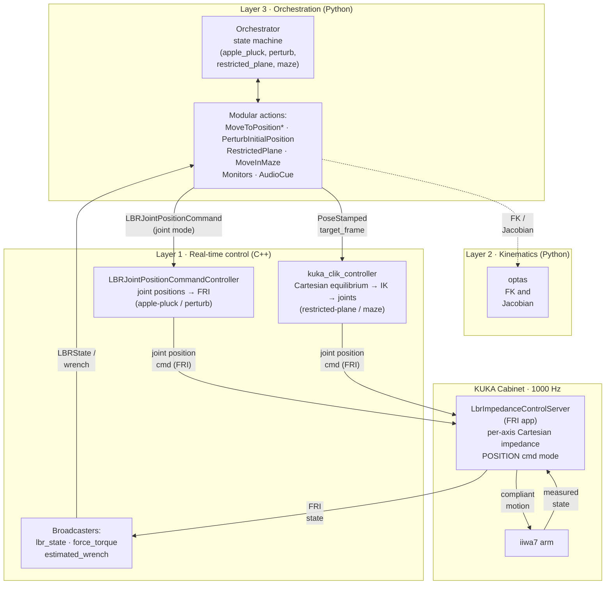
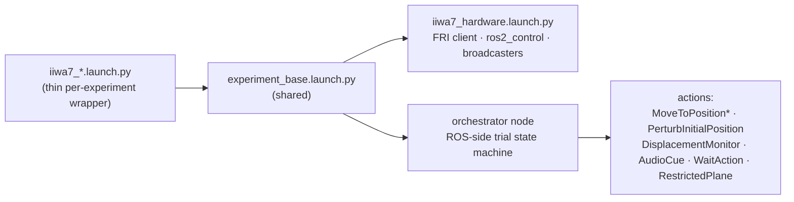
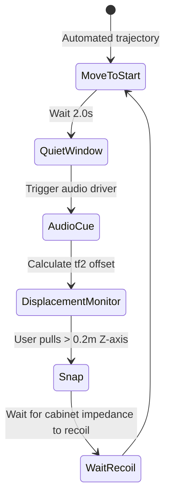
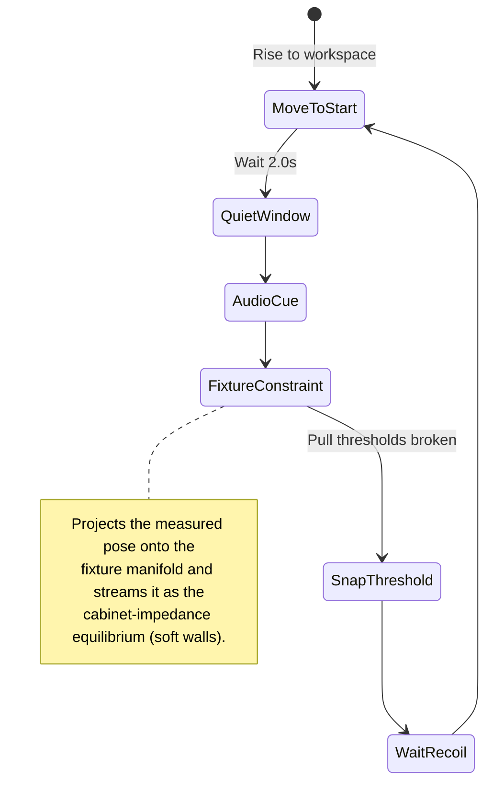
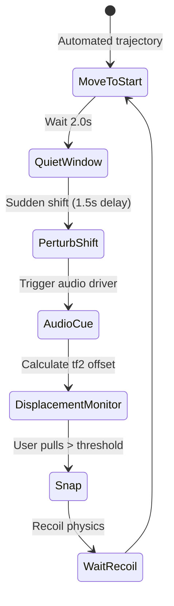

# Sinthlab KUKA Stack

A ROS 2 (Jazzy) control stack for running **compliant "apple‑pluck" experiments** on a KUKA
LBR iiwa7. It is built as an *overlay* on top of the [`lbr_fri_ros2_stack`][^1], adding the
high‑level experiment orchestration, motion actions, and the KUKA Sunrise (FRI) applications
needed to drive the arm.

All experiments run in FRI **position** mode, with the **cabinet** (`LbrImpedanceControlServer`)
providing the Cartesian spring at 1000 Hz. Apple-pluck / perturb stream **joint** setpoints via
`LBRJointPositionCommandController`; restricted-plane / maze stream a fixture-constrained **Cartesian
equilibrium** via `kuka_clik_controller`. Python state machines sequence each trial
(move → cue → monitor displacement → recoil → repeat).

FRI **torque** mode (ROS-side impedance) was evaluated on hardware and **not adopted** — see the
[appendix](#appendix--fri-torque-mode-an-experiment-that-did-not-work-out) for what was learned and
the conditions under which it would be worth revisiting.

## Table of Contents
- [1. Hardware Setup (KUKA Arm)](#1-hardware-setup-kuka-arm)
- [2. Windows Laptop Setup](#2-windows-laptop-setup)
- [3. Building the Stack](#3-building-the-stack)
- [4. Simulation & Visualization (no hardware)](#4-simulation--visualization-no-hardware)
- [5. Running Experiments on Hardware](#5-running-experiments-on-hardware)
- [6. Software Architecture](#6-software-architecture)
- [7. Troubleshooting](#7-troubleshooting)
- [8. Development & Contributing](#8-development--contributing)
- [Acknowledgement](#acknowledgement)
- [Appendix — FRI torque mode (not adopted)](#appendix--fri-torque-mode-an-experiment-that-did-not-work-out)

---

## 1. Hardware Setup (KUKA Arm)
- Use the "Quick Start guide" to cable up the Arm, Cabinet and the SmartPad.
- For the Safety on the X11 interface in the Cabinet:
  - First create 6 jumper cables with the provided pins.
  - Based on the PIN diagram (pg‑53 of `Spez_KUKA_Sunrise_Cabinet_en.pdf`, section 6.6.2),
    jump pins 1/2, 10/11 (external E‑Stop), 3/4, 12/13 (Operator Safety) and 5/6, 14/15
    (Safety stop 1).

---

## 2. Windows Laptop Setup
> **Why Windows + WSL2?** KUKA's robot software (Sunrise Workbench) requires Windows, while our
> stack requires Ubuntu. We use the Windows laptop to install applications onto the robot, and
> run our stack inside WSL2 (Ubuntu) on the same laptop to control the arm.

### Prerequisites
- Install Ubuntu 24.04 with `wsl --install -d Ubuntu-24.04` (the version matters — do **not**
  install the default).
- Confirm you are on WSL version 2 (`wsl -l -v` shows the version and the installed distro).
- Make sure the robot controller box is on.
- Install `Sunrise Workbench` on the laptop. For our arm version we use
  `SunriseWorkbench-1.17.0.4-setup.exe`, provided by KUKA Support.
- Install the FRI plugin in the Sunrise Workbench project (steps to be elaborated).

### Connection Verification
- Connect your computer to the robot controller at **X66** (default IP `172.31.1.147`) via an
  ethernet cable.
- Put your computer on the same network — set your IP to `172.31.1.148` (or anything else in the
  `/16` subnet).
  - On Windows: Settings → Network & Internet → Ethernet, edit the IPv4 manual setup to IP
    `172.31.1.148` and gateway `255.255.0.0`; leave other options as is and save.
- Ping the robot from PowerShell — `ping 172.31.1.147` — and expect something like:
  ```
  PING 172.31.1.147 (172.31.1.147) 56(84) bytes of data.
  64 bytes from 172.31.1.147: icmp_seq=1 ttl=64 time=0.868 ms
  ```
- Enable Hyper‑V on the laptop.
- Set up networking for WSL2: open WSL settings (in the Start menu) and change the Networking
  mode to **Mirrored**.
  
- In a PowerShell window **with admin privileges**, allow inbound Hyper‑V connections:
  ```powershell
  Set-NetFirewallHyperVVMSetting -Name '{40E0AC32-46A5-438A-A0B2-2B479E8F2E90}' -DefaultInboundAction Allow
  ```

### Install Application to Robot
Follow [these steps](https://lbr-stack.readthedocs.io/en/latest/lbr_fri_ros2_stack/lbr_fri_ros2_stack/doc/hardware_setup.html#install-applications-to-the-robot)
to install the application to the robot.

### Tool Load Data (payload calibration)
The cabinet must know the end‑effector's mass, or the compliant control modes (Cartesian / joint
impedance) refuse to activate. With an uncalibrated tool the experiment launch aborts with:
```
[lbr_fri_ros2::StateGuard]: External torque not in limits for joint lbr_A2. Measured: 2.4 Nm, limit: 2 Nm
... External torque limits exceeded. Perform load data calibration!
```
The iiwa has **no SmartPad "load data determination" wizard** like the KR robots — you define a
**tool** in Sunrise Workbench, then run the built‑in **Determine** routine on the SmartPad
(Sunrise OS ≥ 1.16; ours is 1.17).

1. **Define the tool** in Sunrise Workbench — open the project's `RoboticsAPI.data.xml` and add a
   tool under `objectTemplates`. Keep the TCP at the flange (all‑zero transform) so the FRI control
   point stays aligned with the ROS `lbr_link_ee`, and leave `loadData` at zero (Determine fills it):
   ```xml
   <objectTemplates>
     <toolTemplate class="" defaultMotionFrameRef="/SinthLabIiwa7EE_link_ee" name="SinthLabIiwa7EE">
       <frames>
         <frame name="SinthLabIiwa7EE_link_ee">
           <transformation a="0.0" b="0.0" c="0.0" x="0.0" y="0.0" z="0.0"/>
         </frame>
       </frames>
       <loadData cogA="0.0" cogB="0.0" cogC="0.0" cogX="0.0" cogY="0.0" cogZ="0.0"
                 inertiaX="0.0" inertiaY="0.0" inertiaZ="0.0" mass="0.0"/>
     </toolTemplate>
   </objectTemplates>
   ```
   `defaultMotionFrameRef` must match the frame name exactly. **Synchronize** the project to the controller.
2. **Determine the load** on the SmartPad: **Main Menu → Start‑up → Tool/Base Management →
   `SinthLabIiwa7EE` → Edit → Load Data → Determine**. Be in **T1**, **disconnect the tool's cables**
   (the arm swings the tool through joints A5/A6/A7), and keep the swing space clear.
3. **Attach the tool in the FRI app** so the cabinet actually compensates it: in
   `sunrise_controller_code/LbrImpedanceControlServer.java`, create the tool
   (`createFromTemplate("SinthLabIiwa7EE")`), `attachTo(lbr_.getFlange())`, and move the **tool**
   instead of the bare flange. Without this the guard still trips even after Determine.

> Determine writes the mass / COM to the controller's copy of the tool — copy the values back into
> `RoboticsAPI.data.xml` if you want the project/repo to retain them. Re‑run after any change to the
> end‑effector. The `gravitation` vector in `RoboticsAPI.data.xml` assumes a standard floor mount;
> set it to match if the arm is mounted otherwise.

---

## 3. Building the Stack
> These steps run inside **WSL2 / Ubuntu 24.04**.

1. Install ROS 2 development tools (see this [guide](https://docs.ros.org/en/jazzy/Installation/Ubuntu-Install-Debs.html) for details):
   ```bash
   sudo apt update && sudo apt install locales
   sudo locale-gen en_US en_US.UTF-8
   sudo update-locale LC_ALL=en_US.UTF-8 LANG=en_US.UTF-8
   export LANG=en_US.UTF-8
   sudo apt install software-properties-common
   sudo add-apt-repository universe
   sudo apt update && sudo apt install curl -y
   export ROS_APT_SOURCE_VERSION=$(curl -s https://api.github.com/repos/ros-infrastructure/ros-apt-source/releases/latest | grep -F "tag_name" | awk -F'"' '{print $4}')
   curl -L -o /tmp/ros2-apt-source.deb "https://github.com/ros-infrastructure/ros-apt-source/releases/download/${ROS_APT_SOURCE_VERSION}/ros2-apt-source_${ROS_APT_SOURCE_VERSION}.$(. /etc/os-release && echo ${UBUNTU_CODENAME:-${VERSION_CODENAME}})_all.deb"
   sudo dpkg -i /tmp/ros2-apt-source.deb
   sudo apt update && sudo apt install ros-dev-tools
   sudo apt update
   sudo apt upgrade
   sudo apt install ros-jazzy-desktop
   sudo apt install python3-pip
   ```
2. Create a workspace, clone, and install dependencies:
   ```bash
   source /opt/ros/jazzy/setup.bash
   mkdir -p lbr-stack/src && cd lbr-stack
   vcs import src --input https://raw.githubusercontent.com/sinthlab/sinthlab-kuka-stack/main/sinthlab_lbr_stack.repos
   rosdep install --from-paths src -i -r -y
   ```
3. **(Hardware only, one-time)** Raise the FRI external-torque limit. A recent `lbr_fri_ros2` update
   added a safety check on the *external joint torque at activation of compliant control modes*. On a
   floor-mounted iiwa7 this trips (~2.4 Nm on A2 vs. the 2 Nm default) at the extended apple-pluck
   start posture **even with no payload** — it's a gravity-model / mastering margin amplified by A2's
   moment, not a real load. Edit the upstream config
   `src/lbr_fri_ros2_stack/lbr_description/ros2_control/lbr_system_config.yaml` and raise the limit
   (keep the check enabled):
   ```yaml
   state_guard:
     external_torque_safety_check: true
     external_torque_limit: 4.0   # raised from the default 2.0
   ```
   Skip this for mock/sim. The proper long-term fix is calibrating the mounted tool's load data (see
   §2 “Tool Load Data”) so the residual stays under the default — raising the limit is the stopgap
   while the flange is load-free.
4. Install the required Python packages (only needed once per WSL session install):
   ```bash
   pip install pyoptas ruckig --break-system-packages
   ```
5. Build:
   ```bash
   colcon build --symlink-install
   ```

---

## 4. Simulation & Visualization (no hardware)

**Mock setup in RViz**
```bash
# Terminal 1 — launch the mock setup
source install/setup.bash
ros2 launch sinthlab_bringup iiwa7_mock_apple.launch.py
```
```bash
# Terminal 2 — visualize
source install/setup.bash
ros2 launch lbr_bringup rviz.launch.py \
  rviz_cfg_pkg:=lbr_bringup \
  rviz_cfg:=config/mock.rviz
```

**Physics simulation in Gazebo**
```bash
source install/setup.bash
ros2 launch sinthlab_bringup iiwa7_gazebo_apple.launch.py
```

**MoveIt with apple (mock or gazebo)**
```bash
source install/setup.bash

# Mock + MoveIt + RViz
ros2 launch sinthlab_bringup iiwa7_moveit_apple.launch.py mode:=mock rviz:=true

# Gazebo + MoveIt + RViz
ros2 launch sinthlab_bringup iiwa7_moveit_apple.launch.py mode:=gazebo rviz:=true
```

---

## 5. Running Experiments on Hardware
> Python dependencies (`pyoptas`, `ruckig`) must be installed once per WSL session install (see
> [Building the Stack](#3-building-the-stack)).
>
> ⚠️ **Safety first.** On the first run of any scenario, operate in **T1** (reduced speed) with a
> hand on the E‑stop. The arm is actively controlled the moment a SmartPad application is running.

### Scenario quick reference
| # | Scenario | Launch file | SmartPad app (FRI) | ROS controller |
|---|----------|-------------|--------------------|----------------|
| 1 | Apple Pluck          | `iiwa7_apple_pluck_impedance_control.launch.py` | `LbrImpedanceControlServer` | `LBRJointPositionCommandController` |
| 2 | Restricted on Plane  | `iiwa7_move_restricted_plane.launch.py`         | `LbrImpedanceControlServer` | `kuka_clik_controller` |
| 3 | Apple Pluck Perturb  | `iiwa7_apple_pluck_impedance_perturb.launch.py` | `LbrImpedanceControlServer` | `LBRJointPositionCommandController` |
| 4 | Maze                 | `iiwa7_maze.launch.py`                          | `LbrImpedanceControlServer` | `kuka_clik_controller` |

**One control paradigm.** Every scenario uses FRI **POSITION** command mode with the **cabinet**
(`LbrImpedanceControlServer`) running the Cartesian impedance spring at 1000 Hz. They differ only in
what ROS streams into it:

- **Apple Pluck / Perturb (1 & 3)** — **joint** setpoints via `LBRJointPositionCommandController`
  (straight to the FRI position command, no IK).
- **Restricted-plane / Maze (2 & 4)** — a fixture-constrained **Cartesian equilibrium** via
  `kuka_clik_controller` (Cartesian target → IK → joint positions).

> **The two things that decide how a fixture feels** — both were long mis-set, and both are now
> configured correctly:
>
> 1. **Soft-inside comes from tracking, not from low stiffness.** Inside the allowed region the
>    fixture's projection returns the *measured* pose, so the spring error — and hence the force — is
>    ~zero **whatever K is**. High K only bites at the walls and on locked axes. What breaks this is
>    **tracking lag**: if the commanded equilibrium cannot keep up with the operator's hand it falls
>    behind *cumulatively* and `K × error` is felt as resistance in every direction. That is governed
>    by `kuka_clik_controller.max_linear_velocity` (now **1.0 m/s**, well above hand-guiding speed) and
>    the fixture's `max_target_step_m` (now **0.05 m**).
> 2. **Use an anisotropic stiffness profile.** `LbrImpedanceControlServer` takes a full per-axis
>    `{X,Y,Z,A,B,C}` diagonal. A *uniform* profile forces one compromise for locked axes, walls and
>    free motion alike — which is why the maze failed at every uniform value (400 = mushy walls,
>    3000 = heavy everywhere). Lock the constrained axis hard and keep the free axes firm enough for
>    walls; the interior stays free by (1).

### Scenario 1 — Apple Pluck
This scenario streams **joint** setpoints to the `LBRJointPositionCommandController` (joint positions
go straight to the FRI position command — no IK), while the KUKA cabinet runs Cartesian impedance
natively via the `LbrImpedanceControlServer` FRI app. The arm acts as a virtual physical spring and
recoils when pushed off its commanded anchor.

**Steps to run:**
1. Check that `update_rate` in
   `lbr-stack/src/lbr_fri_ros2_stack/lbr_description/ros2_control/lbr_controllers.yaml` is set to `200`.
2. On the KUKA SmartPad, start the **`LbrImpedanceControlServer`** application. It opens four
   selection dialogs in sequence — choose:

   | Prompt | Select |
   |--------|--------|
   | FRI send period [ms] | `10` |
   | Remote IP address | `172.31.1.148` (your ROS / WSL2 laptop IP) |
   | Cartesian stiffness (K diagonal) | `Uniform Medium (Apple Pluck)` |
   | Damping ratio (D0) | `0.7 (Standard)` |

   *This app is hard‑wired to Cartesian Impedance control in `POSITION` command mode. The other
   stiffness profiles (`Very Soft Z`, `Soft Z (Apple Pluck)`, `Stiff Cartesian`) and damping ratios
   (`0.3 (Underdamped)`, `1.0 (Critically Damped)`) are available if you want to change the feel.*
   The app then waits (~60 s) for the ROS client to connect.
3. **Launch the experiment** — this connects ROS to the waiting FRI app and starts the trial loop
   (nothing happens until you run this):
   ```bash
   ros2 launch sinthlab_bringup iiwa7_apple_pluck_impedance_control.launch.py
   ```
4. The arm moves to the start. Wait for the beep, then pull the end effector gently to trigger the
   0.2 m displacement threshold. A second beep plays, and the arm awaits physical recoil before
   restarting.

### Scenario 2 — Move Restricted on a Plane
This scenario applies mathematical **virtual fixtures** (planes, boxes, cylinders, sine rails): the
arm moves freely *within* an allowed region and is pushed back *outside* it. `kuka_clik_controller`
streams a **fixture-constrained equilibrium** pose (the measured pose projected onto the allowed
manifold) and the cabinet's Cartesian impedance turns that into the free-motion + wall feel at 1000 Hz.
Along a free axis the equilibrium tracks the arm, so the spring error — and the force — is ~zero; off
the manifold it stays put, so the spring pulls the arm back.

**Steps to run:**
1. On the KUKA SmartPad, start the **`LbrImpedanceControlServer`** application. It opens four dialogs:

   | Prompt | Select |
   |--------|--------|
   | FRI send period [ms] | `10` |
   | Remote IP address | `172.31.1.148` (your ROS / WSL2 laptop IP) |
   | Cartesian stiffness (K diagonal) | **`Rail guide (uniform 1000)`** |
   | Damping ratio (D0) | `0.7 (Standard)` |

   The app then waits (~60 s) for the ROS client to connect.
2. **Launch the experiment** — this connects ROS to the waiting FRI app and starts it:
   ```bash
   ros2 launch sinthlab_bringup iiwa7_move_restricted_plane.launch.py
   ```
3. The arm rises to the workspace; pull it and feel it held onto the sine rail — free along the pull
   axis, walled in the other two.

> **Tune the feel with the SmartPad stiffness profile.** `Rail guide (uniform 1000)` pins X and holds
> the arm to the rail in Y, while Z (the pull axis) stays free because the equilibrium tracks it. If
> the pull feels heavy *while moving* rather than at the rail, that is tracking lag, not stiffness —
> raise `kuka_clik_controller.max_linear_velocity`.
>
> **Tip:** Set `virtual_fixture_profile` (`sine_wave`, `flat_table`, …) in
> `virtual_fixtures_params.yaml` — this defines *where* the fixture is. For the sine rail, size the
> **wavelength against the pull stroke** — below ~1 period over the stroke it reads as a straight lean.

#### How this relates to Apple Pluck — same cabinet compliance, different ROS controller
Both run the **same cabinet Cartesian impedance at 1000 Hz**; they differ in what ROS streams:

| | Apple Pluck (1 & 3) | Restricted Plane / Maze (2 & 4) |
|---|---|---|
| SmartPad app | `LbrImpedanceControlServer` | `LbrImpedanceControlServer` |
| Compliance | **cabinet** Cartesian impedance, 1000 Hz | **cabinet** Cartesian impedance, 1000 Hz |
| ROS controller | `LBRJointPositionCommandController` | `kuka_clik_controller` |
| ROS streams | **joint** positions (the start config) | a **Cartesian** pose projected onto the fixture manifold |
| Stiffness profile | uniform (omnidirectional spring) | **anisotropic** (lock one axis, firm walls on the others) |
| Feel | omnidirectional spring toward one pose | free within the fixture; firm wall outside it |

So the cabinet — not Python — supplies the give: the arm yields to a sudden jerk at 1 kHz, and the
"walls" are **soft impedance walls** (the arm is gently pulled back onto the manifold), which is the
safer behaviour for an animal subject. The software (`MoveRestrictedOnAPlaneAction`) just keeps the
spring's equilibrium inside the allowed region.

### Scenario 3 — Apple Pluck Perturb
This scenario builds upon the Apple Pluck physics (cabinet‑side Cartesian impedance via
`LbrImpedanceControlServer`, with `LBRJointPositionCommandController` streaming the joint setpoints) but
introduces a sudden, programmatic Cartesian spatial shift right before the user acts, to study the
response to mechanical perturbation.

**Steps to run:**
1. Check that `update_rate` in
   `lbr-stack/src/lbr_fri_ros2_stack/lbr_description/ros2_control/lbr_controllers.yaml` is set to `200`.
2. On the KUKA SmartPad, start the **`LbrImpedanceControlServer`** application with the **same four
   selections as Scenario 1**:

   | Prompt | Select |
   |--------|--------|
   | FRI send period [ms] | `10` |
   | Remote IP address | `172.31.1.148` (your ROS / WSL2 laptop IP) |
   | Cartesian stiffness (K diagonal) | `Uniform Medium (Apple Pluck)` |
   | Damping ratio (D0) | `0.7 (Standard)` |

   The app then waits (~60 s) for the ROS client to connect.
3. **Launch the experiment** — this connects ROS to the waiting FRI app and starts it:
   ```bash
   ros2 launch sinthlab_bringup iiwa7_apple_pluck_impedance_perturb.launch.py
   ```
4. The arm acts exactly as the standard pluck, but automatically jerks to the side approximately
   1.5 seconds prior to the readiness cue.

### Scenario 4 — Maze
The operator (or animal) drives the compliant arm along a network of **linear rails** in a **vertical
Y‑Z plane** in front of the robot. It reuses the same fixture engine as Scenario 2
(`MoveRestrictedOnAPlaneAction` with the `maze` profile). Hitting a checkpoint plays a reward cue
(**any order, once each**); reaching the goal — or timing out — stops the fixtures, waits for the
operator to let go, and resets to the start.

**The legs are LINES, not corridors.** Each "corridor" in `maze_params.yaml` is a *degenerate*
rectangle — a horizontal leg has `b_min == b_max`, a vertical leg has `a_min == a_max` — so the fixture
always projects the equilibrium onto the **nearest segment**, exactly like the sine rail. You slide
*along* a rail and can only turn at a junction; there is no free area to wander in.

**Why vertical, and why this start posture.** The tool axis (the EE frame's **Z** axis) points ~+X at
the subject, and the maze locks base‑X so the plane is enforced by the cabinet. The start posture
matters more than it looks: both fixtures **lock orientation**, and translating the EE while holding
orientation is far more expensive in some arm configurations than others. The shipped start reaches the
same EE pose as an earlier one but with the **elbow flipped**, which cut the cost of sideways motion
from ‖q̇‖ ≈ 19.8 to ≈ 2.5 (6D condition number 45 → 10). Before that change the maze felt like treacle
in exactly the directions it was supposed to be free.

**Workspace limits (measured by IK, holding tool orientation).** From the shipped start the arm can
reach **a ∈ [−0.40, +0.40] m** sideways and **b ∈ [−0.35, +0.20] m** up/down — but that envelope is a
**trapezoid**: full width low down, pinched at the top (at b = +0.20 only a ∈ ±0.10). That is why the
maze grid stops at b = +0.15 and its top row spans only a ∈ [−0.15, +0.15].

**The maze is defined RELATIVE to the start EE** (`corridor_frame: relative`, `relative_to_start: true`),
so its origin is wherever the arm starts: change `move_to_start` and the whole maze — rails, checkpoints,
goal — moves with it. It is anchored on the **settled measured** pose, not the commanded one
(`anchor_settle_sec: 3.0`, `anchor_on_measured: true`): a free axis carries no restoring force, so the
arm sinks a few cm below the commanded start, and anchoring on the command put the whole maze that far
overhead and the checkpoints were missed.

#### What you should expect to see

A **2-D maze** of linear rails on a 0.15 m grid — shaded cells are solid, you can only travel the
rails, and only one route reaches the goal. Coordinates are **offsets from the anchored start**
(▶ = 0,0): **a = Y sideways, b = Z up/down**; X (in/out) is locked by the cabinet.

```
   a:     -0.30    -0.15     0.00    +0.15    +0.30
         ┌─────────────────────────────────┐
 b +0.15 │░░░░░░░░┘═══════════════★░░░░░░░░│  ★ GOAL
         │░░░░░░░░║░░░░░░░░░░░░░░░░░░░░░░░░│
 b  0.00 │┌═══════┘░░░░░░░▶═══════◆═══════┐│  ▶ START
         │║░░░░░░░░░░░░░░░░░░░░░░░║░░░░░░░║│
 b -0.15 │└═══════◆═══════◆═══════◆═══════┘│  ◆ checkpoint (a real fork)
         │░░░░░░░░║░░░░░░░║░░░░░░░░░░░░░░░░│
 b -0.30 │░░░░░░░░└═══════┘░░░░░░░░░░░░░░░░│
         └─────────────────────────────────┘
            ◆ = the only 4 places with a CHOICE -> reward cue fires here
            ░ = solid (no rail)     ═ ║ ┘ ┌ ┐ └ = rail you can travel
```

**A checkpoint fires only where a turn decision is actually made** — the four junctions with three
ways out (◆). The maze's other eight junctions are corners where the turn is forced, and arriving at
one tells the subject nothing they have to act on, so they get no cue. A reward tone therefore means
exactly one thing: **"you are at a fork — choose."** The four forks, in route order:

| fork | the choice |
|---|---|
| (+0.15, 0.00) | first fork out of START: turn down, or carry on right the long way |
| (+0.15, −0.15) | left toward the goal, or right around the far column |
| (0.00, −0.15) | carry on left, or drop into the bottom pocket |
| (−0.15, −0.15) | carry on left, or drop into the bottom pocket |

**The solution — 1.50 m over 7 legs:** ▶START → right to ①, → down, → **left along the whole bottom
row** to ②, → up, → right, → ③, → up, → right → ★GOAL.

**No dead ends — every wrong turn is a loop.** The arm can never end up somewhere it has to be
reversed out of; wrong turns cost *time*, which is what makes them wrong:

| wrong turn | what happens |
|---|---|
| right past ① instead of turning down | the far column takes you down to the b=−0.15 row anyway — the long way round |
| down into the b=−0.30 pocket | drops off the row and climbs back onto it further along |

**The walls hold you.** The fixture latches onto the rail you are travelling and will only hand you
over to a rail that *physically touches* it — a real junction. Push sideways mid-rail and the
equilibrium stays clamped to that rail, so the cabinet spring pulls you back onto it. (Previously the
projection simply picked the globally nearest rail each tick, so a hard push could make an unrelated
rail the closest one and the arm would be dragged across the maze — passing straight through a wall.)

**The gap matters.** On the b=0 row there is deliberately **no rail between a=−0.15 and a=0.00**
(the shaded cells left of ▶). Without it the arm could run straight from START to the goal up-link and
the maze would be trivial — that gap is what forces the long way round.

Every rail is verified reachable by IK while holding the tool orientation (40 samples along the rails,
all reachable, sideways cost median 2.9 / max 3.5).

#### Changing or extending the maze

**The maze is pure configuration — you never edit code to change it.** Everything lives in
`sinthlab_bringup/config/maze_params.yaml`, and the geometry is *relative to the start*, so the whole
maze follows `move_to_start` automatically.

**Rails** are four parallel arrays under the `maze` profile — one entry per segment:

```yaml
#                R1     R2     R3   ...
corridor_a_min: [ 0.00,  0.15, -0.30, ...]   # a = Y sideways
corridor_a_max: [ 0.30,  0.15,  0.30, ...]
corridor_b_min: [ 0.00, -0.15, -0.15, ...]   # b = Z up/down
corridor_b_max: [ 0.00,  0.00, -0.15, ...]
```

A **horizontal** rail has `b_min == b_max`; a **vertical** rail has `a_min == a_max`. If both spans are
non-zero you have made a *box* — an open area the arm can wander inside — not a rail.

**Rules the maze must obey**

| rule | why |
|---|---|
| no key defined twice in the same block | YAML silently keeps the **last** one, so the file says one thing and ROS loads another |
| every rail linear (degenerate in one axis) | otherwise it is an open box, not a corridor |
| all four `corridor_*` arrays the same length | they are read positionally |
| START `(0,0)` lies on a rail | otherwise the arm begins pinned against a wall |
| segments **touch** to form junctions | rails that don't touch are separate; the arm can't cross between them |
| every checkpoint and the goal lies on a rail | a waypoint off the rails can never be triggered |
| `checkpoint_x/y/z/radius` the same length | read positionally, like the rails |
| `maze_safety.max_displacement_m` exceeds the farthest rail point | otherwise the safety stop fires mid-trial |
| fits the reachable envelope | see below |

**Reach.** Holding the tool orientation, the arm covers **a ∈ [−0.40, +0.40]**, **b ∈ [−0.35, +0.20]**,
and that envelope is a **trapezoid** — full width low down, sharply pinched at the top (at b = +0.20
only a ∈ ±0.10). Vertical room is the scarce resource; sideways room is plentiful.

**If you change `move_to_start`**, you must also update `config/clik_nullspace_maze.yaml`
(`nullspace_desired_configuration`) to the same joint array, or the CLIK will hold the right EE pose in
the wrong arm posture. And re-check the *orientation-constrained* cost of the free directions — that is
what decides whether guiding feels light or like treacle, and it is not visible in reach alone.

**Validate before you touch the robot:**

```bash
# reach checks need a generated URDF (once per shell)
xacro $(ros2 pkg prefix lbr_description)/share/lbr_description/urdf/iiwa7/iiwa7.xacro > /tmp/iiwa7.urdf
export IIWA7_URDF=/tmp/iiwa7.urdf

ros2 run sinthlab_bringup check_maze.py
```

It checks every rule above, then IKs points along each rail to confirm the arm can actually reach them
while holding the tool orientation, and reports the sideways-motion cost. Exit code is non-zero on
failure, so it works in CI. Example of a bad maze:

```
  [--] key 'checkpoint_x' is defined TWICE in the same block (second at line 156).
       YAML keeps the LAST one, so the file does not say what ROS loads.
  [--] rails [10] have width in BOTH axes -- they are boxes, not lines.
  [--] rails [10] are NOT connected to the start -- unreachable, the arm can never enter them.
  [--] CP4 is 70 mm off every rail -- it can never be triggered.
  [--] maze reaches 0.99 m but maze_safety.max_displacement_m is 0.20 -- the safety stop
       would fire mid-trial. Raise it above 0.99.
FAILED (5 problem(s))
```

The duplicate-key check runs **first**, and it is there because this bug actually shipped: a stale
three-element `checkpoint_x` sat above the real four-element one, the file parsed cleanly, and every
other check passed while the maze quietly loaded different values than the file appeared to specify.

Structural checks run without the URDF; the kinematic ones are skipped with a note if `optas` or
`IIWA7_URDF` is unavailable.

**Making it harder.** Add rails (junctions, dead ends, loops), not width. Length is cheap along `a`,
expensive along `b`. A deliberate **gap** between two collinear rails — as between `a = −0.15` and
`a = 0.00` on the b = 0 row — is what forces the long way round; without gaps a grid of rails is just
an open field.

#### Diagnostic ladder

If the maze feels wrong, switch `virtual_fixture_profile` to isolate the cause — these need no code
change, because a rail spanning the whole workspace has no walls and a long thin one *is* a line:

| profile | what it is | what it tests |
|---|---|---|
| `free_plane` | one huge corridor, no reachable wall | the plane lock + stiffness + tracking, with the maze removed |
| `single_line` | one corridor, long in Y, ±2 cm in Z | adds exactly one wall pair |
| `maze` | the real thing | full geometry |

Work up the ladder and stop at the first rung that feels wrong.

**Steps to run:**
1. On the KUKA SmartPad, start the **`LbrImpedanceControlServer`** application:

   | Prompt | Select |
   |--------|--------|
   | FRI send period [ms] | `10` |
   | Remote IP address | `172.31.1.148` (your ROS / WSL2 laptop IP) |
   | Cartesian stiffness (K diagonal) | **`Maze walls + easy guiding (rot 120)`** — `{2500, 1000, 1000, 120, 120, 120}` |
   | Damping ratio (D0) | `0.7 (Standard)` |

   > **Use an anisotropic profile, not a uniform one.** X 2500 locks the radial axis so the cabinet
   > enforces the plane in hardware; Y/Z 1000 holds the arm firmly on the rails. Uniform profiles could
   > never win: 400 made the walls mushy, 3000 made everything heavy.
   >
   > Two maze profiles ship, differing **only in rotational stiffness** (300 vs 120) so you can A/B the
   > one knob that matters for feel. The maze's constraints are all *translational* (X = the plane, Y/Z =
   > the rails), so orientation stiffness defines nothing about the maze — it only stops the tool
   > twisting. But holding orientation *while translating* is the expensive motion, so dropping it to
   > 120 reduces guiding effort **without** softening the plane or the rails. Trade-off: the tool may
   > twist a little more — watch the apple angle.
2. **Launch:**
   ```bash
   ros2 launch sinthlab_bringup iiwa7_maze.launch.py
   ```
3. The orchestrator checks **where the arm actually is** before the first move. If it is parked in a
   near-singular ("straight") posture it steps via a pre-start waypoint first; otherwise it drives
   straight to ▶START. The log says which branch it took. Later trials always go straight there.
4. The arm settles for 3 s, the fixture anchors on where it **rests**, the go cue plays, and the rails go
   live. Drive to the goal (or let the 60 s timeout expire).

   > **Watching progress.** The fixture logs your maze position at 2 Hz:
   > `maze: a=+0.180 b=+0.002 -> on rail C1`, or `OFF rail (nearest C1, 31 mm away, being pulled back)`.
   > Every run also writes `analysis/robot_trajectory_*.csv` with
   > `time, x, y, z, rel_a, rel_b, corridor, off_rail, rail_dist` — plot `rel_a` vs `rel_b` straight on
   > top of the rail coordinates in `maze_params.yaml`. Set `checkpoint_monitor.debug_log_enabled: true`
   > to also see live distance to each checkpoint and the goal.

> **⚠️ Gravity matters on the free axes.** Along a rail the equilibrium tracks the arm, so the spring
> exerts ~no restoring force in that direction and the tool's weight rests on **gravity compensation**.
> Measured on the bare flange: the arm sinks ~4 cm and then **stops** (bounded, not a runaway). That is
> why the fixture anchors on the settled pose. With the real EE mounted, run tool-load **Determine**
> first — a wrong `loadData` makes the sink larger and biases every vertical leg.
>
> **Safety-stop (backstop, not a substitute).** `SafetyStopMonitor` (`maze_safety` in the params) trips if
> the EE leaves the start pose by > 0.50 m or exceeds 0.7 m/s (for 5 consecutive samples), and **aborts immediately** —
> stops the fixture and drives back to the start posture, no release wait. This exists because the FRI
> velocity guard only *neutralises the command*, it does not halt the trial. It catches a runaway; it does
> not remove the need for correct gravity compensation.
>
> **Tuning the feel** — three independent levers, in the order worth trying:
> 1. **Rotational stiffness** (SmartPad profile, 300 vs 120): the biggest lever on how heavy guiding
>    feels, and it costs no fixture fidelity.
> 2. **Tracking lag**: if it drags *when you move fast*, that is lag, not stiffness — raise
>    `kuka_clik_controller.max_linear_velocity` (now 1.0 m/s) and `max_target_step_m` (now 0.05).
> 3. **Y/Z stiffness**: how firmly you are held on a rail. Raise if the rails feel mushy.
>
> If a *free* direction feels heavy no matter what, suspect the **start posture** rather than any of
> these — see the note on orientation-constrained translation above.

> **Moving the maze = changing `move_to_start`.** Because everything is start-relative, the joint start
> pose is the one knob that positions the maze. Everything moves with it automatically — but you still have
> to respect **reach**: holding the start orientation the arm covers **a ∈ [−0.40, +0.40], b ∈ [−0.35,
> +0.20]**, and that envelope is a trapezoid (pinched at the top). Every rail point in the shipped maze
> is verified reachable. If you pick a very different start, re-check the footprint **and** re-check the
> orientation-constrained cost of the free directions — a bad posture reintroduces the treacle feel.
>
> **Two syncs to keep (both are pre-set):**
> - `config/clik_nullspace_maze.yaml` `nullspace_desired_configuration` **must equal**
>   `move_to_start.target_joint_position`. The CLIK matches only the EE *pose* and resolves the arm's
>   redundant 7th DOF toward that posture; a mismatch holds the right pose in the wrong arm shape.
> - `checkpoint_monitor.relative_to_start` and the fixture's `corridor_frame` must **both** be relative (or
>   both absolute), or the rewards land in the wrong place relative to the walls.
>
> **Editing the shape:** rails live in `maze_params.yaml` as `corridor_a_min/a_max/b_min/b_max`
> (with `restricted_axis: x`, `a = Y` sideways and `b = Z` up/down, as **offsets from start**). Keep them
> degenerate — a horizontal leg has `b_min == b_max`, a vertical leg has `a_min == a_max` — or you get a
> box with free area inside it again. Segments must **touch** to form a junction; START (0,0) must lie on
> one; the checkpoint/goal **X**-offset is 0 (on the locked plane), and Y/Z carry the position.

---

## 6. Software Architecture
The stack separates **hard real‑time physical loops** from **high‑level orchestration**, so that
Python state transitions never compromise the 1000 Hz hardware control loops.

### 6.1 System Overview — data flow
Both paths end in a joint **position command** over FRI, and the **cabinet's Cartesian impedance
provides the compliance**. Apple-pluck / perturb send **joint** setpoints via
`LBRJointPositionCommandController`; restricted-plane / maze send a fixture-constrained **Cartesian
equilibrium** via `kuka_clik_controller`, which IKs it to joints. Robot state flows *back up* to the
Python monitors.


```mermaid
flowchart TB
    subgraph L3["Layer 3 · Orchestration (Python)"]
        ORCH["Orchestrator<br/>state machine<br/>(apple_pluck, perturb,<br/>restricted_plane, maze)"]
        ACT["Modular actions:<br/>MoveToPosition* · PerturbInitialPosition<br/>RestrictedPlane · MoveInMaze<br/>Monitors · AudioCue"]
    end
    subgraph L2["Layer 2 · Kinematics (Python)"]
        OPTAS["optas<br/>FK and<br/>Jacobian"]
    end
    subgraph L1["Layer 1 · Real-time control (C++)"]
        JPC["LBRJointPositionCommandController<br/>joint positions → FRI<br/>(apple-pluck / perturb)"]
        CLIK["kuka_clik_controller<br/>Cartesian equilibrium → IK → joints<br/>(restricted-plane / maze)"]
        BCAST["Broadcasters:<br/>lbr_state · force_torque<br/>estimated_wrench"]
    end
    subgraph CAB["KUKA Cabinet · 1000 Hz"]
        APP["LbrImpedanceControlServer<br/>(FRI app)<br/>per-axis Cartesian impedance<br/>POSITION cmd mode"]
        ARM["iiwa7 arm"]
    end

    ORCH <--> ACT
    ACT -. "FK /<br/>Jacobian" .-> OPTAS
    ACT -- "LBRJointPositionCommand<br/>(joint mode)" --> JPC
    ACT -- "PoseStamped<br/>target_frame" --> CLIK
    JPC -- "joint position<br/>cmd (FRI)" --> APP
    CLIK -- "joint position<br/>cmd (FRI)" --> APP
    APP -- "compliant<br/>motion" --> ARM
    ARM -- "measured<br/>state" --> APP
    APP -- "FRI<br/>state" --> BCAST
    BCAST -- "LBRState /<br/>wrench" --> ACT
```

> **Where the "feel" is decided.** The fixture geometry (Python) says *where* the walls are; the
> cabinet's **per-axis stiffness** says *how firm* they are; and the **tracking clamps**
> (`kuka_clik_controller.max_linear_velocity`, `virtual_fixtures.max_target_step_m`) decide whether the
> allowed region feels free. All three must be set together — see the note in section 5.

### 6.2 Composition — the launch brings up hardware, the orchestrator runs the experiment
The codebase keeps a hard line between **hardware bring‑up** and **experiment logic**, and that line
*is* the launch ↔ orchestrator boundary:


```mermaid
flowchart LR
    L["iiwa7_*.launch.py<br/>(thin per-experiment wrapper)"] --> B["experiment_base.launch.py<br/>(shared)"]
    B --> HW["iiwa7_hardware.launch.py<br/>FRI client · ros2_control · broadcasters"]
    B --> O["orchestrator node<br/>ROS-side trial state machine"]
    O --> A["actions:<br/>MoveToPosition* · PerturbInitialPosition<br/>DisplacementMonitor · AudioCue · WaitAction · RestrictedPlane"]
```

- **Launch files own the hardware.** Every experiment launch is a *thin wrapper* (~25 lines) over one
  shared [`experiment_base.launch.py`](sinthlab_bringup/launch/experiment_base.launch.py), which does
  the identical hardware setup for every experiment: build the `robot_description`, include
  `iiwa7_hardware.launch.py` (FRI client + `ros2_control` + broadcasters), and start the
  orchestrator. A wrapper supplies only the three things that differ — the **config YAML**, the
  **orchestrator** to run, and the **controllers**: `lbr_joint_position_command_controller` is always
  the ACTIVE one, and the fixtures additionally load `kuka_clik_controller` INACTIVE for the
  orchestrator to switch to.

- **The orchestrator owns the ROS side.** Each experiment has exactly one orchestrator node (1:1 with
  its launch) that builds the experiment's **trial state machine**. The three orchestrators are kept
  **independent** (no shared base) so each reads top‑to‑bottom as one self‑contained experiment.

- **Orchestrators are composed only of actions.** An orchestrator holds no inline robot logic; it is a
  wiring of reusable **action** objects, each with a uniform `start()` → `on_complete` shape, chained
  by callbacks. Changing a step means swapping an action, not rewriting the node:

  | Action | Responsibility |
  |--------|----------------|
  | `MoveToPositionJointSpace` | drive to an absolute joint target (FRI position cmd). Used for every start / recover move, and for the maze's conditional pre-start waypoint |
  | `MoveToPositionCartesianSpace` | drive to a target via `kuka_clik_controller` (Cartesian → IK) |
  | `PerturbInitialPosition` | polar (r, θ) perturbation from the start pose (joint‑space DLS‑IK) |
  | `MoveRestrictedOnAPlaneAction` / `MoveInMaze` | stream the fixture‑constrained equilibrium to `kuka_clik_controller` |
  | `CartesianImpedanceDisplacementMonitor` | baseline → displacement threshold → snap → recover |
  | `AudioCue` / `WaitAction` | play a tone cue / one‑shot delay |

  **Start-up guard (maze).** `MoveToPositionJointSpace` exposes `latest_measured_joints()`, so the
  orchestrator can ask *where the arm physically is* before committing to a move. The maze uses this to
  decide **once per run** whether it needs its pre-start waypoint:

  ```
  max(|A2|, |A4|, |A6|) < extended_if_bend_below_deg   ->  arm is nearly STRAIGHT
                                                       ->  near-singular  ->  go via the waypoint
  otherwise                                            ->  drive straight to the start
  ```

  A straight arm is a singular one: at mechanical zero the Jacobian's smallest singular value is
  **0.0**, and a Cartesian-impedance move commanded from there does not reliably reach the target. The
  bend test was validated against the Jacobian and agrees exactly with "smallest singular value <
  0.05" — including the awkward *extended-but-rotated* case (A1 = 90° but the arm straight), which a
  plain "distance from mechanical zero" test would miss. The maze start scores 79.5° and the plane
  start 90°, so neither triggers it.

  This is a guard, not a routine step: running the waypoint unconditionally dragged the arm out to the
  restricted-plane posture and back on every launch — including when it was already sitting at the maze
  start — which was disruptive and pointless.

  A trial is then literally a chain of actions — e.g. apple‑pluck:
  `move_to_start → quiet_window → audio_cue → monitor → (snap cue) → move_recover → repeat`.

### 6.3 Hardware Bring‑up Sequence
Controllers are spawned in a deliberate order: `joint_state_broadcaster` first (it needs no URDF
and proves the controller_manager has received the robot description), then the controllers that
parse the URDF in `on_init()`.

```mermaid
sequenceDiagram
    actor Op as Operator
    participant ROS as ROS 2 (WSL2)
    participant CM as controller_manager
    participant CAB as KUKA cabinet (SmartPad)

    Op->>ROS: ros2 launch ... (apple_pluck | move_restricted_plane | maze)
    ROS->>CM: start ros2_control_node (FRI client) + robot_state_publisher
    Op->>CAB: Start LbrImpedanceControlServer (pick the stiffness profile for the scenario)
    CAB-->>CM: FRI session established (COMMANDING_ACTIVE)
    CM->>CM: spawn joint_state_broadcaster
    Note over CM: only after it activates (URDF received)
    CM->>CM: spawn estimated_wrench · lbr_state · force_torque · active ctrl
    Note over CM: apple/perturb → joint_position_command_controller only;<br/>fixtures also load kuka_clik_controller INACTIVE
    ROS-->>Op: Orchestrator starts trial — arm moves to start pose
```

### 6.4 Layers
**Layer 1 — Real‑time control (C++ / ros2_control)**
- **Cabinet‑side Cartesian impedance (`LbrImpedanceControlServer`):** the KUKA cabinet runs the
  Cartesian‑impedance virtual spring at 1000 Hz with a **per‑axis** `{X,Y,Z,A,B,C}` stiffness diagonal,
  so it can enforce axis‑aligned fixtures in hardware (lock a plane, firm walls on the free axes). ROS
  only streams the equilibrium to it.
- **`LBRJointPositionCommandController` (lbr_ros2_control):** the **apple‑pluck / perturb** controller
  — forwards joint positions straight to the FRI position command (no IK). Typed message
  `lbr_fri_idl/LBRJointPositionCommand` on `…/command/lbr_joint_position_command`.
- **`kuka_clik_controller` (IDRA Lab, vendored):** the **restricted‑plane / maze** controller — a
  Closed‑Loop IK tracker that converts the fixture's Cartesian equilibrium into joint commands. Message
  `geometry_msgs/PoseStamped` on `…/kuka_clik_controller/target_frame`. Its `max_linear_velocity` caps
  how fast that equilibrium may chase the operator's hand and is the main "does the fixture feel free"
  knob.

**Layer 2 — Kinematics math (Python)**
- **`optas`:** used inside the Python actions for fast Forward Kinematics (FK) and analytical
  Jacobian conversions, avoiding singular‑matrix crashes when reading Cartesian poses or mapping
  forces.

**Layer 3 — State‑machine orchestration (Python)**
The experimental flows are orchestrated by high‑level `rclpy` nodes (one per experiment), each
composed entirely of the modular actions catalogued in §6.2 — `MoveToPositionJointSpace` /
`MoveToPositionCartesianSpace`, `PerturbInitialPosition`, `CartesianImpedanceDisplacementMonitor`,
`MoveRestrictedOnAPlaneAction` / `MoveInMaze`, `AudioCue`, `WaitAction`. The per‑scenario flows are below.

### 6.5 Control rates — why a 1000 Hz spring but a 10 ms FRI period
The cabinet's control loop and the FRI network exchange run on **two different clocks** — don't
conflate them:

| Clock | What it does | Rate |
|-------|--------------|------|
| **Cabinet control loop** | Computes the Cartesian‑impedance law (`F = K·(x_target − x) − D·v`) and applies joint torques. | **1 ms (1000 Hz)** — fixed by KUKA Sunrise |
| **FRI send period** | Network packet exchange with the ROS client: ROS pushes a new **equilibrium** (joint positions for apple‑pluck, a Cartesian pose for restricted‑plane) and reads back state. | **10 ms (100 Hz)** — you pick 1 / 2 / 5 / 10 ms |

So selecting **10 ms does not slow the spring down.** The cabinet keeps evaluating the impedance
physics every 1 ms against the latest equilibrium; FRI only refreshes the *target* (the spring's
anchor) and the *feedback* 100×/second.

**Between FRI packets**, the cabinet holds the last commanded equilibrium and runs the 1 kHz loop
against it, smoothing the stepwise 10 ms updates via `joint_position_tau` (a 40 ms EMA in
`lbr_system_config.yaml`) so the arm doesn't jerk. Because the target moves slowly (a start pose, a
gentle pull), a 100 Hz anchor refresh is plenty — the 1 kHz loop fills in the dynamics.

**Why 10 ms and not 1 ms?** The FRI send period is a hard deadline the *client* must meet; miss it
and the session drops out of `COMMANDING_ACTIVE` and the robot stops. The client is ROS 2 on
**WSL2 — not a real‑time OS** — over a jittery ethernet link, so reliably hitting a 1–2 ms deadline
is impractical while 10 ms is robust. It also matches the ROS rate (`controller_manager`
`update_rate: 100`; `lbr_controllers.yaml` = `200`) — no point sending faster than ROS produces
commands.

This decoupling is the whole reason the impedance lives **on the cabinet**: the fast,
safety‑critical loop stays at 1 kHz on a real‑time controller, while the slow, non‑real‑time ROS
link only streams a position target at 100 Hz. Running the impedance in ROS instead would pin the
spring law to that ~100 Hz link — far coarser and riskier for torque control.

### 6.6 Experiment State Flows

**Flow 1 — Apple Pluck**

```mermaid
stateDiagram-v2
    [*] --> MoveToStart : Automated trajectory
    MoveToStart --> QuietWindow : Wait 2.0s
    QuietWindow --> AudioCue : Trigger audio driver
    AudioCue --> DisplacementMonitor : Calculate tf2 offset
    DisplacementMonitor --> Snap : User pulls > 0.2m Z-axis
    Snap --> WaitRecoil : Wait for cabinet impedance to recoil
    WaitRecoil --> MoveToStart
```

**Flow 2 — Restricted Virtual Fixtures**

```mermaid
stateDiagram-v2
    [*] --> MoveToStart : Rise to workspace
    MoveToStart --> QuietWindow : Wait 2.0s
    QuietWindow --> AudioCue
    AudioCue --> FixtureConstraint
    note right of FixtureConstraint
      Projects the measured pose onto the
      fixture manifold and streams it as the
      cabinet-impedance equilibrium (soft walls).
    end note
    FixtureConstraint --> SnapThreshold : Pull thresholds broken
    SnapThreshold --> WaitRecoil
    WaitRecoil --> MoveToStart
```

**Flow 3 — Perturb Experiment**

```mermaid
stateDiagram-v2
    [*] --> MoveToStart : Automated trajectory
    MoveToStart --> QuietWindow : Wait 2.0s
    QuietWindow --> PerturbShift : Sudden shift (1.5s delay)
    PerturbShift --> AudioCue : Trigger audio driver
    AudioCue --> DisplacementMonitor : Calculate tf2 offset
    DisplacementMonitor --> Snap : User pulls > threshold
    Snap --> WaitRecoil : Recoil physics
    WaitRecoil --> MoveToStart
```

---

## 7. Troubleshooting
- **RViz shows nothing / Gazebo crashes immediately.** The graphics library may be trying to use a
  GPU that isn't available. Force software rendering, then relaunch:
  ```bash
  export LIBGL_ALWAYS_SOFTWARE=1
  ```

---

## 8. Development & Contributing
- This stack follows an **underlay → overlay** structure. It reuses
  [`lbr_fri_ros2_stack`](https://github.com/lbr-stack/lbr_fri_ros2_stack)[^1], which in turn has
  ROS 2 as its underlay — so our code imports classes and functions from `lbr_fri_ros2_stack`.
- The `sinthlab_lbr_stack.repos` file lists every repository dependency that gets imported during
  setup. After setup, `~/lbr-stack/src` (the default) contains 4 repositories.
- **We own and manage only `sinthlab-kuka-stack`** — make changes only in that folder. Its git
  repository is [here](https://github.com/sinthlab/sinthlab-kuka-stack).
  - To contribute, create your own branch and open a pull request on GitHub so changes can be
    tracked and approved.
- If you use Copilot (or another AI‑assisted editor), open the codebase from the **root**
  (`~/lbr-stack` by default) so the agent can index the whole codebase including its dependencies.

> **Maintainer (Navin Modi) disclosure:** for my development I have used VS Code and Claude / Copilot
> agents for assisted development.

### Testing / rebuild loop
After making changes, rebuild from the workspace root (`~/lbr-stack` by default), re‑source, and
relaunch:
```bash
rm -rf build/ install/ log/
colcon build --symlink-install
source install/setup.bash
```

---

## Acknowledgement
This work is built on top of Huber et al.[^1]; all original credit for `lbr_fri_ros2_stack` goes to
that team.

The vendored controllers in [`vendored_controllers/`](vendored_controllers/) —
`kuka_clik_controller`, `controller_base`, and `debug_msg` — are by the **IDRA Lab** (University of
Trento), from [`idra-lab/ros2_effort_controller`](https://github.com/idra-lab/ros2_effort_controller)
(branch `kuka-prop-ctrl`), used via
[`idra-lab/kuka_lbr_control`](https://github.com/idra-lab/kuka_lbr_control). They are distributed
under the Apache License 2.0 (see [`vendored_controllers/LICENSE`](vendored_controllers/LICENSE)).

[^1]: LBR-Stack: ROS 2 and Python Integration of KUKA FRI for Med and IIWA Robots, Journal of Open Source Software. [doi](https://doi.org/10.21105/joss.06138)

---

## Appendix — FRI torque mode: an experiment that did not work out

This records an attempt to move the fixture experiments from FRI **position** mode to FRI **torque**
mode. **It was reverted** — none of it is in the repo any more. It is written down so the reasoning is
not lost if anyone considers it again.

### Why we tried it

The maze felt wrong at every cabinet stiffness: at `Maze compliant (uniform 400)` the walls were too
weak to feel; at `Stiff (3000)` the arm was too heavy to move. idra-lab's wiki states that their
proprietary-impedance path has **"no runtime stiffness tuning"** and cannot add custom torque terms,
and that their **custom torque control** branch exists precisely to provide variable impedance. That
looked like the principled fix: cabinet does gravity compensation only, ROS computes the whole
Cartesian spring at the control rate, giving genuinely soft interiors with firm walls.

### What we built (all since removed)

- Vendored `idra-lab/ros2_effort_controller` (`effort_controller_base`, `cartesian_impedance_controller`,
  `joint_impedance_controller`, `debug_msg`) with two local patches: one for a Jazzy `get_value()` that
  throws `std::bad_optional_access` on an empty state interface, one adding a joint-space target topic
  to bypass a fragile Cartesian→IK round trip.
- `TorqueControl.java` — a Sunrise FRI app running a joint overlay in `ClientCommandMode.TORQUE`.
- Torque FRI system config, controller config, per-experiment stiffness overlays, a joint-space move
  action, and a zero-torque "float" diagnostic.

### What we observed on hardware

1. **In `ClientCommandMode.TORQUE` the joint position you send is not the servo reference.** The cabinet
   keeps servoing to the `positionHold` pose captured when the Sunrise app started; your torque is
   added on top. Confirmed directly — push the arm and it springs back to the app-start pose no matter
   what position is commanded. **Torque mode can only perturb the arm around an anchor; it cannot drive
   it anywhere.** That invalidated the whole move-to-start design.
2. **Zero cabinet stiffness is unusable on this arm.** `JointImpedanceControlMode(0,…,0)` leaves nothing
   holding the joints, so the ~2.5 Nm gravity-compensation residual makes the arm drift until FRI aborts
   with **"illegal axis delta"** — reproduced with **zero commanded torque and none of our control
   code**, using lbr's own `lbr_torque_command_controller`.
3. **Non-zero cabinet stiffness fixes the drift but tethers the arm** to the app-start pose:

   | K [Nm/rad] | sag (2.5 Nm residual) | tether at EE 20 cm from start |
   |---|---|---|
   | 30 | ~4.8 deg (visible) | ~9 N |
   | 50 | ~2.9 deg (not visible) | ~16 N |

   30 was the lowest that held. That tether is superimposed on every fixture force.
4. **Both the sag and the stiffness floor are set by the gravity residual** (`sag = residual / K`). With
   a 0.5 Nm residual, K=10 would give less sag than K=50 does at 2.5 Nm, with a third of the tether. So
   torque mode's quality is gated on gravity-compensation accuracy.
5. **Echoing the measured joint position as the FRI position command breaks under fast motion.** FRI
   limits how much the commanded position may change per cycle; a raw echo changes as fast as the
   operator's hand, and trips "illegal axis delta". It needs rate limiting.
6. Also learned the hard way: the effort controllers hard-abort the **process** (`std::terminate`) if a
   newly desired joint torque differs from the applied one by more than 10 Nm, and joint damping of
   `2*sqrt(K)` turns velocity noise into large torque swings — at K=200 a mere 0.14 rad/s transient
   trips it, which is less than the arm's own glide speed.

### Why we went back to position mode

Two levers that directly address the original complaint had **never been tested** before the migration:

- **The CLIK tracking clamps.** `max_linear_velocity: 0.4` and `max_target_step_m: 0.01` cap how fast
  the commanded equilibrium can chase the hand. Move faster and it falls behind *cumulatively*, so the
  error — and `K * error` — grows without bound. **That, not stiffness, is what made the maze feel
  stiff.** Now 1.0 m/s and 0.05 m.
- **Anisotropic cabinet stiffness.** `LbrImpedanceControlServer` always supported a full per-axis
  `{X,Y,Z,A,B,C}` diagonal, but every maze profile we had tried was uniform. Added
  `Maze walls (X lock, Y/Z firm)` = `{2500, 1000, 1000, 300, 300, 300}`.

And the principle we had lost sight of: **soft-inside does not come from low stiffness.** Inside a
corridor the fixture's projection returns the measured pose, so spring error — and force — is ~zero
whatever K is. High K only bites at the walls. Firm walls and a free interior are therefore not in
conflict, *provided the equilibrium can track the hand*. Both of the maze's failure modes are explained
by this, and neither was a test of the right configuration.

### If you revisit torque mode

Everything above was removed, but it is recoverable from git history (the work sits between the commits
"moving to torque plane from clik" and the revert). Do not start again until **both** hold:

- The real end effector is mounted **and** SmartPad **Determine** has been run and persisted to
  `RoboticsAPI.data.xml`, so the gravity residual — and with it the stiffness floor and the tether —
  drops; **and**
- the experiment design can accept an operator pre-positioning the arm, since torque mode anchors at
  the app-start pose and cannot drive there itself.

A useful first test is a **zero-torque float**: stream `joint_position = measured, torque = 0` through
`lbr_torque_command_controller` and see whether the arm simply holds its pose. If it drifts, gravity
compensation is not good enough and nothing above that layer will work.
