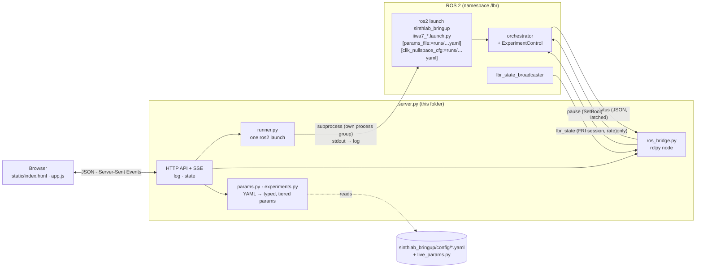

# Experiment Control Dashboard: architecture and software

**How to use the dashboard is in the main README:
[Quick start: the experiment dashboard](../README.md#quick-start-the-experiment-dashboard).** This file
covers how it is built: its components, the robot-side interfaces it relies on, how parameters are
classified, where the parameter help comes from, and how to extend it.

---

## Contents
- [Architecture](#architecture)
- [Components](#components)
- [Robot side: ExperimentControl](#robot-side-experimentcontrol)
- [Parameter model](#parameter-model)
- [Parameter documentation](#parameter-documentation)
- [HTTP API](#http-api)
- [Process control](#process-control)
- [Demo mode](#demo-mode)
- [Security](#security)
- [Extending](#extending)
- [Developing and testing](#developing-and-testing)

---

## Architecture



- **The dashboard never talks to the arm.** It starts and stops the same `ros2 launch` a user would
  type, and uses the orchestrator's public ROS interfaces. The same interfaces serve the terminal
  (`ros2 param set`, `ros2 service call`), which is also why an experiment launched in a terminal
  is picked up automatically.
- **The YAMLs are the source of truth** for values, defaults, descriptions and notes. The dashboard
  never writes them: a per-run edit becomes a copy in `runs/`, passed as `params_file:=`.

---

## Components

| File | Role |
|---|---|
| `server.py` | `ThreadingHTTPServer`: static files, the JSON API, and a Server-Sent Events stream of log lines and state (state is re-sent every second). Owns start / stop / restart / stop-after-trial |
| `runner.py` | runs one `ros2 launch` in its own process group, pumps its output into the log ring buffer (5000 lines) and `logs/`, and stops it: SIGINT → 20 s → SIGTERM → 5 s → SIGKILL |
| `ros_bridge.py` | `RosBridge`: an rclpy node on a background executor that subscribes to `experiment_status` and `lbr_state` and calls `set_parameters` / `pause`. `UnavailableBridge` when ROS is not sourced. `DemoBridge` for `--demo` |
| `experiments.py` | the four experiments (launch file, YAML, orchestrator node, SmartPad profile, controllers, run name); cautions, linked parameters, iiwa7 joint limits, the straight-arm check |
| `params.py` | YAML → flat dotted names; descriptions and notes; type coercion; per-run edits; the edited YAML and CLIK posture files; the Fixed tab's sections |
| `static/` | the page: `index.html`, `style.css`, `app.js`. No external libraries or fonts |
| `demo_launch.py` | stands in for `ros2 launch` in demo mode |
| `check_param_docs.py` | fails if any key in `sinthlab_bringup/config/*.yaml` has no one-line description |
| `run_gui.sh` | sources ROS 2 and the workspace, then runs `server.py` |

Dependencies: the Python standard library and PyYAML (installed with ROS); `rclpy` and the message
packages when ROS is sourced.

---

## Robot side: ExperimentControl

[`helpers/experiment_control.py`](../sinthlab_bringup/sinthlab_bringup/helpers/experiment_control.py)
makes an orchestrator controllable from outside. Each of the four orchestrators creates one:

| Interface | Type | Behaviour |
|---|---|---|
| `<ns>/experiment_status` | `std_msgs/String`, JSON, transient-local | published on every trial event and once a second: experiment, trial, phase, paused / held, live values **in effect**, and changes **pending** for the next trial |
| `<ns>/<orchestrator>/pause` | `std_srvs/SetBool` | `true`: finish this trial, recover, hold at the start. `false`: apply pending changes and start the next trial |
| `set_parameters` | parameter callback | names in `live_params.py` are range-checked, accepted and **applied at the next trial boundary**; anything else is rejected with the reason |
| `on_event(token, arg)` | `TrialRecorder` hook | every `mark()` updates the status, and with `nsp_sync.enabled` sends the event's NSP code (`_pulse()`, a stub until the DIO arrives) |

The orchestrators end each trial with `control.begin_trial(self.start_trial)`. That call is where a
pause holds and where accepted changes are applied: `_reload_live()` calls `reload()` on the cue,
monitor and perturbation actions and resets the quiet-window and timeout durations. So a change
never lands mid-trial, and the sidecar written at the next `TrialRecorder.start()` records the
values that trial used.

---

## Parameter model

| Tier | Decided by | Enforced by |
|---|---|---|
| **Live** | `LIVE_PARAMS` in [`live_params.py`](../sinthlab_bringup/sinthlab_bringup/helpers/live_params.py): fnmatch globs per experiment | the orchestrator's parameter gate, and the server |
| **Per-run** | every other key in the experiment YAML | the server refuses edits while that experiment runs; the orchestrator rejects runtime sets |
| **Fixed** | not in the experiment YAML: SmartPad selections, launch arguments, `iiwa7_hardware_controllers.yaml`, the CLIK posture | shown read-only (`read_fixed_config()`) |

`live_params.py` has no ROS import, so the dashboard loads it from the source tree whether or not
ROS is sourced; the orchestrators import the same module, so the two cannot disagree. It also holds
`LIMITS` (ranges) and `CHOICES` (enums), checked by `check_value()` on both sides.

**Dashboard-only checks and conveniences** (`experiments.py`, `params.py`):
- `CAUTION`: amber notes on parameters other things depend on. They never lock anything.
- `LINKED`: `move_to_start.target_joint_position` and `move_to_start_recover.target_joint_position`
  are set together.
- **Poses:** 7 values, within `IIWA7_LIMITS_DEG`, and not a straight arm
  (max(|A2|, |A4|, |A6|) ≥ `STRAIGHT_BELOW_DEG`, 12°; the maze pre-start waypoint is exempt).
- **Parallel arrays** (`corridor_*`, `checkpoint_*`) must keep their length.
- **Coercion:** values from the browser are coerced to the YAML default's exact type, because ROS
  refuses a set that changes a parameter's type.

**Launch overrides** (`ExperimentParams.launch_overrides()`):
- With any edit, the YAML is written to `runs/<exp>_<time>.yaml` and passed as `params_file:=`.
- If a CLIK experiment's start pose was edited, a matching `runs/<exp>_<time>_clik_nullspace.yaml` is
  passed as `clik_nullspace_cfg:=`. `iiwa7_hardware.launch.py` joins that argument onto the package
  directory, and an absolute path replaces the package part, so the generated file is used as is.

---

## Parameter documentation

The help text comes from the YAML files (`params.yaml_docs()`):

```yaml
    # Notes: the reasoning, measurements, knobs. Comment lines directly above the key,
    # with no blank line between, belong to that key (or to that block, above a block).
    polar_r_m: 0.05  # perturbation distance from the start [m]      <- the description
```

- **Description:** the comment on the key's own line. It is shown under the parameter and at the top
  of its popup. Every key, blocks included, must have one.
- **Notes:** the comment block above the key. Prose lines are reflowed into paragraphs; indented
  lines (tables, diagrams) keep their columns.
- **Borrowed notes:** a key with no notes of its own borrows a sibling's notes when they mention it
  by name. The perturbation's notes sit above `polar_r_m` but explain θ and plane too.
- **Enforcement:** `check_param_docs.py` walks every YAML in `sinthlab_bringup/config/` and exits 1
  listing any undocumented key.

The Fixed tab's SmartPad and launch-argument rows are not YAML keys; their help is in
`SMARTPAD_HELP` and `LAUNCH_HELP` in `params.py`.

---

## HTTP API

POSTs need the header `X-Experiment-Ctrl: 1`; errors return 409 with `{"ok": false, "error": …}`.

| Method | Path | Does |
|---|---|---|
| GET | `/api/experiments` | the four experiments and their SmartPad selections |
| GET | `/api/params/<exp>` | `params` (typed rows with tier, value, default, description, notes, caution, links, limits, choices), `groups` (block docs), `fixed` (Fixed tab sections) |
| GET | `/api/state` | runner state, ROS availability, status, robot, data folder, edit counts |
| GET | `/api/logs` | the log ring buffer |
| GET | `/api/events` | Server-Sent Events: `{"type": "log" \| "state", "data": …}` |
| POST | `/api/params/<exp>` `{name, value}` | per-run edit (linked keys follow); refused while that experiment runs |
| POST | `/api/params/<exp>/reset` | drop all edits |
| POST | `/api/start` `{experiment}` | launch; refused if anything is running, here or in a terminal |
| POST | `/api/stop` `{mode: "now" \| "after_trial"}` | Ctrl-C now, or pause and stop once the orchestrator reports it is holding |
| POST | `/api/restart` | stop now, then start the same experiment with the current edits |
| POST | `/api/pause` `{paused}` | the orchestrator's pause service |
| POST | `/api/live` `{name, value}` | `set_parameters` on the running orchestrator |
| POST | `/api/validate` | `analysis/validate_recording.py --folder <this run's folder>`, output to the log |

---

## Process control

- **Start:** `ros2 launch sinthlab_bringup <launch> [overrides]` runs with `start_new_session=True`,
  so one signal reaches the launch and every node it spawned. `RCUTILS_COLORIZED_OUTPUT=0` and
  `PYTHONUNBUFFERED=1` keep the log clean and live.
- **Stop now:** SIGINT to the process group, exactly like Ctrl-C. After 20 s it sends SIGTERM, and
  after 5 s more SIGKILL.
- **Stop after trial:** pause, then Stop now once the status reports `held`.
- **Restart:** Stop now; when the launch has exited, start again after 1 s.
- **Shutting down the server** stops a launch it started, the same way.
- **The data folder** is the newest `analysis/expt_<run_name>_*` modified since the launch started.

---

## Demo mode

`--demo` replaces the ROS side:
- `demo_launch.py` stands in for `ros2 launch`. It prints a banner and exits cleanly on SIGINT, so
  Start / Stop / Restart run for real.
- `DemoBridge` simulates an orchestrator on a fast clock. It uses the same trial phases, the same
  pause / held behaviour, the same live-parameter rules (`live_params.py`), the same apply-at-next-trial
  behaviour, and heartbeats once a second.

Nothing connects to the arm.

---

## Security

The server binds to `127.0.0.1` unless `--host` says otherwise, since whoever reaches it can start the
robot. POSTs require a custom header that a page on another site cannot send without CORS, which
the server never grants. So a malicious web page cannot drive the robot through a local browser.
Static files are served from `static/` only, with no path traversal.

---

## Extending

**A new live parameter:**
1. Add its name or glob to `LIVE_PARAMS` in `live_params.py`, with a range in `LIMITS` (and
   `CHOICES` if it is an enum).
2. Make the action that uses it re-readable: give it a `reload()` (see `AudioCue.reload()`,
   `CartesianImpedanceDisplacementMonitor.reload()`) and call that from the orchestrator's
   `_reload_live()`.
3. Declare it in the experiment YAML, with a one-line description on its line. ROS will not set a
   parameter the node never declared, and `check_param_docs.py` fails without the description.

It then appears on the Live tab automatically. Do step 2 before step 1: a listed name that is never
re-read would be accepted and silently ignored, which is the failure the gate exists to prevent.

**A new experiment:** add an `Experiment` to `EXPERIMENTS` in `experiments.py`, an entry in
`LIVE_PARAMS`, and create an `ExperimentControl` in its orchestrator. The orchestrator must end each
trial with `control.begin_trial(...)` and pass `on_event=self.control.on_event` to its `TrialRecorder`.
Add its step list to `STEPS` in `static/app.js` for the status card.

---

## Developing and testing

```bash
python3 experiment_ctrl_gui/server.py --demo --port 8765      # the whole page against a simulated robot
python3 experiment_ctrl_gui/check_param_docs.py               # YAML documentation complete?
```

URL options, for testing and for linking:

| Option | Effect |
|---|---|
| `?exp=maze` | select an experiment |
| `?tab=live` \| `run` \| `fixed` | open a tab |
| `?hover=<parameter>` | open that parameter's help popup |
| `?nostream` | poll `/api/state` every second instead of using the event stream. Use it behind a proxy that breaks SSE, and for headless screenshots, since an open stream never lets a headless browser go idle |
